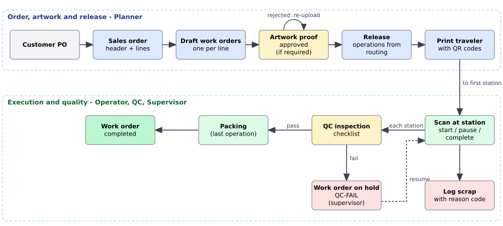
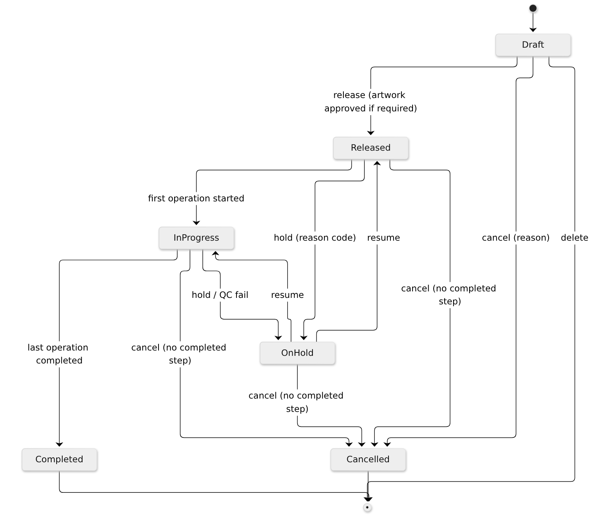
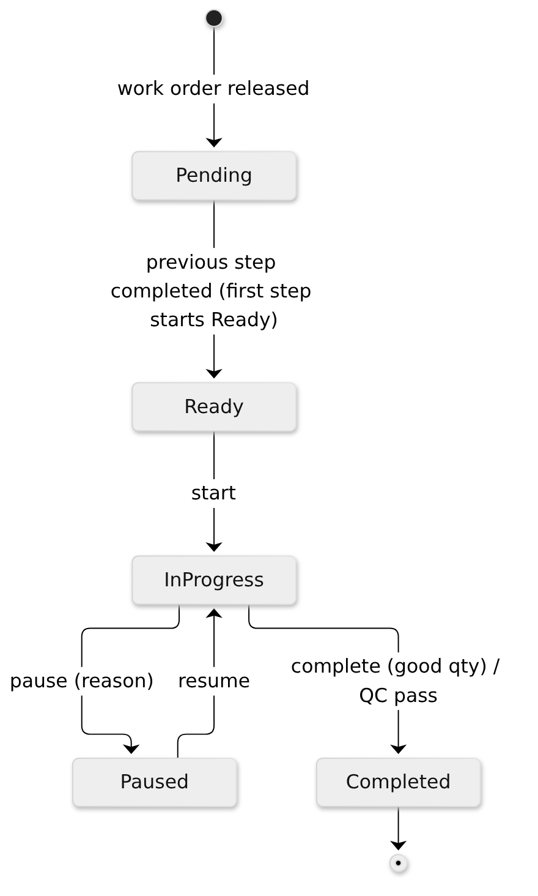

title: Business Document
subtitle: Purpose, production context, processes, rules, KPIs and scope
audience: Plant management, planners, supervisors, quality, IT and project stakeholders
---

# Executive summary

DMB ProdTrack is a production work-order and shop-floor tracking system for a plant that makes safety identification
products - pipe markers, valve tags, safety signs and labels. It replaces paper travelers and spreadsheets with a single
system that follows each job from the customer's sales order through artwork approval, release, station-by-station
execution, quality inspection and completion, and shows the live state of the floor on a dashboard.

This document describes the application **as built** after the Sprint 2-3 batch (27 September 2026). It is a
practice project: it is not affiliated with DMB Websolutions, and the business rules are plausible
assumptions for a marking-products plant.

What the current release delivers:

* Sales orders with lines, and one-click generation of work orders from the lines.
* Work orders with specification snapshot, artwork proof approval, release to the floor, hold/resume/cancel with
  reason codes, and a printable traveler with QR codes.
* A shop-floor web app for tablets: station queue, QR scanning (camera, hardware scanner or typed), start, pause,
  complete with good quantity, scrap with reason codes, and QC checklists.
* A live supervisor dashboard (work orders by status, late jobs, today's good/scrap units and scrap rate, WIP by
  station) that updates as operators work.
* User administration with six roles, a full audit trail, and protection against two people overwriting each other's
  changes.

# Purpose and problem statement

A marking-products plant handles many small, highly customised orders. One customer order can contain hundreds of
pipe-marker legends, engraved valve tags with unique numbers and safety signs in several sizes and materials, often for
oil and gas, power and industrial projects with strict deadlines and documentation requirements.

In the assumed current situation:

* Orders are re-keyed from sales documents into spreadsheets and work instructions travel on paper.
* Supervisors walk the floor to find out where a job is; work in progress per station is unknown.
* Late jobs are discovered late, and customer service cannot quickly answer "where is my order?".
* Scrap is recorded on paper, if at all, so its main causes are not measured.
* QC results are kept on paper forms, which makes traceability slow.

**Purpose of ProdTrack:** provide real-time, reliable and auditable information about production status and quality,
with minimal typing on the shop floor.

## Business objectives

| ID | Objective | How the current release supports it |
|---|---|---|
| BO1 | Real-time visibility of every work order | Operation events are pushed to the dashboard and work order pages within seconds (SignalR) |
| BO2 | Improve on-time delivery | Late work orders are counted on the dashboard and highlighted in lists; at-risk forecasting is future work |
| BO3 | Reduce scrap through measurement | Every scrap entry needs a quantity and a reason code; scrap units and scrap rate are shown for today |
| BO4 | Paperless QC traceability | QC checklists are recorded per operation with inspector, time, measured values and result |
| BO5 | Reduce data entry | Operators scan the traveler QR codes instead of typing numbers |

# DMB production context

## Product families

| Family | Examples | Typical specification |
|---|---|---|
| Pipe markers | Printed vinyl markers for flammable, water, compressed air lines | Material, pipe OD range, ASME A13.1 colour scheme, legend text, letter height |
| Valve tags | Engraved brass or aluminium tags | Material, shape, diameter, thickness, hole size, engraved text |
| Safety signs | Aluminium or polymer signs | Size, material, ANSI Z535 signal word (DANGER, WARNING, CAUTION, NOTICE), mounting |
| Labels | Polyester labels | Size, adhesive, finish |

Reference data seeded with the application includes the ASME A13.1 colour schemes (for example Flammable = black on
yellow, Fire quenching = white on red) and the ANSI Z535 signal words with their colours.

## Stations and routings

| Station | Type | Used by |
|---|---|---|
| PREPRESS | Prepress / artwork | All product types |
| PRINT-01 | Digital printing | Pipe markers, signs, labels |
| LAM-01 | Laminating | Pipe markers, signs |
| ENGRAVE-01 | Engraving | Valve tags |
| DIECUT-01 | Die-cutting / cutting | Pipe markers, signs, labels |
| QC-01 | Quality control (inspection) | All product types |
| PACK-01 | Packing and shipping | All product types |

A **routing** is the ordered list of stations for a product type, with setup time and standard minutes per unit. For
example, a printed pipe marker goes PREPRESS, PRINT-01, LAM-01, DIECUT-01, QC-01, PACK-01; an engraved valve tag goes
PREPRESS, ENGRAVE-01, QC-01, PACK-01. Routings are versioned: planners edit them by creating a new version.

# Stakeholders and roles

| Stakeholder | Interest | Role in ProdTrack |
|---|---|---|
| Plant manager | Throughput, on-time delivery, cost | Viewer or Supervisor (dashboard) |
| Production planner | Order entry, artwork, releasing work | Planner |
| Shift supervisor | WIP, bottlenecks, holds | Supervisor |
| Machine operator | Clear queue, easy recording | Operator (shop-floor app) |
| QC inspector | Consistent inspections, stopping bad product | QC |
| Customer service / sales | Order status for customers | Viewer |
| IT administrator | Users, security, availability | Admin |
| Customers (indirect) | On-time, correct, compliant product | - |

## Role permissions

| Capability | Admin | Planner | Supervisor | Operator | QC | Viewer |
|---|:-:|:-:|:-:|:-:|:-:|:-:|
| View dashboard, orders, products, routings | Yes | Yes | Yes | Yes | Yes | Yes |
| Sales orders and work orders (create, edit, release) | Yes | Yes | - | - | - | - |
| Products and routings (edit) | Yes | Yes | - | - | - | - |
| Hold / resume / cancel work orders, print traveler | Yes | Yes | Yes | - | - | - |
| Upload artwork proof | Yes | Yes | - | Yes | - | - |
| Approve / reject artwork | Yes | Yes | - | - | - | - |
| Run operations (start, pause, complete, scrap) | Yes | - | Yes | Yes | Yes | - |
| Record QC inspections | Yes | - | - | - | Yes | - |
| Stations, reason codes, users | Yes | - | - | - | - | - |

# Business processes

## End-to-end flow

### 1. Sales order entry

The planner enters the customer's purchase order as a **sales order** (`SO-yyyy-nnnnn`): customer, customer PO, due
date and one line per product with quantity and legend text. The product's default specification is copied onto the
line and can be adjusted.

### 2. Work order generation

**Create work orders** turns each sales order line into a Draft **work order** (`WO-yyyy-nnnnnn`) with the line's
product, quantity, legend, specification and due date. The specification is a snapshot: later catalogue changes do not
change existing work orders. Lines that already have a work order are skipped. Planners can also create work orders
directly from a product (stock or internal jobs).

### 3. Artwork approval

For products flagged *requires artwork approval*, the planner or operator uploads a proof (PDF or image). A planner
approves it or rejects it with a reason. Only an approved proof allows release. A new upload supersedes the previous
proof.

### 4. Release and traveler

**Release** copies the current routing into the work order as numbered operations. The first operation becomes Ready at
its station. The planner prints the **traveler**, which carries a QR code for the work order and one per operation,
the specification and space for handwritten notes.

### 5. Operations at stations

At each station the operator opens the queue on the tablet, scans the traveler and:

* **starts** the operation (the operator and start time are recorded);
* **pauses** it with a reason when needed, and resumes;
* **logs scrap** with a quantity and a scrap reason;
* **completes** it with the good quantity. The next operation becomes Ready with that quantity as its input.

### 6. Quality control and scrap

At the QC station the inspector fills in the checklist for the product type. A pass completes the inspection step and
the job moves to packing. A fail puts the whole work order **on hold** with reason `QC-FAIL` so a supervisor can decide
what to do. Scrap is captured at every station with reason codes so its causes can be analysed.

### 7. Hold, resume and cancel

Supervisors and planners can put a work order on hold with a hold reason (for example a customer change), resume it
(back to its previous status) or cancel it with a reason while no step has been completed.

### 8. Completion

Completing the last operation (packing) completes the work order; its completed quantity is the good quantity of that
last step. The sales order shows each line's work order status.

## Work order lifecycle

## Operation lifecycle

# Business rules

| ID | Rule (as implemented) |
|---|---|
| BR-01 | Numbers: work order `WO-{yyyy}-{nnnnnn}`, sales order `SO-{yyyy}-{nnnnn}`, generated by the server and safe under concurrent use. |
| BR-02 | The product specification is snapshotted onto the sales order line and the work order; catalogue changes do not alter existing orders. |
| BR-03 | An operation can only be started when it is Ready and its work order is Released or In progress (not On hold, Cancelled or Completed). If a station is given, it must be the routed station. |
| BR-04 | The first operation is Ready at release; each next operation becomes Ready when the previous one completes. |
| BR-05 | The input quantity of an operation is the good quantity of the previous one (first = work order quantity). Good plus scrap cannot exceed the input. |
| BR-06 | A work order is Completed when its last operation completes; its completed quantity is the last operation's good quantity. |
| BR-07 | Server UTC time is authoritative for all events; dates are displayed in plant time (Asia/Manila). |
| BR-08 | Pauses and scrap require an active reason code of the matching category (Pause, Scrap). Holds require a Hold reason code; cancel requires a free-text reason. |
| BR-09 | QC measured values outside [min, max] fail the item automatically; any failed item fails the inspection. |
| BR-10 | A failed inspection puts the work order on hold with reason `QC-FAIL`. An inspection step can only be completed after a passed inspection. |
| BR-11 | Products flagged "requires artwork approval" cannot be released without an approved proof; approving a new version supersedes the old one. |
| BR-12 | Cancelling a work order is allowed only while no operation is completed. Cancelling a sales order is allowed only while it has no open work orders. |
| BR-13 | Sales order lines that already have a work order cannot be changed or removed. |
| BR-14 | Routing changes create a new version; released work orders keep the operations they were released with. |
| BR-15 | Users are created by an administrator only; there is no self-registration and no email. New and reset passwords must be changed at the next sign-in. |
| BR-16 | Every change to business data is recorded in the audit trail (who, when, what changed, correlation id). |
| BR-17 | When two users edit the same record, the second save is rejected with a "changed by someone else" message instead of silently overwriting the first. |

# Key performance indicators

| KPI | Definition | Where shown |
|---|---|---|
| Work orders by status | Count of work orders in Draft, Released, In progress, On hold, Completed | Dashboard tiles |
| Late work orders | Open (not Completed/Cancelled) with due date before today (plant time) | Dashboard tile; lists highlight late rows |
| Completed today | Work orders completed since midnight plant time | Dashboard |
| Good units today | Sum of good quantity of operations completed today | Dashboard |
| Scrap units today | Sum of scrap quantity logged today | Dashboard |
| Scrap rate today | scrap / (good + scrap) for today, e.g. 2 / (114 + 2) = 1.7 % | Dashboard |
| WIP by station | Operations Ready, In progress, Paused and Pending per station | Dashboard table |

Planned KPIs for later releases: throughput per period and station, on-time delivery, at-risk jobs, scrap Pareto by
reason, OEE-lite (availability and performance from downtime and standard minutes).

# Scope

## In scope (delivered)

| Area | Delivered capability |
|---|---|
| Security | Sign-in with personal accounts, forced password change, lockout, six roles, administrator-managed users |
| Master data | Products with type-specific specifications, stations, reason codes, ASME/ANSI reference data, versioned routings with editor, QC checklist templates (seeded) |
| Orders | Sales orders with lines, work order generation, work orders with specification snapshot |
| Artwork | Proof upload, approval, rejection, versioning |
| Release | Operations from routing, printable traveler with QR codes |
| Shop floor | Installable tablet app, station queue, scanning, start/pause/resume/complete, scrap, QC inspections |
| Control | Hold/resume/cancel with reason codes, automatic hold on failed QC |
| Visibility | Live dashboard and work order pages |
| Compliance | Audit trail of all changes, optimistic concurrency |

## Out of scope for this release / future

| Item | Notes |
|---|---|
| Materials and inventory | Stock levels, receipts, consumption and low-stock alerts (backlog PT-038 to PT-040, PT-049) |
| Downtime and OEE-lite | Station downtime logging and OEE-lite KPIs (PT-045, PT-046) |
| Rework routing | Failed QC currently holds the job; creating rework operations is future work |
| Reporting | Late/at-risk list, throughput and scrap Pareto charts, work order timeline, audit viewer (PT-042 to PT-044, PT-048) |
| Traveler reprint audit | Reprints are possible from the browser but not yet logged (PT-026) |
| Badge/PIN sign-in on tablets | Tablets use the normal account sign-in today (PT-011) |
| Email notifications | Not available on the free hosting plan; administrators hand out passwords |
| ERP / accounting integration | Not planned for the MVP |
| Hosting | The application currently runs locally. Deployment to the MonsterASP.NET free plan and an Azure DevOps phase 2 are documented options, not yet performed |

# Assumptions and constraints

* Single plant, single time zone (Asia/Manila), one shift pattern.
* Shop-floor devices are tablets or phones with a modern browser (Chrome or Edge recommended for camera scanning).
* Cost must stay at zero: free, open-source libraries (MIT or Apache licensed) and free hosting tiers only.
* No email or SMS is available; all notifications are in-app.
* All data in this practice project is fictitious.

# Glossary

| Term | Meaning |
|---|---|
| Sales order (SO) | A customer's order, with one line per product |
| Work order (WO) | A production job for one product and quantity |
| Operation | One step of a work order at a station (for example printing) |
| Routing | The ordered stations and standard times for a product type |
| Traveler | The printed sheet that travels with a job, carrying QR codes |
| WIP | Work in progress |
| Scrap | Units that are unusable, recorded with a reason code |
| Hold | A temporary stop of a work order with a reason |
| QC | Quality control inspection |
| ASME A13.1 | US standard for pipe marker colours and sizes |
| ANSI Z535 | US standard for safety sign signal words and colours |
