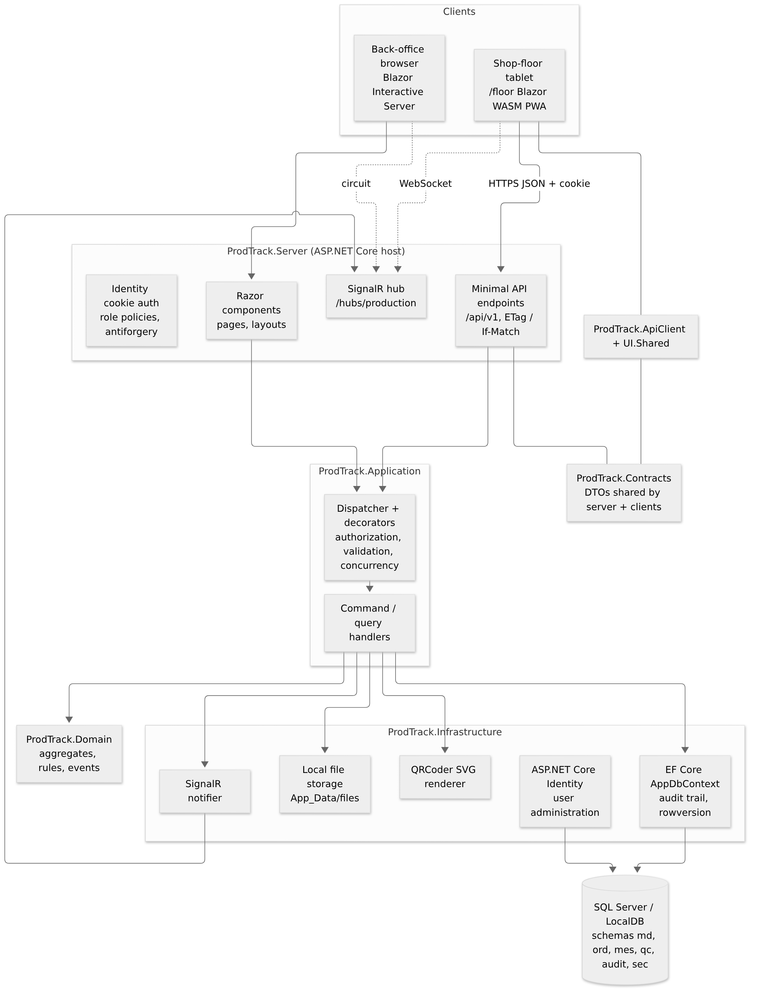
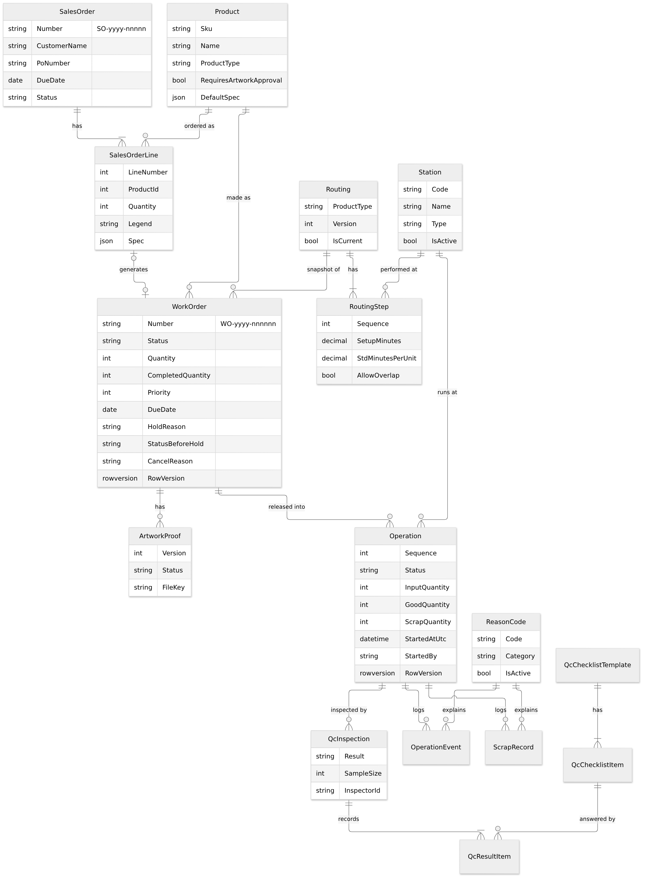
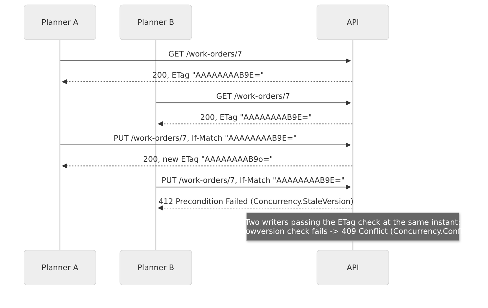
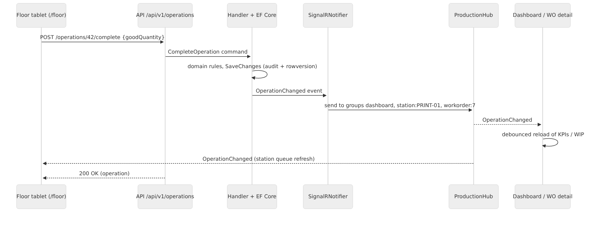

title: Technical Document
subtitle: Architecture, data model, API, security, operations and testing
audience: Developers, reviewers, IT administrators
---

# Overview

DMB ProdTrack is a .NET 10 web application with two front ends served by one ASP.NET Core host:

* a **back office** built with Blazor Web App (Interactive Server rendering) for planners, supervisors, QC and admins;
* a **shop-floor PWA** built with Blazor WebAssembly, served under `/floor`, for station tablets.

Both use the same REST API (`/api/v1`), the same cookie-based ASP.NET Core Identity sign-in and the same SignalR hub
for live updates. Data lives in SQL Server (LocalDB for local development) through EF Core. This document reflects the
code on branch `feature/sprint-2-3` (PR #2), 27 September 2026.

# Architecture

## Layers and projects

The solution (`ProdTrack.slnx`) follows Clean Architecture with a lightweight CQRS style (ADR-0001). Dependencies
point inwards; architecture tests (NetArchTest) fail the build if a layer references an outer one.

| Project | Layer | Responsibility |
|---|---|---|
| `ProdTrack.Domain` | Domain | Aggregates (WorkOrder, Operation, SalesOrder, Routing, Product, Station, ReasonCode, QcInspection, ...), invariants, state machines, `Result`/`Error`, domain events. No framework dependencies. |
| `ProdTrack.Application` | Application | Commands and queries with handlers, `IDispatcher`, decorators (authorization, validation, concurrency), FluentValidation validators, abstractions (`IAppDbContext`, `INotifier`, `IFileStorage`, `IQrCodeRenderer`, `IPlantClock`, `ICurrentUser`), role/policy definitions. |
| `ProdTrack.Infrastructure` | Infrastructure | EF Core `AppDbContext` and configurations, migrations, audit trail, number sequences, seeding, Identity stores and user administration, QRCoder renderer, local file storage, SignalR notifier. |
| `ProdTrack.Contracts` | Shared | Request/response DTOs and the hub contract shared by server and clients. |
| `ProdTrack.ApiClient` | Shared client | Typed `HttpClient` wrapper used by the PWA (antiforgery-aware). |
| `ProdTrack.UI.Shared` | Shared UI | Razor components shared between back office and PWA. |
| `ProdTrack.ShopFloor` | Presentation | Blazor WebAssembly PWA (`/floor`): station picker, queue, scan box, operation page, SignalR client. |
| `ProdTrack.Server` | Presentation / host | Minimal API endpoints, SignalR hub, Blazor Server pages, Identity UI (sign-in, change password), security setup, Serilog, health checks, hosting of the PWA. |



## Request pipeline

1. Endpoint (Minimal API) or Razor component builds a command/query from the request.
2. `IDispatcher` resolves the handler, wrapped by decorators (outermost first):
   **Authorization** (policy from `[RequiresPolicy]`) → **Validation** (FluentValidation) →
   **Concurrency** (maps `DbUpdateConcurrencyException` to `Concurrency.Conflict`) → handler.
3. The handler loads aggregates through `IAppDbContext`, calls domain methods that return `Result`, and saves.
4. `SaveChanges` writes audit entries in the same transaction and dispatches domain events after commit
   (for example to the SignalR notifier).
5. Endpoints map `Result` errors to ProblemDetails: Validation → 400, NotFound → 404, Conflict → 409, BusinessRule → 422,
   Forbidden → 403, `Concurrency.StaleVersion` → 412, `Concurrency.Conflict` → 409.

# Technology stack

| Area | Technology | Version |
|---|---|---|
| Runtime / SDK | .NET, C# | SDK 10.0.401 (`global.json`, roll-forward latestFeature) |
| Web host | ASP.NET Core (Minimal APIs, Blazor Web App, SignalR) | 10.0 |
| Shop floor | Blazor WebAssembly PWA, SignalR client | 10.0 |
| Data access | EF Core (SqlServer provider; Sqlite for tests) | 10.0 |
| Database | SQL Server LocalDB `MSSQLLocalDB` (local); SQL Server / MonsterASP MSSQL (future hosting) | - |
| Identity | ASP.NET Core Identity (EF stores), cookie auth | 10.0 |
| Validation | FluentValidation | 12.1.1 |
| DI scanning / decorators | Scrutor | 7.0.0 |
| QR codes | QRCoder (MIT) - SVG output | 1.8.0 |
| Logging | Serilog.AspNetCore, Serilog.Sinks.File, Serilog.Formatting.Compact | 10.0.0 / 7.0.0 / 3.0.0 |
| API docs | Microsoft.AspNetCore.OpenApi + Swashbuckle SwaggerUI (Development) | 10.0 / 10.2.3 |
| Unit/integration tests | xUnit, AwesomeAssertions, NSubstitute, Microsoft.AspNetCore.Mvc.Testing, TimeProvider.Testing | 2.9.3 / 9.6.0 / 6.2.0 / 10.0 / 10.10.0 |
| Architecture tests | NetArchTest.Rules | 1.3.2 |
| E2E tests | Microsoft.Playwright (Chromium) | 1.63.0 |
| Coverage | coverlet.collector, ReportGenerator (local tool) | 10.0.1 |
| CI | GitHub Actions (ubuntu-latest) | - |

Package versions are pinned centrally in `Directory.Packages.props`. Commercially licensed packages (FluentAssertions
v8+, MediatR v13+, AutoMapper) are deliberately avoided.

# Data model

EF Core maps the domain to SQL Server schemas: `md` (master data), `ord` (orders and work orders), `mes` (execution),
`qc` (quality), `audit` and `sec` (Identity and data-protection keys). Specifications are stored as JSON columns.
Aggregates carry a SQL Server `rowversion` column used for optimistic concurrency.



| Entity | Schema | Notes |
|---|---|---|
| Product | md | SKU, type (PipeMarker, ValveTag, SafetySign, Label), `RequiresArtworkApproval`, default spec (JSON) |
| Station | md | Code, name, type (Prepress, Printing, Laminating, Engraving, Cutting, Inspection, Packing), active flag |
| ReasonCode | md | Code, description, category (Scrap, Pause, Downtime, Hold, Skip) |
| ColorScheme, SignalWord | md | ASME A13.1 and ANSI Z535 reference data |
| Routing, RoutingStep | md | Versioned per product type; one current version |
| SalesOrder, SalesOrderLine | ord | Number `SO-yyyy-nnnnn`, status Open/Closed/Cancelled; line spec snapshot |
| WorkOrder | ord | Number `WO-yyyy-nnnnnn`, optional `SalesOrderLineId`, spec snapshot, status, hold reason, `StatusBeforeHold`, `CancelReason` |
| ArtworkProof | ord | Versioned proof files with status Pending/Approved/Rejected/Superseded |
| Operation | mes | Sequence, station, status, input/good/scrap quantity, standard times, `StartedAtUtc`, `StartedBy`, rowversion |
| OperationEvent | mes | Start/pause/resume/complete events with reason, user, device and idempotency `RequestId` |
| ScrapRecord | mes | Quantity, reason, note, user, time |
| QcChecklistTemplate, QcChecklistItem | qc | Per product type; PassFail or Measured items with min/max/unit |
| QcInspection, QcResultItem | qc | Result Passed/Failed, sample size, inspector, per-item results |
| AuditEntry | audit | Entity, key, action, changes JSON (old → new), user, correlation id, UTC time |
| AppUser (+ roles) | sec | Identity user with display name, employee number, badge number, home station, `IsActive`, `MustChangePassword` |
| NumberSequence | ord | Per-kind, per-year counters with rowversion |

## Migrations

| Migration | Content |
|---|---|
| `20260927124814_InitialCreate` | All schemas and tables of Sprint 0-1 (master data, orders, execution, QC, audit, Identity) |
| `20260927143317_Sprint23Execution` | `WorkOrder.CancelReason`, `WorkOrder.StatusBeforeHold`, `Operation.StartedBy` and related indexes |

`dotnet ef database update` creates a clean database from these migrations. The deploy workflow (future) applies an
idempotent script generated by CI instead of migrating at startup.

# API reference summary

All endpoints are under `/api/v1`, require an authenticated user (fallback policy) and return ProblemDetails with a
`traceId` on errors. Unsafe requests from cookie-authenticated browsers must send the antiforgery token in
`X-XSRF-TOKEN` (fetch it from `GET /api/v1/antiforgery`). Swagger UI is available at `/swagger` in Development.

| Area | Endpoints | Policy |
|---|---|---|
| Me | `GET /me` | ReadAll |
| Dashboard | `GET /dashboard/wip` | ReadAll |
| Reference | `GET /reference/{list}` (color-schemes, signal-words, product-types, station-types, reason-categories) | ReadAll |
| Products | `GET /products`, `GET /products/{id}` (ETag), `POST /products`, `PUT /products/{id}` (If-Match) | ReadAll / ManageProductsAndRoutings |
| Stations | `GET /stations`, `POST /stations`, `PUT /stations/{id}` (If-Match), `DELETE /stations/{id}` (deactivate) | ReadAll / ManageMasterData |
| Reason codes | `GET /reason-codes`, `POST /reason-codes`, `PUT /reason-codes/{id}` (If-Match) | ReadAll / ManageMasterData |
| Routings | `GET /routings`, `GET /routings/{id}`, `POST /routings` (new version) | ReadAll / ManageProductsAndRoutings |
| Sales orders | `GET /sales-orders`, `GET /sales-orders/{id}` (ETag), `POST /sales-orders`, `PUT /sales-orders/{id}` (If-Match), `POST /sales-orders/{id}/cancel`, `POST /sales-orders/{id}/work-orders` | ReadAll / PlanWorkOrders |
| Work orders | `GET /work-orders`, `GET /work-orders/{id}` (ETag), `GET /work-orders/by-number/{number}`, `POST /work-orders`, `PUT /work-orders/{id}` (If-Match), `DELETE /work-orders/{id}`, `POST /work-orders/{id}/release` | ReadAll / PlanWorkOrders |
| Work order control | `POST /work-orders/{id}/hold`, `/resume`, `/cancel` (all If-Match), `GET /work-orders/{id}/traveler` | ControlWorkOrders |
| Artwork | `POST /work-orders/{id}/artwork`, `GET .../artwork/{version}`, `POST .../artwork/{version}/approve`, `.../reject` | UploadArtwork / ReadAll / ApproveArtwork |
| Floor | `GET /stations/{code}/queue`, `GET /scan/{code}` | ReadAll / ExecuteOperations |
| Operations | `GET /operations/{id}`, `POST /operations/{id}/start`, `/pause`, `/resume`, `/complete`, `/scrap` | ReadAll / ExecuteOperations |
| QC | `GET /qc/templates`, `POST /operations/{id}/inspection` | ReadAll / RecordInspections |
| Users | `GET /users`, `GET /users/{id}` (ETag), `POST /users`, `PUT /users/{id}` (If-Match), `POST /users/{id}/active`, `POST /users/{id}/reset-password` | ManageUsers |

Other routes: `/hubs/production` (SignalR), `/health`, `/health/live`, `/health/ready`, `/account/login`,
`/account/logout`, `/account/change-password`, `/floor/` (PWA).

## Scan codes

The traveler QR codes carry `WO:{number}` for the work order and `OP:{number}:{sequence}` for an operation
(ADR-0007). `GET /scan/{code}` also accepts a bare work order number (typed by hand) and returns the target operation
or a 404 ProblemDetails with a readable message.

# Security

## Authentication

* ASP.NET Core Identity with EF stores; accounts are created by administrators only (no self-registration, no email).
* Cookie `__Host-ProdTrack`: HttpOnly, Secure, SameSite=Lax, 12-hour sliding expiration. API calls receive 401/403
  ProblemDetails instead of redirects.
* Password policy: minimum 12 characters; lockout after 5 failures for 15 minutes; `MustChangePassword` forces a
  change after creation or reset. Disabled users are rejected at sign-in and at the next security-stamp validation
  (30 minutes).
* Bootstrap admin: created on an empty database from `Auth:BootstrapAdmin` (Development default
  `admin@prodtrack.local` / `ChangeMe!Dev2026`; outside Development it must come from host configuration).
* Optional `Auth:Mode=Dev` user picker for local development only (refused outside Development).

## Authorization

Roles: Admin, Planner, Supervisor, Operator, QC, Viewer. Policies are defined once in `Policies.Definitions` and used by
endpoints, Razor `AuthorizeView` and the application authorization decorator.

| Policy | Roles |
|---|---|
| ReadAll | all roles |
| ManageMasterData, ManageUsers | Admin |
| ManageProductsAndRoutings, PlanWorkOrders, ApproveArtwork | Admin, Planner |
| ControlWorkOrders | Admin, Planner, Supervisor |
| ExecuteOperations | Admin, Supervisor, Operator, QC |
| RecordInspections | Admin, QC |
| UploadArtwork | Admin, Planner, Operator |
| ViewAudit | Admin, Supervisor, QC |

Antiforgery protection applies to forms and to cookie-authenticated API calls (`X-XSRF-TOKEN`).

# Audit trail

`AppDbContext.SaveChanges` captures added, modified and deleted entities from the change tracker and writes
`AuditEntry` rows in the **same transaction** (ADR-0011): entity name, key, action, a JSON document of changed fields
(old → new), user id, correlation id and UTC timestamp. Secrets and noise (password hashes, security stamps,
rowversions, normalized names) are excluded. User administration actions are audited too.

# Concurrency

* Every aggregate root has a `rowversion` column configured as an EF concurrency token (emulated for SQLite in tests).
* `GET` of a single resource returns an `ETag` (base64 rowversion; the Identity concurrency stamp for users).
* `PUT` and state-changing `POST` endpoints accept `If-Match`:
  * missing or `*` → last write wins (backwards compatible);
  * stale or malformed → **412 Precondition Failed**, code `Concurrency.StaleVersion`;
  * a concurrent write between the check and the save (EF `DbUpdateConcurrencyException`) → **409 Conflict**, code
    `Concurrency.Conflict`, via the `ConcurrencyCommandDecorator`.
* Blazor edit pages keep the version they loaded and show "Someone else changed this ... Reload latest" on 409/412.
* Floor commands accept an optional `RequestId` so retried taps are idempotent.



# Real-time updates (SignalR)

The strongly typed hub `ProductionHub` at `/hubs/production` pushes server-to-client messages only (ADR-0006):
`WorkOrderChanged` and `OperationChanged`. Groups: `dashboard`, `station:{code}` and `workorder:{id}`.

* `SignalRNotifier` (Infrastructure) sends events after the database commit.
* Back office: an `IRealtimeFeed` singleton relays hub events to Blazor Server components; the `LiveRefresh` component
  debounces bursts and reloads the dashboard or work order detail. The former 30-second polling was removed.
* Shop floor: `LiveUpdates` uses the SignalR .NET client in WebAssembly with automatic reconnect and refreshes the
  station queue and operation page.



# Logging, errors and health

* **Serilog** writes compact JSON rolling files to `App_Data/logs/prodtrack-.json` (and the console in Development),
  with request logging and a correlation id (`X-Correlation-Id`) on every request and audit entry.
* A global exception handler returns ProblemDetails with `traceId` for API calls and a friendly error page for the UI.
* Health endpoints: `/health/live` (process), `/health/ready` and `/health` (database check). Anonymous access.

# Traveler and QR codes

`GET /work-orders/{id}/traveler` returns the work order, operations and QR codes rendered by **QRCoder** as SVG
strings (`IQrCodeRenderer`). The Blazor page `/work-orders/{id}/traveler` uses a print layout without navigation and
inlines the SVGs, so printing or saving as PDF from the browser needs no server-side PDF engine.

# Shop-floor PWA

* Blazor WebAssembly app hosted by the server under `/floor` (same origin, same cookie), installable via a web manifest
  and service worker.
* `StationPreference` stores the chosen station in `localStorage`.
* `ScanBox` accepts keyboard-wedge scanners and typed codes, and uses the browser `BarcodeDetector` API through
  `wwwroot/js/floor.js` for camera scanning where available (feedback tones included).
* `ApiClient` adds the antiforgery header to unsafe requests.
* WebAssembly hot reload is disabled for this project (`WasmEnableHotReload=false`) because its reload module breaks
  the server-hosted pages.

# Testing strategy

| Project | Type | What it covers | Tests |
|---|---|---|---|
| ProdTrack.Domain.Tests | Unit | Aggregates, state machines, quantity rules, QC evaluation, scan code parsing | 56 |
| ProdTrack.Application.Tests | Unit | Handlers and decorators with SQLite in-memory and fakes (sales orders, hold/cancel, execution, QC, concurrency) | 56 |
| ProdTrack.Infrastructure.Tests | Integration (component) | Audit trail, number sequences, QR renderer, plant clock, local file storage | 13 |
| ProdTrack.ArchitectureTests | Architecture | Layer dependency rules (NetArchTest) | 6 |
| ProdTrack.Server.IntegrationTests | Integration | Full HTTP pipeline via `WebApplicationFactory` + SQLite in-memory: every endpoint, role matrix, ETag/If-Match 412/409, ProblemDetails, health | 110 |
| ProdTrack.E2E.Tests | End-to-end | Playwright/Chromium against an in-process Kestrel host: sign-in with forced password change, create and release a work order, run an operation on /floor, scan box | 2 (+1 opt-in screenshot capture) |
| **Total** | | | **243** (+1) |

* Tests need neither SQL Server nor Docker: SQLite in-memory replaces SQL Server (ADR-0010), with rowversion emulation
  for concurrency tests.
* Tests are tagged with `Category` (Unit, Integration, E2E) and `Story` (PT-xxx) traits.
* E2E: the first run installs Chromium user-locally (`%LOCALAPPDATA%\ms-playwright` on Windows,
  `~/.cache/ms-playwright` on Linux). `PRODTRACK_E2E_HEADED=1` shows the browser; failure screenshots go to
  `%TEMP%/prodtrack-e2e-failures`. The docs screenshot capture runs only with `PRODTRACK_DOCS_SCREENSHOTS=<dir>`.
* Quality gates: `dotnet format --verify-no-changes`, `dotnet build -warnaserror` (0 warnings), all tests green.

# Continuous integration

`.github/workflows/ci.yml` runs on pull requests to `main`, pushes to `main` and manual dispatch, on GitHub-hosted
`ubuntu-latest`. It needs **no secrets**.

| Job | Steps |
|---|---|
| `build-test` | Restore tools and packages, format check, Release build with `-warnaserror`, unit tests, integration tests (coverage + trx), coverage summary, vulnerable-package check; on `main` also publishes the `win-x86` framework-dependent app and an idempotent migration script as the `prodtrack-drop` artifact |
| `e2e` | Build the E2E project, install Chromium with OS dependencies on the runner, run `Category=E2E`, upload trx files and failure screenshots on failure |

`deploy.yml` (manual, MonsterASP Web Deploy) and `ops.yml` (weekly checks) exist from the scaffold but have not been
run; they require secrets that are intentionally not configured.

# Local setup and configuration

## Prerequisites

* .NET SDK 10.0.401 or later feature band; SQL Server Express LocalDB (installed with Visual Studio 2026).
* Visual Studio 2026 (or the `dotnet` CLI). No Docker needed.

## Run

```powershell
dotnet tool restore
dotnet build ProdTrack.slnx
dotnet run --project src/ProdTrack.Server --launch-profile https
# https://localhost:5001  (back office)   https://localhost:5001/floor/  (shop floor)
```

In Visual Studio 2026 open `ProdTrack.slnx`, set **ProdTrack.Server** as startup project, choose the **https** profile
and press F5. In Development the app applies pending migrations and seeds reference and demo data on startup.

## Database commands

```powershell
dotnet ef database update -p src/ProdTrack.Infrastructure -s src/ProdTrack.Server    # create / upgrade
dotnet ef database drop -f -p src/ProdTrack.Infrastructure -s src/ProdTrack.Server   # reset (then run again)
dotnet ef migrations add <Name> -p src/ProdTrack.Infrastructure -s src/ProdTrack.Server -o Persistence/Migrations
```

## Configuration keys

| Key | Default (Development) | Purpose |
|---|---|---|
| `ConnectionStrings:ProdTrack` | `Server=(localdb)\MSSQLLocalDB;Database=ProdTrack;...` | SQL Server connection |
| `Database:MigrateOnStartup` | `true` (false in base settings) | Apply EF migrations at startup |
| `Database:SeedDemoData` | `true` | Seed demo products |
| `Auth:Mode` | `Identity` (`Dev` = user picker, Development only) | Sign-in mode |
| `Auth:BootstrapAdmin:Email` / `Password` | `admin@prodtrack.local` / `ChangeMe!Dev2026` | First administrator on an empty database |
| `Storage:Local:RootPath` | `App_Data/files` | Artwork files |
| `LogFile:Enabled` / `LogFile:Path` | `true` / `App_Data/logs/prodtrack-.json` | Serilog file sink |
| `Plant:TimeZone` | `Asia/Manila` | Plant-local dates (late, today KPIs) |
| `App:PublicBaseUrl`, `App:UseForwardedHeaders` | empty / false | Reverse-proxy hosting |

Secrets for local overrides go into `dotnet user-secrets` (project `ProdTrack.Server`), never into the repository.

# Deployment options (future)

No deployment has been performed. The documented target is:

1. **MonsterASP.NET free plan** (US$0): one IIS site (planned `https://dmb-prodtrack.runasp.net`) and a 1 GB MSSQL
   database. CI publishes a `win-x86` framework-dependent build; `deploy.yml` uses Web Deploy (FTP alternative), takes
   the site offline with `app_offline.htm`, applies the idempotent migration script and brings it back. Free-plan
   limits (256 MB RAM, sleep after 30 minutes idle, no email, manual HTTPS renewal) are handled by design:
   no background jobs, reconnect-aware SignalR clients, no email features.
2. **Azure DevOps (phase 2)**: mirror or migrate Boards, Repos and Pipelines (YAML equivalent of the GitHub workflows,
   environments with approvals), as documented in `docs/04-azure-devops-setup.md`.

Optional alternatives (Azure App Service + Azure SQL, Google Cloud Run) are described in `docs/03`.

# Architecture decisions

| ADR | Decision |
|---|---|
| 0001 | Clean Architecture with CQRS-lite (own dispatcher, no MediatR) |
| 0002 | Blazor Server back office and WebAssembly PWA in a single host |
| 0003 | ASP.NET Core Identity with admin-created accounts |
| 0004 | MonsterASP.NET free hosting |
| 0005 | SQL Server with EF Core migrations (idempotent scripts in deployment) |
| 0006 | Minimal APIs for commands, SignalR for push only |
| 0007 | QR payload format `WO:` / `OP:` |
| 0008 | Custom domain deferred |
| 0009 | GitHub Actions with Web Deploy |
| 0010 | SQLite in-memory for tests |
| 0011 | Audit in SaveChanges and database number sequences |
