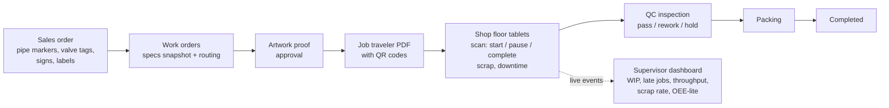

# DMB ProdTrack

> **Practice project.** A production work-order and shop-floor tracking system for a plant that makes safety identification products (pipe markers, valve tags, safety signs, labels). Built by Deo to practise the skills of a Senior Developer role (C#/.NET/SQL, web + mobile, testing, CI/CD with GitHub Actions and Azure DevOps, REST, Scrum, SDLC documentation, mentoring).
> It is **not** affiliated with, endorsed by, or based on the internal systems of DMB Websolutions. All business rules and data are plausible assumptions.

**Status:** Sprints 0-3 implemented plus most of Sprints 4-5: Identity sign-in and roles, user administration, master data, routing editor, sales orders, work orders (release, artwork approval, hold/resume/cancel with reason codes), printable traveler with QR codes, shop-floor PWA with QR scanning and operation execution (start/pause/complete, scrap, QC checklists), live SignalR dashboard, optimistic concurrency (ETag/If-Match), audit trail, CI with Playwright E2E. Product documentation (PDF) is in [`Documentations/`](Documentations/). See the status table in [`docs/05-backlog.md` section 6](docs/05-backlog.md#6-backlog-status-tracking).

**Hosting (final):** the **free MonsterASP.NET plan** - US$0, no credit card - one IIS site at **https://dmb-prodtrack.runasp.net** (planned name, confirm at sign-up) with one 1 GB MSSQL database (EU). Environments: **Local** and **Prod** only. The free plan sleeps after 30 minutes idle, has 256 MB RAM, no email, no backups and needs a manual HTTPS renewal every 90 days - the design and backlog handle each one ([`docs/03`](docs/03-tech-stack-and-cloud.md), [`docs/research/monsterasp.md`](docs/research/monsterasp.md)). Custom domain `prodtrack.dmbwebsolutions.com` is deferred; Azure/Google Cloud are optional documented alternatives.

**Tooling (for now): GitHub** - private repo `deo-bernal/dmb-prodtrack`, **GitHub Projects** board with issues (labels per epic/feature, one milestone per sprint), **GitHub Actions** (`ci`, `deploy`, `ops`) on GitHub-hosted runners (2,000 free minutes/month on private repos), secrets in Actions secrets - see [`docs/11-github-setup.md`](docs/11-github-setup.md). **Azure DevOps** is a documented **Phase 2** migrate/mirror plan ([`docs/04`](docs/04-azure-devops-setup.md), PT-073) and interview refresher ([`docs/10`](docs/10-azure-devops-study-guide.md)).

> **Heads-up:** on a *private* repo, GitHub Free does not enforce branch protection/rulesets, required deployment reviewers or environment secrets. The plan uses a **manual deploy gate** (Deo runs the `deploy` workflow) plus conventions; making the repo public or using GitHub Pro (US$4/month, or via the Student Developer Pack) enables the real protections (`docs/11` section 7).

## What it does



Roles: Admin, Planner, Supervisor, Operator, QC, Viewer. Full audit trail.

## Tech summary

| Area | Choice |
|---|---|
| Runtime | .NET 10 LTS, ASP.NET Core, C# (framework-dependent `win-x86` publish, IIS in-process) |
| UI | Blazor Web App (Interactive Server) for back office; Blazor WebAssembly **PWA** for tablets; .NET MAUI in Phase 2 |
| API | REST (Minimal APIs, OpenAPI/Swagger), SignalR for real-time push (reconnect-aware for the 30-minute sleep) |
| Data | EF Core + SQL Server (local Docker / LocalDB; MonsterASP MSSQL 1 GB in prod); idempotent migration scripts applied by the deploy workflow |
| Files | Local disk `App_Data/files` behind `IFileStorage` (Azure Blob / GCS adapters optional) |
| Auth | ASP.NET Core Identity with roles, admin-created accounts, TOTP 2FA; optional Google sign-in (new billing-free OAuth project); Microsoft Entra ID as a Phase 2 option |
| Tests | xUnit, AwesomeAssertions, NSubstitute, Testcontainers, bUnit, Playwright, k6 |
| Observability | Serilog compact JSON rolling files in `App_Data/logs`, health endpoints, weekly `ops` workflow; OpenTelemetry export optional |
| Hosting | **MonsterASP.NET free plan** (IIS, Let's Encrypt, EU). Optional alternatives (Sprint 8): Azure App Service/Azure SQL (Bicep) or Google Cloud Run (`deployTarget: monsterasp \| azure \| gcp`, default `monsterasp`) |
| ALM / CI/CD | **GitHub:** Projects board, issues + milestones, PRs, Actions (`ci` on ubuntu-latest; `deploy` via Web Deploy from windows-latest, FTP alternative; `ops` weekly), Actions secrets, Dependabot. **Phase 2:** Azure DevOps Boards/Repos/Pipelines on a self-hosted agent, environments + approvals, Wiki, dashboards (Test Plans optional) |

## Getting started

### Prerequisites

- .NET 10 SDK (pinned in `global.json`, `winget install Microsoft.DotNet.SDK.10`)
- SQL Server **LocalDB** (installed with Visual Studio) *or* Docker Desktop for `docker compose up -d sql`
- Optional: Visual Studio 2026 (or 2022 17.14+ with .NET 10 support), VS Code with C# Dev Kit

Tests need neither SQL Server nor Docker (they use SQLite in-memory, [ADR-0010](docs/adr/0010-sqlite-in-memory-for-tests.md)).

### Run locally (command line)

LocalDB (`(localdb)\MSSQLLocalDB`, database `ProdTrack`) is the default; the connection string is in
`src/ProdTrack.Server/appsettings.Development.json`. In **Development** the app applies pending EF Core migrations and
seeds reference data on startup (`Database:MigrateOnStartup=true`), so a plain run works on a clean machine.

```powershell
git clone https://github.com/deo-bernal/dmb-prodtrack.git
cd dmb-prodtrack
dotnet tool restore                      # dotnet-ef, reportgenerator (repo-local tools)
dotnet build ProdTrack.slnx
dotnet test ProdTrack.slnx               # unit + integration + E2E (no SQL Server needed)

dotnet run --project src/ProdTrack.Server --launch-profile https
# https://localhost:5001          back office (sign in)
# https://localhost:5001/floor/   shop-floor PWA (station queue, scan, execute operations)
# https://localhost:5001/swagger  API docs (Development only, sign in first)
# https://localhost:5001/health   readiness (database check); /health/live liveness
```

Stop the app with Ctrl+C.

**Apply migrations manually** (optional - e.g. to inspect the schema before the first run, or with `MigrateOnStartup=false`):

```powershell
dotnet ef database update -p src/ProdTrack.Infrastructure -s src/ProdTrack.Server
```

**Reset the local database** (drops all local data; the next run re-creates and re-seeds it):

```powershell
dotnet ef database drop -f -p src/ProdTrack.Infrastructure -s src/ProdTrack.Server
dotnet ef database update -p src/ProdTrack.Infrastructure -s src/ProdTrack.Server   # or just run the app
```

If LocalDB itself misbehaves: `sqllocaldb stop MSSQLLocalDB` then `sqllocaldb start MSSQLLocalDB`.

**First sign-in (Development only):** on an empty database the app creates the bootstrap admin
`admin@prodtrack.local` with the documented development password `ChangeMe!Dev2026` (from
`appsettings.Development.json`) and asks you to change it. Then create real users under **Admin > Users**.
Demo products and reference data (stations, ASME A13.1 colour schemes, ANSI Z535 signal words, reason codes,
v1 routings, QC checklists) are seeded too.
Prefer your own password: `dotnet user-secrets --project src/ProdTrack.Server set "Auth:BootstrapAdmin:Password" "<12+ chars>"`
before the first run. Outside Development the bootstrap password must come from host configuration.

Optional development user picker (one user per role, no passwords):
`dotnet user-secrets --project src/ProdTrack.Server set "Auth:Mode" "Dev"` (refused outside Development).

**Shop-floor scanning:** open `/floor/`, pick a station, then scan a traveler QR code. Camera scanning uses the browser
`BarcodeDetector` API (Chrome/Edge on Android, ChromeOS, macOS; allow camera access). Where it is not available, type
or paste the code (`WO-2026-000001` or `OP:WO-2026-000001:20`) or use a USB/Bluetooth keyboard-wedge scanner.
Browsers only allow the camera on `https://` or `localhost`.

Using Docker instead of LocalDB: copy `.env.example` to `.env`, set `MSSQL_SA_PASSWORD`, run `docker compose up -d sql`,
then store the connection string with
`dotnet user-secrets --project src/ProdTrack.Server set "ConnectionStrings:ProdTrack" "Server=localhost,1433;Database=ProdTrack;User Id=sa;Password=<pwd>;TrustServerCertificate=True"`.

### Run locally (Visual Studio 2026)

1. Open `ProdTrack.slnx` (File > Open > Project/Solution).
2. Set **ProdTrack.Server** as the startup project, choose the **https** launch profile and press **F5**.
   The database is created, migrated and seeded on first start (Development). Sign in as the bootstrap admin.
3. Test Explorer runs all tests (`Category=Unit|Integration|E2E`, `Story=PT-xxx` traits).
4. Optional: Tools > Command Line > Developer PowerShell for `dotnet ef ...` commands (or Package Manager Console:
   `Update-Database` / `Drop-Database` with default project `ProdTrack.Infrastructure`).

Hot reload is disabled for the WebAssembly shop-floor project (`WasmEnableHotReload=false`) because its reload module
breaks the Server-hosted pages; restart the app after changing `ProdTrack.ShopFloor`.

### End-to-end tests (Playwright)

`tests/ProdTrack.E2E.Tests` starts the app in-process on a free local port (SQLite in-memory, Identity sign-in) and drives
headless Chromium through sign-in, creating and releasing a work order, and running an operation on `/floor`.

```powershell
dotnet test tests/ProdTrack.E2E.Tests          # first run downloads Chromium to %LOCALAPPDATA%\ms-playwright (user-local)
$env:PRODTRACK_E2E_HEADED = "1"                 # optional: watch the browser
```

Failure screenshots go to `%TEMP%\prodtrack-e2e-failures`. Set `PRODTRACK_DOCS_SCREENSHOTS=<folder>` and run
`dotnet test tests/ProdTrack.E2E.Tests --filter "FullyQualifiedName~Capture"` to regenerate the user-guide screenshots.
CI runs the same tests in the `e2e` job (no secrets).

Logs are written as compact JSON to `src/ProdTrack.Server/App_Data/logs/` (and the console in Development);
uploaded artwork goes to `App_Data/files/`. Both folders are git-ignored and never deployed.

## Repository layout

```text
.
├─ README.md                      This file
├─ AGENTS.md                      Instructions for AI coding agents (Cursor, etc.)
├─ .cursor/rules/*.mdc            Cursor project rules (architecture, C#, testing, workflow, docs, pipelines, UI)
├─ .github/                       workflows ci/deploy/ops, dependabot, PR + issue templates, CODEOWNERS
├─ .githooks/pre-push             local guard against pushing to main (git config core.hooksPath .githooks)
├─ deploy/                        app_offline.htm, appsettings.Production.template.json (no secrets)
├─ scripts/create-github-issues.sh  Generated: labels, milestones, issues from the backlog (gh, dry run by default)
├─ Documentations/               Product PDFs (User Guide, Business, Technical) + source/ (HTML, images)
├─ docs/
│  ├─ 00-project-plan.md          Goals, scope, phases, sprints, risks, assumptions, OPEN QUESTIONS
│  ├─ 01-business-requirements.md BRD: processes, personas, FR/NFR, KPIs, glossary
│  ├─ 02-technical-design.md      Architecture, solution structure, ERD, API list, auth, real-time, security, ADRs
│  ├─ 03-tech-stack-and-cloud.md  Technologies, MonsterASP free plan limits and design responses, GitHub/ADO free tiers, costs, portability, Azure/GCP appendix
│  ├─ 04-azure-devops-setup.md    PHASE 2: Azure DevOps setup (Boards import, self-hosted agent, pipeline YAML, Test Plans, Artifacts, Wiki)
│  ├─ 05-backlog.md               Epics > features > stories with Given/When/Then, points, sprints
│  ├─ backlog-github-issues.csv   GitHub issues (Title, Body, Labels, Milestone, Points, Epic, Feature)
│  ├─ backlog.csv                 Azure Boards CSV import, Scrum process (Phase 2)
│  ├─ backlog-agile-process.csv   Same backlog for the Agile process (Phase 2)
│  ├─ 06-testing-strategy.md      Test pyramid, tools, conventions, gates
│  ├─ 07-user-guide.md            Per-role guide for plant staff (screenshot placeholders)
│  ├─ 08-deployment-and-operations.md  MonsterASP setup, deployment, HTTPS renewal, backups, monitoring, troubleshooting, rollback
│  ├─ 09-coding-standards.md      C#/.NET conventions, architecture rules, PR workflow
│  ├─ 10-azure-devops-study-guide.md  Azure DevOps interview refresher (labs in Phase 2 / ADO-Lab)
│  ├─ 11-github-setup.md          GitHub repo, Projects, issue import, secrets, workflows, Free-plan limits, Phase 2 mapping
│  ├─ research/monsterasp.md      MonsterASP free-plan research with sources
│  └─ adr/                        Architecture decision records
├─ src/                           ProdTrack.Domain, .Application, .Infrastructure, .Contracts, .ApiClient,
│                                 .UI.Shared, .ShopFloor (PWA), .Server (API + SignalR + Blazor host)
├─ tests/                         Domain, Application, Infrastructure, Architecture, Server.IntegrationTests,
│                                 TestSupport (SQLite in-memory helpers), E2E.Tests (Playwright)
├─ infra/azure/                   (Sprint 8, optional) Bicep for the Azure alternative
└─ docker-compose.yml             optional local SQL Server (LocalDB works too)
```


## Working on the project with Cursor

1. **Answer the open questions** in [`docs/00-project-plan.md` section 10](docs/00-project-plan.md#10-open-questions-for-deo) (defaults are listed if you skip them) - especially Q3 (private vs public repo). Update the docs if a default changes.
2. **Set up GitHub** following [`docs/11-github-setup.md`](docs/11-github-setup.md): the repo `deo-bernal/dmb-prodtrack` exists with docs, scaffold and code; create the Projects board, then run `scripts/create-github-issues.sh` (dry run first, then `APPLY=1`) to create labels, Sprint 0-8 milestones and the 73 issues.
3. **Set up MonsterASP** following [`docs/08` section 3](docs/08-deployment-and-operations.md): free account, site `dmb-prodtrack`, database, remote access, HTTPS; store the Web Deploy/FTP/DB credentials only as GitHub Actions secrets and in your password manager. Do not touch any `dmbwebsolutions.com` DNS record or the GCP project `find-an-agent`.
4. **Open the repo in Cursor.** The rules in `.cursor/rules/` and `AGENTS.md` load automatically and tell the agent how the project is structured and how to work.
5. **Work story by story.** Prompt pattern:

   ```text
   Implement PT-003 (issue #3) from docs/05-backlog.md.
   Follow AGENTS.md and the Cursor rules. Start with a short plan, then tests, then code.
   Update the docs listed in the Definition of Done.
   ```

   The agent should: read the story and related design sections, propose a plan, create `feature/PT-003-...`, write failing tests from the Given/When/Then, implement, run `dotnet build` / `dotnet test`, update docs, and summarise what changed.
6. **Review like a senior dev:** use the PR template checklist, run the app locally, and merge only through a PR with green `build-test` and `e2e` checks (`Closes #n`). Deploy by running the `deploy` workflow on `main`.
7. **Keep docs as the source of truth.** If the implementation needs to deviate, change the doc (and add an ADR for significant decisions) in the same PR.
8. **Phase 2 (optional):** connect Azure DevOps to the GitHub repo or mirror it (`docs/04` section 12, PT-073) to practise Azure Boards/Pipelines with a self-hosted agent.

## Document status

Planning documents are **v0.3 drafts** dated 2026-09-26 (v0.3 = MonsterASP free hosting + GitHub tooling, Azure DevOps Phase 2); implementation notes and deviations are recorded in the docs' change logs and in [`docs/adr/`](docs/adr/README.md). Free-tier numbers and prices were checked on official pages on that date and must be re-verified before relying on them (links in `docs/03` sources, `docs/11` section 12 and `docs/research/monsterasp.md`).
