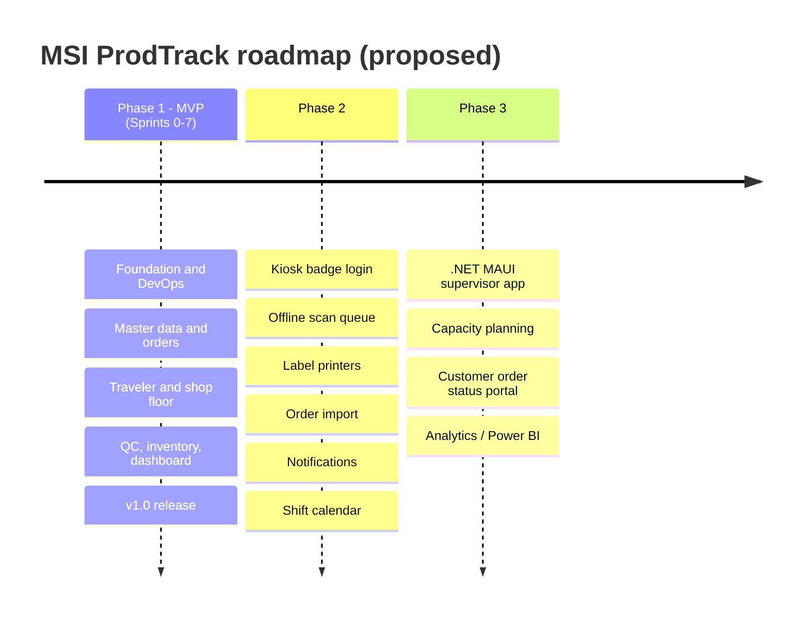

# 00 - Project Plan: MSI ProdTrack

> **Status:** Draft v0.3 (2026-09-26) - practice project.
> **Owner / Product Owner / Developer:** Deo (solo practice project).
> **Disclaimer:** MSI ProdTrack is a *practice application* designed to be plausible for a manufacturer of safety identification products such as Marking Services Inc. (MSI). It is **not** based on any knowledge of MSI's real internal systems, processes, volumes or data. Every business rule here is an assumption made for practice and should be treated as such.
> **Platform decision (final, 2026-09-26, v0.3 - supersedes the Google Cloud primary of v0.2):** MSI ProdTrack is hosted on the **free MonsterASP.NET plan** - **US$0, no credit card**: one IIS site on the free subdomain **`msi-prodtrack.runasp.net`** (planned; confirm availability at sign-up) with one **1 GB MSSQL** database on EU servers. Environments are **Local** (Deo's PC) and **Prod** (MonsterASP) only. The free plan is for learning/testing, which fits this practice project; it sleeps after 30 minutes idle, has 256 MB RAM, no email, no scheduled tasks, no backups, and HTTPS (Let's Encrypt) must be renewed manually every 90 days - the design and backlog handle each of these. **Delivery tooling (2026-09-26 update): GitHub for now** - private repo `deo-bernal/msi-prodtrack`, a **GitHub Projects** board with issues (labels per epic/feature, one milestone per sprint), **GitHub Actions** on GitHub-hosted runners (2,000 free minutes/month on private repos, no card) deploying to MonsterASP with Web Deploy, secrets in Actions secrets (`11-github-setup.md`). **Azure DevOps** remains a learning goal as a documented **Phase 2** migrate/mirror plan (`04`, `10`, PT-073). Note: GitHub Free cannot enforce branch protection or required deployment reviewers on a *private* repo - see `11` section 2 for the manual-deploy gate and the public/Pro options. Sign-in: **ASP.NET Core Identity** (optional Google sign-in). The custom domain **`prodtrack.dmbwebsolutions.com` is deferred** (upgrade path: MonsterASP Premium ~US$1.95/month first year, or Azure for Students; no code change). **Azure and Google Cloud** are optional documented alternatives (`deployTarget: monsterasp | azure | gcp`, default `monsterasp`). Deo's existing site (apex/`www` of dmbwebsolutions.com, GCP project `find-an-agent`) is never touched. Details: `03-tech-stack-and-cloud.md`.

---

## 1. Purpose

Build, end to end and "the professional way", a realistic line-of-business application that exercises the skills in a Senior Developer job description at a marking-products manufacturer:

| JD skill | Where it is practised in this project |
|---|---|
| C# / .NET / SQL in Visual Studio | .NET 10 LTS solution, EF Core + SQL Server (LocalDB/Express or Docker locally, MonsterASP MSSQL in prod) |
| Web and mobile applications | Blazor Web App (supervisor/admin, Interactive Server) + Blazor WebAssembly PWA (tablets); .NET MAUI in Phase 2 |
| REST / RPC APIs | ASP.NET Core Web API with OpenAPI; SignalR (RPC-style hub) for real-time |
| Unit and automated testing | xUnit, assertions library, NSubstitute, Testcontainers, bUnit, Playwright |
| CI/CD (GitHub now, Azure DevOps Phase 2) | GitHub: Projects board, issues/milestones, PR workflow, Actions workflows (`ci`, `deploy`, `ops`) deploying to MonsterASP via Web Deploy (FTP alternative) with EF Core migration scripts, `production` environment, Actions secrets, scheduled ops workflow, Dependabot. Azure DevOps (Phase 2, PT-073, study guide `10`): Boards, Repos branch policies, multi-stage YAML on a self-hosted agent, environments with approvals, variable groups, Artifacts, dashboards, wiki |
| Scrum | 2-week sprints, backlog with Given/When/Then, DoR/DoD, reviews and retros |
| SDLC documentation | This `docs/` set: plan, BRD, technical design, test strategy, user guide, ops runbook |
| Mentoring | Coding standards, AGENTS.md, Cursor rules, PR checklist written as if for a team |

## 2. Product vision

> *For planners, supervisors, operators and QC inspectors in a plant that makes pipe markers, valve tags, safety signs and labels, **MSI ProdTrack** is a work-order and shop-floor tracking system that turns customer orders into routed work orders, lets operators record progress by scanning a job traveler, and gives supervisors a live view of WIP, late jobs, throughput, scrap and OEE-lite. Unlike paper travelers and spreadsheets, it gives real-time, auditable status for every job.*

Working name: **MSI ProdTrack** (solution/namespace: `ProdTrack`). Alternative names if a neutral name is preferred for a public portfolio: *MarkTrack*, *FloorTrace*.

## 3. Goals and success criteria

| # | Goal | Measure of success (for the practice project) |
|---|---|---|
| G1 | Working MVP covering order -> work order -> shop floor -> QC -> dashboard | All MVP stories in `05-backlog.md` Done; demo script in section 8 runs without errors |
| G2 | Professional delivery pipeline | Every change goes through a PR + green `ci` workflow (build, tests, E2E) on GitHub Actions; `main` is deployed to the MonsterASP site by the `deploy` workflow (manual gate on the private Free repo; required reviewer if public/Pro), with migrations and a smoke test; hosting setup and ops (HTTPS renewal, backups) are documented and automated where the free plan allows |
| G3 | Test discipline | Domain + Application line coverage >= 80%; integration tests for every endpoint; E2E for main flows |
| G4 | Documentation that drives development | Docs stay in sync with the code (checked in each PR); an AI agent can pick up any story using only the repo |
| G5 | Zero cost | Everything stays at US$0: MonsterASP free plan, GitHub Free (private repo, 2,000 Actions minutes/month), Azure DevOps free tier in Phase 2 (5 Basic users, 1 self-hosted parallel job); no credit card anywhere (see `03` section 5) |
| G6 | Interview-ready | Deo can explain architecture, trade-offs, pipeline and testing choices using this repo, explains the GitHub Actions setup (`11`) and answers the Azure DevOps questions in `10` confidently |
| G7 | Portability | The same build runs locally, on MonsterASP and (optionally) on Azure or Google Cloud by configuration only; no cloud SDKs in the default build; provider contract tests pass for every storage/secret implementation |

## 4. Scope

### 4.1 In scope (MVP)

- Master data: stations, product catalog with specifications (material, size, color scheme per ASME A13.1, signal word per ANSI Z535, legend text), routings, reason codes, materials.
- Sales order entry (manual) and work order generation, release, hold/resume/cancel.
- Artwork proof upload and approval (gates release).
- Printable job traveler PDF with QR codes; reprint with audit.
- Shop-floor PWA for tablets: station selection, scan (keyboard-wedge scanner or camera), start/pause/resume/complete operations, scrap with reason codes, downtime.
- QC inspection with checklist templates, pass/fail, rework or hold on failure.
- Basic inventory: materials, receipts/adjustments, backflush consumption from a simple bill of materials.
- Supervisor dashboard (live via SignalR): WIP by station, late / at-risk jobs, throughput, scrap rate and Pareto, OEE-lite.
- Authentication with ASP.NET Core Identity (admin-created accounts, lockout, optional TOTP 2FA); roles Admin, Planner, Supervisor, Operator, QC, Viewer; user administration and profiles (employee number, badge); optional Google sign-in (PT-068). Microsoft Entra ID is a Phase 2 option (PT-069, Q3).
- Audit trail of all business data changes; audit viewer.
- GitHub repo, Projects board and issue import (PT-001), CI workflow (PT-002), repository guardrails on GitHub Free (PT-059); CD to the MonsterASP free site with Web Deploy and a manual gate (PT-007) and an FTP alternative + rollback (PT-008); ops runbook and scheduled `ops` workflow for HTTPS renewal check, encrypted database backup export and size watch (PT-067).
- Free-hosting resilience: friendly reconnect and cold-start UX for the 30-minute sleep (PT-072); lean memory for 256 MB.
- Portability: `IFileStorage` / `ISecretProvider` / logging abstractions with Local implementations by default (local disk under `App_Data`, server config, Serilog file); a Docker image for local runs.
- Optional Sprint 8: alternative targets (Azure Bicep, `deployTarget=azure|gcp`; need a subscription) and an Azure Artifacts NuGet feed.

### 4.2 Out of scope for MVP (Phase 2+)

- Shared-tablet kiosk login with badge + PIN (MVP uses personal sign-in).
- Offline operation of the PWA (MVP requires connectivity; shows a clear offline banner).
- .NET MAUI native app.
- Direct printing to industrial label printers; label design.
- ERP / accounting / e-commerce integration; order import.
- Finite capacity scheduling, shift calendars (MVP uses one configurable default shift for OEE-lite).
- Costing, invoicing, shipping carrier integration, customer portal.
- Multi-plant / multi-tenant.
- Email of any kind (password-reset mail, notifications): the free plan has no SMTP; Admins reset passwords.
- Custom domain `prodtrack.dmbwebsolutions.com` and a hosted dev/staging environment (need paid hosting, see `03` section 7).
- Automated validation of marker length / letter height against pipe OD tables of ASME A13.1 (needs licensed standard data).

### 4.3 Phases

## 5. Milestones and sprints

Two-week sprints. Dates below are a **proposal** assuming a start on Monday 5 October 2026 and a holiday break over Christmas/New Year (a major holiday period in the Philippines). Adjust the GitHub milestones (and the `create-github-issues.sh` due dates) to your real availability.

| Iteration | Dates (proposed) | Sprint goal | Points | Milestone |
|---|---|---|---|---|
| Sprint 0 | 2026-10-05 to 2026-10-16 | Foundation: GitHub repo + Projects + issues, CI workflow, repo guardrails, solution skeleton, logging, local environment, MonsterASP account/site/DB | 26 | M0 "Walking skeleton" - app runs locally; the MonsterASP site answers on HTTPS |
| Sprint 1 | 2026-10-19 to 2026-10-30 | Identity sign-in + roles, master data, audit capture, deploy workflow to MonsterASP (Web Deploy) | 26 | First deploy to `msi-prodtrack.runasp.net` |
| Sprint 2 | 2026-11-02 to 2026-11-13 | Routings, sales orders, work orders, release, artwork proofs, ops runbook (HTTPS renewal, backup export) | 26 | M1 "Order to work order" |
| Sprint 3 | 2026-11-16 to 2026-11-27 | Traveler PDF + QR, PWA shell, scanning, user administration, planner list, E2E setup | 26 | |
| Sprint 4 | 2026-11-30 to 2026-12-11 | Operation execution, scrap, holds, materials and consumption | 25 | M2 "Shop floor loop" |
| Break | 2026-12-14 to 2027-01-01 | Holidays / buffer / learning. Keep logging in to MonsterASP; the first HTTPS renewal falls around early January if the certificate was issued in early October | - | |
| Sprint 5 | 2027-01-04 to 2027-01-15 | QC + rework, live dashboard, friendly reconnect / cold-start UX | 25 | |
| Sprint 6 | 2027-01-18 to 2027-01-29 | Downtime, OEE-lite, timeline, audit viewer, reprint, FTP deploy alternative + rollback rehearsal | 19 | M3 "Feature complete" |
| Sprint 7 | 2027-02-01 to 2027-02-12 | Hardening, release gate, performance/security checks, manual regression run (GitHub test-run issue), optional Google sign-in, portability check, docs, v1.0 | 22 | M4 "MVP v1.0 on MonsterASP" |
| Sprint 8 (optional) | 2027-02-15 to 2027-02-26 | Alternative targets (Azure Bicep, `deployTarget=azure|gcp`), GitHub Packages NuGet feed | 12 | M5 "Multi-target" (optional) |

Total MVP: **195 points / 61 stories (+ 12 optional points in Sprint 8)**, about 16 weeks of part-time work. Detailed stories and acceptance criteria: [`05-backlog.md`](05-backlog.md).

**No trial clock:** unlike the v0.2 Google Cloud trial, the free MonsterASP plan has no end date, so the whole MVP runs on it. Recurring chores instead: HTTPS renewal every 90 days, regular control-panel logins (inactivity deletion risk), weekly backup export (PT-067).

Note on dates: Philippine public holidays in this window (for example All Saints' Day, Bonifacio Day, Immaculate Conception) can reduce capacity; check the official proclamation for 2026/2027 and adjust.

### 5.1 Scrum cadence (solo adaptation)

| Event | When | Timebox | Output |
|---|---|---|---|
| Sprint Planning | Day 1 | 1 h | Sprint goal, select issues into the sprint milestone, tasks as checklists on the GitHub Projects board |
| Daily Scrum | Each working day | 5 min | Short note as a comment on the sprint tracking issue (or `docs/sprints/`) |
| Backlog refinement | Mid-sprint | 30-45 min | Next sprint's stories meet DoR |
| Sprint Review | Last day | 30 min | Demo recording / notes, increment deployed to prod (MonsterASP) |
| Retrospective | Last day | 15-30 min | 1-2 improvement actions added as tasks |

## 6. Deliverables

| Deliverable | Location |
|---|---|
| Planning and design documents | `docs/00`-`09`, GitHub setup `docs/11-github-setup.md`; Azure DevOps (Phase 2) setup `docs/04` and interview refresher `docs/10-azure-devops-study-guide.md` |
| Backlog (markdown, GitHub issues CSV + script, CSVs for Azure Boards in Phase 2) | `docs/05-backlog.md`, `docs/backlog-github-issues.csv`, `repo-scaffold/scripts/create-github-issues.sh`, `docs/backlog.csv`, `docs/backlog-agile-process.csv` |
| AI agent guidance | `AGENTS.md`, `.cursor/rules/*.mdc` |
| Source code (to be written with Cursor) | `src/`, `tests/` |
| Hosting setup and ops | Runbooks in `docs/08` (MonsterASP has no IaC API); `infra/azure/` (Bicep) only if the optional Azure target is activated |
| CI/CD workflows and repo scaffold | `.github/workflows/ci.yml`, `deploy.yml`, `ops.yml`, `scripts/create-github-issues.sh` (ready-to-commit in `repo-scaffold/`); Phase 2: `azure-pipelines.yml`, `pipelines/` (`04` section 10) |
| Local containers | `docker-compose.yml` (SQL Server), optional `src/ProdTrack.Server/Dockerfile` (portability check) |
| Release notes | `docs/releases/` (created at first release) |

## 7. Risks

| # | Risk | Likelihood | Impact | Mitigation |
|---|---|---|---|---|
| R1 | Free plan is best-effort: no SLA, no backups, may be limited/suspended/discontinued without notice; free accounts may be deleted after an unpublished period of inactivity | Medium | High | Weekly encrypted bacpac + files export as GitHub Actions artifacts, downloaded monthly to Deo's PC (PT-067); regular panel logins; code, config and runbooks in Git so a rebuild takes hours; restore drill before v1.0 |
| R2 | App pool sleeps after 30 min idle: cold starts and dropped Blazor circuits/SignalR connections | High | Medium | Auto-reconnect + friendly reconnect/cold-start UI (PT-072); smoke test with retries; accepted for a practice app; no keep-alive pings (fair use) |
| R3 | 256 MB RAM limit causes recycles under load | Medium | Medium | Framework-dependent win-x86 publish, Workstation GC, OpenTelemetry off by default, bounded caches and circuit retention; measure (PT-006, PT-051) |
| R4 | Scope creep (MES is a huge domain) | High | High | Strict MVP list; alternative targets isolated in optional Sprint 8; Phase 2 backlog for everything else |
| R5 | Part-time availability, interview schedule | Medium | Medium | Velocity-based planning; buffer in Sprints 6-7; holiday break |
| R6 | Manual Let's Encrypt renewal every 90 days is forgotten -> expired certificate, WebSockets fail | Medium | Medium | Weekly cert-expiry check workflow failing at < 21 days, calendar reminder, runbook (PT-067, `08` section 6) |
| R7 | Mistakes affecting the live site www.dmbwebsolutions.com or project `find-an-agent` (DNS edits, shared OAuth client) | Low | High | No DNS changes at all in the MVP (custom domain deferred); Google sign-in uses a new billing-free project; rules in AGENTS.md and `.cursor/rules` |
| R8 | Portability abstractions add complexity | Medium | Medium | Abstract only file storage, secrets and telemetry export; SQL Server everywhere; Local implementations by default; contract tests |
| R9 | GitHub Free limits on a private repo: no branch protection/rulesets and no required deployment reviewers or environment secrets; 2,000 Actions minutes/month (Windows jobs may count more); scheduled workflows pause after 60 days of inactivity. (Phase 2: Azure DevOps hosted grant needs billing, so a self-hosted agent.) | Medium | Medium | Manual `deploy` dispatch as the gate, deploy refuses non-`ci` builds, documented merge discipline and a local pre-push hook; option to make the repo public or use GitHub Pro/Student Pack (`11` section 7.2); minutes budget ~1,300/month (`11` section 8); manual fallback deploy (`08` section 5.2) |
| R10 | Shared tablets vs personal sign-in is unrealistic for a real floor | High | Low (practice) | Documented limitation; kiosk mode story PT-060 in Phase 2 |
| R11 | Third-party library licensing changes (FluentAssertions v8+, MediatR v13+, AutoMapper, QuestPDF thresholds) | Medium | Low | Licensing notes in `03`; prefer permissive alternatives |
| R12 | Standards data (ASME A13.1, ANSI Z535) are copyrighted, paid documents | Medium | Low | Seed only widely published high-level values; verify before real use |
| R13 | AI-generated code drifts from the design | Medium | Medium | Cursor rules, AGENTS.md, architecture tests, PR checklist, story-by-story workflow |
| R14 | EU (Germany) servers: roughly 200+ ms round trip from the Philippines (unverified) makes scans and live updates feel slower | High | Low | Measure in PT-051 and report server time separately; keep payloads small; acceptable for practice; Azure/GCP in Asia is the upgrade path |
| R15 | ToS: free plan only for learning/testing; one account per person; fair-use limits (1 GB DB, bandwidth) | Low | Medium | Fictional data only, no commercial use, no second account; DB size watch (`08` section 7.4) |
| R16 | Remote SQL access or FTPS behaviour on the free plan differs from the docs (unverified) | Medium | Medium | Verify in PT-055; fallbacks: migrate on startup behind a flag, web SQL manager for backups, SFTP/FTP options |

## 8. MVP demo script (acceptance of the whole release)

1. Planner signs in, creates sales order SO-2027-00001 for "Acme Refinery" with a pipe-marker line (Flammable, black on yellow, legend "NATURAL GAS", 100 pcs) and a valve-tag line.
2. Planner creates work orders, uploads an artwork proof, approves it and releases the work order; prints the traveler.
3. Operator at PRINT-01 tablet scans the operation QR, starts, logs 2 scrap (MISPRINT), completes with 98 good.
4. Supervisor dashboard shows the WIP tile update live, scrap rate change and the job moving to LAM-01.
5. Operations continue to QC; QC inspector records a pass; packing completes; work order is Completed.
6. Supervisor views OEE-lite, the work order timeline and the audit log.
7. Show the GitHub Actions runs (`ci`: tests, coverage, E2E, migration script; `deploy`: manual run, Web Deploy with `app_offline`, smoke test) with the result on `https://msi-prodtrack.runasp.net`; show the weekly `ops` workflow, the GitHub Projects board and sprint milestone progress. Mention that the first request may take a few seconds (free-plan cold start).

## 9. Assumptions

- A1. One plant, one time zone (Asia/Manila, UTC+8), English UI. All timestamps stored in UTC.
- A2. Plant has Wi-Fi coverage at stations; tablets are Android or Windows with Chrome/Edge; USB/Bluetooth keyboard-wedge barcode scanners are available (camera scanning as fallback).
- A3. One work order per sales order line; quantities in pieces (each).
- A4. Routings are defined per product type (optionally overridden per product); linear sequence, no parallel branches in MVP.
- A5. Operators are identified by their own ProdTrack (ASP.NET Core Identity) account in MVP, created by an Admin.
- A6. Volumes for sizing (practice guess, not MSI data): up to 200 open work orders, 30 tablets, 10 dashboard users, ~5,000 operation events per day.
- A7. Deo develops on Windows with Visual Studio 2026 (recommended for .NET 10 development) and/or Cursor, with SQL Server LocalDB/Express or Docker Desktop available for the local database and Testcontainers.
- A9. Hosting: MonsterASP.NET free plan (one site, one 1 GB MSSQL DB, EU), Azure/GCP only as optional alternatives; CI/CD is GitHub Actions on GitHub-hosted runners; the GitHub repo `deo-bernal/msi-prodtrack` is the source of truth. Azure DevOps is Phase 2 (PT-073: Azure Pipelines GitHub App or a one-way mirror, self-hosted agent).
- A10. MonsterASP free-plan terms and limits as published on 2026-09-26 (`03` section 3.3, `research/monsterasp.md`); re-check at sign-up. Only fictional/sample data is used (the free plan forbids production and commercial use).
- A11. No DNS change is needed for the MVP. If the custom domain is activated later (paid), Deo adds a single CNAME at the registrar himself.
- A8. .NET 10 is the current LTS (supported until November 2028 per Microsoft's support policy). .NET 8 LTS, mentioned in the brief, reaches end of support on 10 November 2026, so a new project should target .NET 10.

## 10. Open questions for Deo

| # | Question | Why it matters | Default if no answer |
|---|---|---|---|
| Q1 | Is **`msi-prodtrack.runasp.net`** available at sign-up? If not, which name (e.g. `msiprodtrack`, `prodtrack-deo`)? | URLs in docs, OAuth redirect URIs, GitHub variable `APP_URL` | First available of those three; update `APP_URL` and docs |
| Q2 | Does **remote SQL access** (Databases > "Users and remote") work on the **free** plan so the deploy/ops workflows and SSMS can reach the DB? (Docs imply yes, not stated explicitly.) | Workflow migrations, bacpac backups, SSMS | Assume yes; fallback: migrate on startup behind a flag + web SQL manager (`08` section 3) |
| Q3 | Keep the GitHub repo **private** (branch protection and deployment reviewers cannot be enforced on GitHub Free) or make it **public** / use **GitHub Pro** (US$4/month, or free with the Student Developer Pack if eligible) to enable them? | PT-059, PT-007 deploy gate | Private + manual deploy gate; revisit before v1.0 |
| Q4 | Is it acceptable to keep the name "MSI ProdTrack" on a public `runasp.net` URL and in repos, or should it be neutral (e.g. "MarkTrack")? | Avoids implying an affiliation with MSI | Keep repos private; neutral display name on the public site (and sign-in required anyway) |
| Q5 | Phase 2: connect Azure DevOps via the *Azure Pipelines* GitHub App (no mirror) or a one-way mirror to Azure Repos; where should the self-hosted agent run (box or your Windows PC)? | PT-073 | GitHub App option; Linux agent on the box |
| Q6 | Blazor for the UI is proposed (`02` section 3). Prefer Razor Pages/MVC or an Angular/React front end? | UI technology choice | Blazor Web App + Blazor WASM PWA |
| Q7 | How many hours per week can you commit? | Velocity and dates | 15-20 hours/week, ~24 points/sprint |
| Q8 | Is the **EU latency** (~200+ ms from PH, unverified) and the **30-minute sleep** acceptable for demos, or should we plan the paid upgrade earlier? | UX and demo quality | Accept for practice; measure in PT-051 |
| Q9 | When (if ever) to activate the **custom domain** `prodtrack.dmbwebsolutions.com`: MonsterASP Premium (~US$1.95/month first year, then ~US$2.50, billed annually) or Azure for Students? | Cost vs professional URL | Deferred; no DNS change |
| Q10 | Load testing tool: k6 (free, local) or a paid service? | PT-051 | k6, small loads only (fair use) |
| Q11 | Assertion library given FluentAssertions v8's commercial licence: FluentAssertions (free for non-commercial use), AwesomeAssertions (Apache 2.0 fork) or Shouldly? | Licensing hygiene | AwesomeAssertions |
| Q12 | Include the shared-tablet kiosk login in the MVP instead of personal sign-in? | Realism vs complexity | No, Phase 2 (PT-060) |
| Q13 | Does the MonsterASP panel offer **environment variables** for the site, and does **self-contained** publish work? (Both unverified.) | Secrets handling, deploy size | Server-only `appsettings.Production.json`; framework-dependent publish |
| Q14 | Enable **Google sign-in** (PT-068) at all? It needs a new OAuth client in a new billing-free Google Cloud project (separate from `find-an-agent`) | Scope | Yes in Sprint 7, Testing mode with listed test users |
| Q15 | Do you qualify for **Azure for Students** (US$100, 12 months, no card; full-time student at an accredited institution)? | Unlocks the Azure alternative (Sprint 8), custom domain, Entra | Assume no; Sprint 8 stays optional |
| Q16 | Phase 2 only: start the Azure **Test Plans 30-day trial** (Basic + Test Plans is paid afterwards and billing needs an Azure subscription)? | PT-073 | Optional; MVP uses the GitHub test-run issue (PT-070) |
| Q17 | Microsoft **Entra ID**: can your Azure DevOps / Microsoft account directory create **app registrations without an Azure subscription**? (Unverified.) | Phase 2 Entra option (PT-069) | ASP.NET Core Identity |

## 11. Governance and document control

- Every document has a status line and a change log section at the end.
- Docs change in the same PR as the code that changes behaviour (enforced by the PR template checklist and `.cursor/rules/50-docs-maintenance.mdc`).
- Decisions with real trade-offs are recorded as ADRs in `docs/adr/NNNN-title.md` (template in `02` section 17).

## 12. Change log

| Date | Version | Change |
|---|---|---|
| 2026-09-26 | 0.1 | Initial plan |
| 2026-09-26 | 0.2 | Final platform decision: Google Cloud primary (free trial, project `msi-prodtrack`, custom subdomains), Azure alternative; Identity auth; trial timeline; new risks and open questions; study guide `10` |
| 2026-09-26 | 0.3 | **Final hosting decision: MonsterASP.NET free plan** (US$0, no card, `msi-prodtrack.runasp.net`, Local + Prod only, self-hosted Azure DevOps agent). Banner, JD mapping, goals G2/G5/G7, scope (no email, custom domain deferred), sprint table (61 stories / 195 points), risks R1-R16 and open questions Q1-Q17 rewritten; Google Cloud trial content removed |
| 2026-09-26 | 0.3b | **GitHub is the delivery tooling for now** (private repo `deo-bernal/msi-prodtrack`, Projects + issues/milestones, Actions `ci`/`deploy`/`ops`, Actions secrets; doc `11`); Azure DevOps becomes Phase 2 (PT-073, docs `04`/`10`). Banner, JD row, G2/G5/G6, scope, sprint goals, cadence, deliverables, R1/R6/R9 (GitHub Free private-repo limits), demo step 7, A9, Q3/Q5/Q16 updated |
