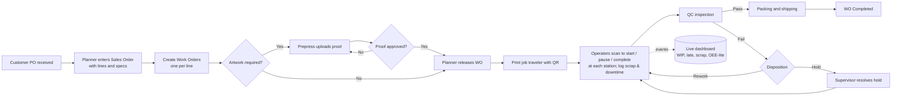
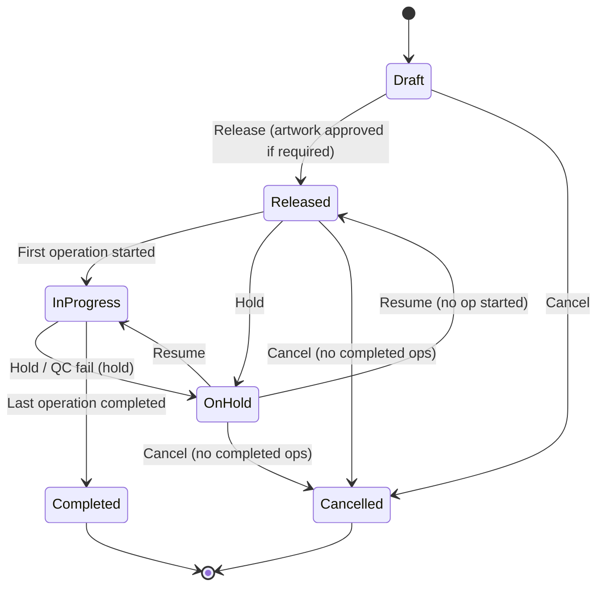
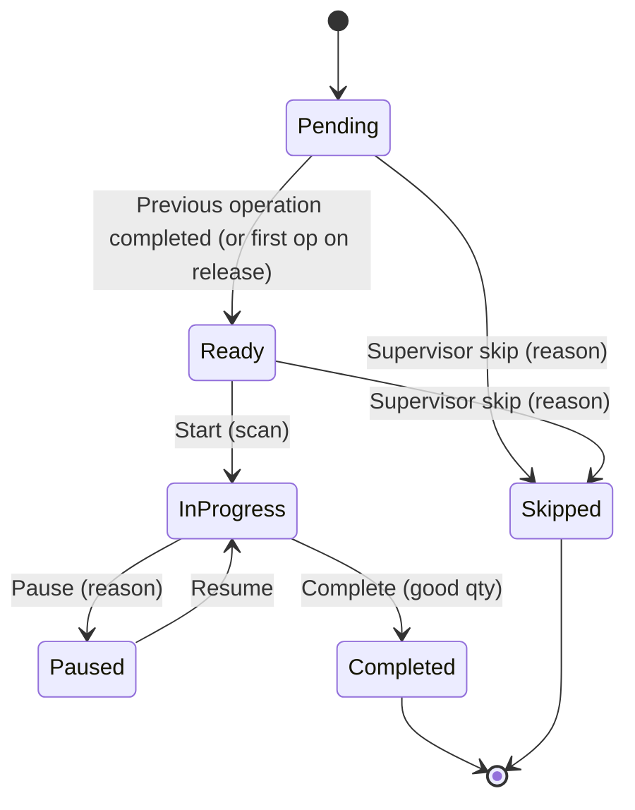

# 01 - Business Requirements Document (BRD)

> **Status:** Draft v0.3 (2026-09-26) - practice project.
> **Disclaimer:** This BRD describes a *plausible* plant that manufactures safety identification products (pipe markers, valve tags, safety signs, labels). It does not describe Marking Services Inc.'s actual processes, systems or data. Standards references (ASME A13.1, ANSI Z535) are summarised at a high level only and must be verified against the current published editions before any real use.

---

## 1. Background and problem statement

A marking-products plant produces many small, highly customised orders: a single customer order can contain hundreds of different pipe-marker legends, engraved valve tags with unique numbers, and safety signs in several sizes and materials, often for oil & gas, offshore and power-generation projects with strict deadlines and documentation needs.

In the assumed "as-is" situation:

- Orders are re-keyed from sales documents into spreadsheets; work instructions travel on paper.
- Supervisors walk the floor to find out where a job is; WIP per station is unknown until someone counts.
- Late jobs are discovered late; customers ask "where is my order?" and nobody can answer quickly.
- Scrap is written on paper (if at all), so the main causes (misprint, wrong color, lamination bubbles, engraving errors) are not measured.
- QC results are stored on paper forms, making traceability for demanding customers (e.g. offshore projects) slow.
- Material usage is estimated; stock-outs of specific vinyl colors or metal blanks stop production.

**Problem:** lack of real-time, reliable, auditable information about production status, quality and material usage.

**Proposed solution:** MSI ProdTrack, a web + tablet application to plan work orders, track them through stations by scanning a job traveler, record scrap/QC/material usage, and show live KPIs.

## 2. Business objectives

| ID | Objective | Target (illustrative, for practice) |
|---|---|---|
| BO1 | Real-time visibility of every work order's location and status | Status available within 5 seconds of an event |
| BO2 | Improve on-time delivery | Late jobs identified at least 1 working day before due date (at-risk list) |
| BO3 | Reduce scrap through measurement | Scrap captured with a reason code for 100% of scrapped units |
| BO4 | Faster, paperless QC traceability | Any work order's QC record retrievable in under 1 minute |
| BO5 | Reduce data entry | Operators never type a work order number (scan only) |
| BO6 | Better material availability | Low-stock alert when on-hand falls below reorder point |

## 3. Stakeholders

| Stakeholder | Interest | Involvement |
|---|---|---|
| Plant Manager | Throughput, on-time delivery, cost | Sponsor; reviews KPIs |
| Production Planner | Order entry, releasing work, schedule | Primary user (Web) |
| Production Supervisor | WIP, bottlenecks, holds, people | Primary user (Web dashboard, tablet) |
| Machine Operator | Clear job queue, easy recording | Primary user (tablet PWA) |
| Prepress / Artwork staff | Proofs and approvals | User (Web) |
| QC Inspector | Inspections, holds, rework | Primary user (tablet/Web) |
| Shipping / Packing | Knowing what is complete | User (tablet) |
| Customer Service / Sales | Order status for customers | Viewer |
| IT / System Admin | Security, users, availability | Admin |
| Customers (indirect) | On-time, correct, compliant product | Indirect |

## 4. Personas

| Persona | Role in app | Goals | Pain points | Device |
|---|---|---|---|---|
| **Ana, Production Planner** | Planner | Turn orders into correct jobs fast; know what is late | Re-typing specs; chasing artwork approvals | Desktop, Web |
| **Ramon, Shift Supervisor** | Supervisor | Keep all stations busy; handle problems | Walking the floor to find jobs; no scrap data | Laptop + phone/tablet |
| **Jomar, Printer Operator** | Operator | Know the next job; record work without fuss | Paper forms; unclear priorities; gloves and dust | Shared tablet at station + scanner |
| **Liza, QC Inspector** | QC | Consistent inspections; stop bad product | Paper checklists; no link to job history | Tablet at QC table |
| **Mark, IT Administrator** | Admin | Secure, reliable system; easy user management | Many spreadsheets, no audit trail | Desktop |
| **Carla, Customer Service** | Viewer | Answer "where is my order?" | Has to phone the floor | Desktop |

## 5. Business context: products and processes (assumed)

### 5.1 Product families

| Family | Typical specs captured | Typical processes |
|---|---|---|
| **Pipe markers** | Pipe outside diameter range, marker length, letter height, legend text, flow arrow (direction / double), color scheme per ASME A13.1 (e.g. Flammable fluids: black on yellow), material (vinyl self-adhesive, polyester, coiled/snap-on plastic, aluminum), UV/chemical resistance, mounting (adhesive, strap, snap-around) | Prepress, digital/screen print, laminate, die-cut or cut-to-length, QC, pack |
| **Valve tags** | Shape (round, square, rectangle), diameter/size, material (brass, stainless steel, aluminum, engraved plastic laminate), thickness, hole size and count, text/numbering sequence, fill color | Prepress, engrave (laser/rotary) or emboss/stamp, deburr/finish, QC, pack |
| **Safety signs** | Size, material (aluminum, plastic, vinyl, photoluminescent, reflective), signal word and header color per ANSI Z535 (DANGER, WARNING, CAUTION, NOTICE, SAFETY INSTRUCTIONS), symbol, message, language, mounting holes, corners | Prepress, print, laminate, cut/rout, QC, pack |
| **Labels** | Size, material, adhesive, finish, sequence/barcode data, quantity per roll/sheet | Prepress, print, laminate, die-cut, QC, pack |

### 5.2 Stations (seed data)

| Code | Station | Type | Notes |
|---|---|---|---|
| PREPRESS | Prepress / artwork | Prepress | Artwork proof preparation and approval |
| PRINT-01 | Digital printing | Printing | Wide-format / UV printer |
| LAM-01 | Laminating | Laminating | Over-laminate for durability |
| ENGRAVE-01 | Engraving | Engraving | Laser / rotary engraving of tags |
| DIECUT-01 | Die-cutting / cutting | Cutting | Die-cut, plotter cut, cut-to-length |
| QC-01 | Quality control | Inspection | Checklist and measurements |
| PACK-01 | Packing and shipping | Packing | Count, bag/box, label, ship |

### 5.3 Default routings (seed data)

| Product type | Sequence (operation number: station) |
|---|---|
| Pipe marker (printed) | 10 PREPRESS, 20 PRINT-01, 30 LAM-01, 40 DIECUT-01, 50 QC-01, 60 PACK-01 |
| Valve tag (engraved) | 10 PREPRESS, 20 ENGRAVE-01, 30 QC-01, 40 PACK-01 |
| Safety sign | 10 PREPRESS, 20 PRINT-01, 30 LAM-01, 40 DIECUT-01, 50 QC-01, 60 PACK-01 |
| Label | 10 PREPRESS, 20 PRINT-01, 30 LAM-01, 40 DIECUT-01, 50 QC-01, 60 PACK-01 |

### 5.4 To-be end-to-end process

### 5.5 Work order lifecycle

### 5.6 Operation lifecycle

## 6. Functional requirements

Priority uses MoSCoW (M = Must for MVP, S = Should, C = Could, W = Won't in MVP). Story keys refer to `05-backlog.md`.

### 6.1 Security and users

| ID | Requirement | Priority | Stories |
|---|---|---|---|
| FR-SEC-01 | Users sign in with an account created by an Admin (ASP.NET Core Identity: email + password, lockout, optional authenticator-app 2FA); no self-registration | M | PT-009, PT-011 |
| FR-SEC-01a | Users may optionally sign in with Google if their Google email matches an existing account | S | PT-068 |
| FR-SEC-01b | Microsoft Entra ID sign-in as an alternative mode for Microsoft-centric plants | W (Phase 2) | PT-069 |
| FR-SEC-02 | Access controlled by roles: Admin, Planner, Supervisor, Operator, QC, Viewer (role matrix in section 6.10) | M | PT-010 |
| FR-SEC-03 | Admins create, deactivate and reset users (set a temporary password; no password-reset email because the free hosting has no SMTP), assign roles, and maintain employee number, badge code, home station | M | PT-012 |
| FR-SEC-04 | Kiosk mode with badge + PIN on shared tablets | W (Phase 2) | PT-060 |
| FR-SEC-05 | Users are told clearly when the connection drops or the site is waking up, and the app reconnects automatically without losing their place | M | PT-072 |

### 6.2 Master data

| ID | Requirement | Priority | Stories |
|---|---|---|---|
| FR-MD-01 | Maintain stations (code, name, type, active) | M | PT-013 |
| FR-MD-02 | Maintain versioned routings per product type (sequence, station, setup minutes, standard minutes per unit, overlap allowed flag) | M | PT-014 |
| FR-MD-03 | Maintain product catalog with type-specific specification fields and simple BOM (material per unit per operation) | M | PT-015, PT-040 |
| FR-MD-04 | Reference lists: ASME A13.1 color schemes, ANSI Z535 signal words, materials, mounting types | M | PT-016 |
| FR-MD-05 | Maintain reason codes by category: Scrap, Pause, Downtime, Hold, Adjustment | M | PT-017 |

### 6.3 Orders and work orders

| ID | Requirement | Priority | Stories |
|---|---|---|---|
| FR-WO-01 | Enter sales orders: customer, customer PO, order date, due date, lines with product, specs overrides, legend text, quantity | M | PT-018 |
| FR-WO-02 | Create one work order per sales order line, copying specs (snapshot), quantity, due date, priority | M | PT-019 |
| FR-WO-03 | Release work order: generate operations from the current routing version; first operation Ready | M | PT-020 |
| FR-WO-04 | Block release if artwork is required and no approved proof exists | M | PT-020, PT-024 |
| FR-WO-05 | Hold / resume / cancel with reason; held work cannot be started | M | PT-022 |
| FR-WO-06 | Search and filter work orders; late flag | M | PT-021 |
| FR-WO-07 | Work order timeline of all events | S | PT-044 |
| FR-WO-08 | Import orders from CSV/ERP | W | PT-064 |

### 6.4 Artwork

| ID | Requirement | Priority | Stories |
|---|---|---|---|
| FR-ART-01 | Upload versioned proofs (PDF, PNG, JPG, SVG; max 20 MB) stored in blob storage | M | PT-023 |
| FR-ART-02 | Approve/reject proofs with note, user, timestamp | M | PT-024 |

### 6.5 Job traveler

| ID | Requirement | Priority | Stories |
|---|---|---|---|
| FR-TRV-01 | Generate a PDF traveler: WO header QR, customer, due date, product, specs, legend, quantity, routing table with one QR per operation, notes | M | PT-025 |
| FR-TRV-02 | Reprints are numbered and audited | M | PT-026 |

### 6.6 Shop floor execution

| ID | Requirement | Priority | Stories |
|---|---|---|---|
| FR-SF-01 | Installable PWA optimised for 10-inch tablets, large touch targets (min 48 px), high contrast | M | PT-027 |
| FR-SF-02 | Scan input via keyboard-wedge scanner (focused input + Enter) and camera | M | PT-028 |
| FR-SF-03 | Station queue of Ready/In Progress/Paused operations sorted by priority then due date, updated live | M | PT-030 |
| FR-SF-04 | Start, pause (reason), resume, complete (good qty) operations; server time is authoritative | M | PT-031-PT-033 |
| FR-SF-05 | Enforce station match, sequence (unless overlap allowed), and hold status | M | PT-031 |
| FR-SF-06 | Log scrap quantity with reason code, optional note/photo | M | PT-034 |
| FR-SF-07 | Log station downtime start/stop with reason | M | PT-045 |
| FR-SF-08 | Offline queue | W | PT-061 |

### 6.7 Quality

| ID | Requirement | Priority | Stories |
|---|---|---|---|
| FR-QC-01 | Checklist templates per product type; items are pass/fail or measured with min/max tolerance | M | PT-035 |
| FR-QC-02 | Record inspection with sample size, item results, inspector, time; out-of-tolerance auto-fail | M | PT-036 |
| FR-QC-03 | Failed inspection disposition: rework at a chosen station (adds operations) or hold | M | PT-037 |

### 6.8 Materials

| ID | Requirement | Priority | Stories |
|---|---|---|---|
| FR-INV-01 | Maintain materials (SKU, name, UoM, on-hand, reorder point) | M | PT-038 |
| FR-INV-02 | Receipts and adjustments with reason; negative stock only by Admin | M | PT-039 |
| FR-INV-03 | Backflush consumption on operation completion from BOM, editable before confirm | M | PT-040 |
| FR-INV-04 | Low-stock alert on dashboard | S | PT-049 |

### 6.9 Dashboard and reporting

| ID | Requirement | Priority | Stories |
|---|---|---|---|
| FR-DB-01 | Live WIP by station (counts and units per status), station Down indicator | M | PT-041, PT-045 |
| FR-DB-02 | Late and at-risk work orders | M | PT-042 |
| FR-DB-03 | Throughput and scrap rate by station/reason/period; scrap Pareto | M | PT-043 |
| FR-DB-04 | OEE-lite per station per shift | S | PT-046 |
| FR-DB-05 | Export KPI tables to CSV | C | - |

### 6.10 Role matrix

Legend: **F** full (create/update/delete), **E** execute (record shop-floor events), **R** read, **-** none.

| Capability | Admin | Planner | Supervisor | Operator | QC | Viewer |
|---|---|---|---|---|---|---|
| Stations, reason codes, reference data | F | R | R | R | R | R |
| Products, routings, BOM | F | F | R | R | R | R |
| QC checklist templates | F | R | R | - | F | R |
| Sales orders, work orders (create/release) | F | F | R | R | R | R |
| Hold / resume / cancel work order | F | F | F | - | Hold only | - |
| Artwork upload | F | F | R | E (Prepress operators) | R | R |
| Artwork approve/reject | F | F | - | - | - | - |
| Print / reprint traveler | F | F | F | - | - | - |
| Start/pause/complete operations, scrap, downtime | F | - | E | E | E (QC ops) | - |
| Skip operation, allow overlap | F | - | F | - | - | - |
| QC inspection and disposition | F | - | R | - | E | R |
| Materials, receipts, adjustments | F | F | R | - | - | R |
| Dashboard and KPIs | R | R | R | R (own station) | R | R |
| User profiles | F | - | R | - | - | - |
| Audit log viewer | R | - | R | - | R | - |

### 6.11 Audit

| ID | Requirement | Priority | Stories |
|---|---|---|---|
| FR-AUD-01 | Automatically record create/update/delete of business entities with user, UTC time, old/new values, correlation ID | M | PT-047 |
| FR-AUD-02 | Audit records are append-only | M | PT-047 |
| FR-AUD-03 | Search audit log by entity, key, user, date range | M | PT-048 |

## 7. Business rules

| ID | Rule |
|---|---|
| BR-01 | Work order number format `WO-{yyyy}-{nnnnnn}`; sales order `SO-{yyyy}-{nnnnn}`; sequences reset yearly. |
| BR-02 | Specs are **snapshotted** onto the work order at creation; later catalog changes do not alter existing work orders. |
| BR-03 | An operation can be started only at its routed station, only when Ready, and only if the work order is Released/In Progress (not On Hold/Cancelled). |
| BR-04 | An operation becomes Ready when the previous operation is Completed or Skipped. If the routing step allows overlap, it becomes Ready as soon as the previous one starts. |
| BR-05 | Input quantity of operation n = good quantity of operation n-1 (first operation = work order quantity). Good + scrap cannot exceed input quantity. |
| BR-06 | A work order is Completed when its last operation is Completed. Completed quantity = good quantity of the last operation. Short quantity is shown if lower than ordered. |
| BR-07 | Server UTC time is authoritative for all events; client clocks are ignored. Display in plant time zone (Asia/Manila). |
| BR-08 | Pause time is excluded from run time. An operation cannot remain Paused across a shift end without a supervisor note (Phase 2 enforcement; MVP shows a warning). |
| BR-09 | Scrap requires a reason code; downtime requires a reason code. |
| BR-10 | QC measured items outside [min, max] fail automatically. A failed inspection requires a disposition (Rework or Hold). |
| BR-11 | Artwork required = product type is not Label with stock artwork (configurable flag `RequiresArtworkApproval` on product). |
| BR-12 | Only one proof version per work order can be Approved; approving a new version supersedes the old one. |
| BR-13 | Backflush quantity = BOM quantity per unit x (good + scrap) of the operation. |
| BR-14 | Cancelling is allowed only when no operation is Completed. |
| BR-15 | Color scheme values for pipe markers come from the ASME A13.1 reference list; free text is not allowed for color scheme. |

## 8. Non-functional requirements

| ID | Category | Requirement |
|---|---|---|
| NFR-01 | Performance | Server-side p95 < 500 ms for scan/start/complete under 30 concurrent tablets and 10 dashboards on the warm free site (PT-051); network round trip from the Philippines to the EU servers is measured and reported separately; the first request after the 30-minute sleep (cold start) may take several seconds |
| NFR-02 | Real-time | Dashboard and queue update within 2 seconds of an event |
| NFR-03 | Availability | Practice target: best effort on the free MonsterASP plan (no SLA, sleeps after 30 min idle); design supports higher availability on paid hosting (health checks, stateless apps, auto-reconnect) |
| NFR-04 | Security | ASP.NET Core Identity (lockout, strong passwords, TOTP 2FA required for Admin in prod); HTTPS only (Let's Encrypt on the free subdomain, renewed every 90 days); least-privilege roles; secrets never in the repo: server-only configuration on the host and secret variables in Azure DevOps (Key Vault / Secret Manager only on the optional alternatives); OWASP Top 10 reviewed |
| NFR-05 | Auditability | All business data changes audited and immutable (FR-AUD) |
| NFR-06 | Usability | Shop-floor screens usable with gloves: touch targets >= 48 px, font >= 18 px, color not the only signal (icons + text), audible scan feedback |
| NFR-07 | Accessibility | Web UI targets WCAG 2.2 AA where practical |
| NFR-08 | Browser support | Latest Edge and Chrome (desktop, Android, Windows tablets); Safari iPadOS best effort |
| NFR-09 | Data retention | Business data kept indefinitely in MVP; audit log >= 7 years (configurable, assumption); application log files kept 14 days (rolling, size-capped); audit rows older than 12 months may be archived out of the 1 GB database and kept in the backup exports |
| NFR-10 | Backup/recovery | The free plan has no backups: weekly `.bacpac` export plus uploaded files, and a manual export before risky migrations, stored off the host; RPO <= 7 days, RTO <= 4 h (practice targets) |
| NFR-11 | Maintainability | Clean architecture; >= 80% line coverage for Domain/Application; analyzers with warnings as errors |
| NFR-12 | Observability | Structured logs (rolling files) with correlation IDs, health endpoints, failed-workflow notifications (GitHub Actions) and a weekly ops check; OpenTelemetry export optional |
| NFR-13 | Localisation | English UI; all times shown in plant time zone; numbers/dates en-PH format (configurable) |
| NFR-14 | Scalability | Stateless request handling (Data Protection keys in the database); MVP runs a single instance; the free site has 256 MB RAM, so memory use must stay lean; scale-out later (paid hosting) needs a SignalR backplane (Redis / Azure SignalR Service) and session affinity for Blazor Server |
| NFR-15 | Cost | US$0: MonsterASP free plan, GitHub Free (private repo, 2,000 Actions minutes/month), Azure DevOps free tier with a self-hosted agent in Phase 2, no credit card (see `03` section 5) |
| NFR-16 | Portability | Same build runs locally and on MonsterASP, and can move to Azure or Google Cloud by configuration; no cloud SDKs in the default build (only in optional adapter projects) |
| NFR-17 | Hosting limits | Fits the free plan: 1 GB database, 5 GB disk, 256 MB RAM, no email, no scheduled tasks; background work tolerates the app sleeping |

## 9. KPIs and formulas

All KPIs can be filtered by station, date range (plant local time) and product type.

| KPI | Formula | Notes |
|---|---|---|
| WIP (count) | Number of operations with status Ready, InProgress or Paused per station | Units = sum of input qty |
| Throughput | Sum of good quantity of **last** operations completed in the period (units shipped-ready) | Per station: good qty completed at that station |
| Scrap rate | scrap qty / (good qty + scrap qty) for the station/period | Example: 5 / (100 + 5) = 4.8% |
| Scrap Pareto | Scrap qty grouped by reason code, descending | |
| On-time delivery | Work orders completed on or before due date / work orders completed in period | |
| Late | Not completed and due date < today (plant local) | |
| At risk | Not completed and remaining standard minutes > remaining working minutes until due date | Remaining standard minutes = sum over not-completed operations of (setup + std min/unit x remaining qty); working minutes from the default shift (MVP: one shift, 08:00-17:00 with 60 min break, Mon-Sat, configurable) |
| Availability (OEE-lite) | (planned production time - downtime) / planned production time | Planned time from default shift |
| Performance (OEE-lite) | standard minutes earned / run time; standard minutes earned = sum(std min/unit x (good + scrap)) | Capped at 100% for display, raw value in tooltip |
| Quality (OEE-lite) | good qty / (good + scrap) | |
| OEE-lite | Availability x Performance x Quality | Example: 90% x 80% x 95% = 68.4%. Called "lite" because it uses a simplified shift model and operator-logged downtime |
| Avg lead time | Completed time - released time, average per product type | |
| First pass yield (QC) | Inspections passed on first attempt / total first inspections | |

## 10. Reports (MVP)

- Dashboard (live): WIP by station, late / at-risk, today's throughput and scrap, OEE-lite, low stock.
- Work order detail with timeline.
- KPI page: throughput, scrap rate, scrap Pareto, OEE-lite trend by day.
- Audit log search.

## 11. Constraints

- Solo developer, part time, 2-week sprints.
- Must use the Microsoft .NET stack; delivery tooling is GitHub (repo, Projects, Actions) for now, with Azure DevOps as a Phase 2 practice goal (PT-073); hosting on the free MonsterASP.NET plan; Azure and Google Cloud only as optional alternatives.
- Zero budget and no credit card.
- Free-plan terms: learning/testing use only, one site, one database, EU servers, no custom domain.
- No real MSI data; all seed data is fictitious (customers like "Acme Refinery", "Blue Ocean Offshore").

## 12. Glossary

| Term | Definition |
|---|---|
| **ANSI Z535** | Family of American National Standards for safety signs, colors and labels (e.g. Z535.1 colors, Z535.2 facility signs, Z535.4 product safety labels). Defines signal words DANGER (red), WARNING (orange), CAUTION (yellow), NOTICE (blue), and safety instruction signs (green). Verify details against the current edition. |
| **ASME A13.1** | ASME standard "Scheme for the Identification of Piping Systems". Defines pipe-marker color schemes by fluid category, e.g. Fire quenching (white on red), Toxic and corrosive (black on orange), Flammable (black on yellow), Combustible (white on brown), Potable/cooling/boiler feed/other water (white on green), Compressed air (white on blue), plus user-defined schemes; also marker length and letter height by pipe diameter. Verify against the current edition. |
| **At-risk job** | Work order whose remaining standard work exceeds the working time left before its due date. |
| **Backflush** | Automatically consuming materials based on the BOM when production is reported, instead of manual issue. |
| **BOM** | Bill of materials: materials and quantities needed per unit of product. |
| **Disposition** | Decision taken for non-conforming product (rework, hold, scrap). |
| **Downtime** | Period when a station cannot produce (fault, no operator, changeover). |
| **Job traveler** | Printed document that accompanies a job through the plant, listing specs and steps, with QR codes to scan. |
| **Keyboard wedge scanner** | Barcode scanner that "types" the scanned value followed by Enter into the focused input. |
| **Legend** | The text printed/engraved on a marker or tag (e.g. "NATURAL GAS", "V-1023"). |
| **OEE** | Overall Equipment Effectiveness = Availability x Performance x Quality. OEE-lite is this project's simplified version. |
| **Operation** | One routing step of a specific work order at a specific station. |
| **PWA** | Progressive Web App: a web app that can be installed on a device and runs full screen. |
| **Routing** | Ordered list of stations/steps with standard times needed to make a product type. |
| **Scrap** | Units that are defective and discarded. |
| **Signal word** | Word at the top of a safety sign indicating hazard level (DANGER, WARNING, CAUTION, NOTICE). |
| **Standard minutes** | Expected minutes per unit for an operation, used for performance and at-risk calculations. |
| **Station** | Physical work area/equipment (printer, laminator, engraver, QC table). |
| **WIP** | Work in process: operations released but not completed. |
| **Work order (WO)** | Instruction to produce a quantity of one product with defined specs by a due date. |

## 13. Change log

| Date | Version | Change |
|---|---|---|
| 2026-09-26 | 0.1 | Initial BRD |
| 2026-09-26 | 0.2 | Identity-based sign-in (optional Google, Entra Phase 2), GCP-primary NFRs, custom domain |
| 2026-09-26 | 0.3 | MonsterASP free hosting: FR-SEC-03 (no reset email), new FR-SEC-05 (reconnect/cold start), NFR-01/03/04/09/10/12/14/15/16 updated, new NFR-17 (free-plan limits), constraints |
| 2026-09-26 | 0.3b | GitHub as delivery tooling (NFR-12, NFR-15, constraints); Azure DevOps Phase 2 |
