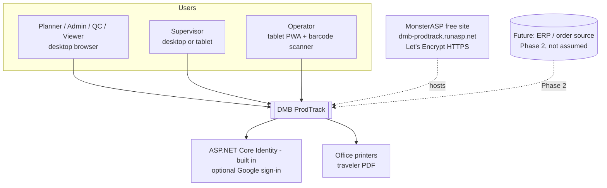
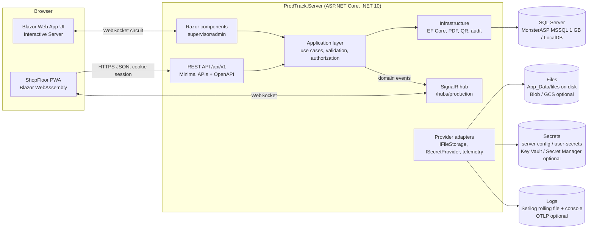
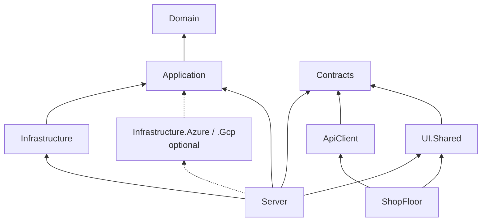
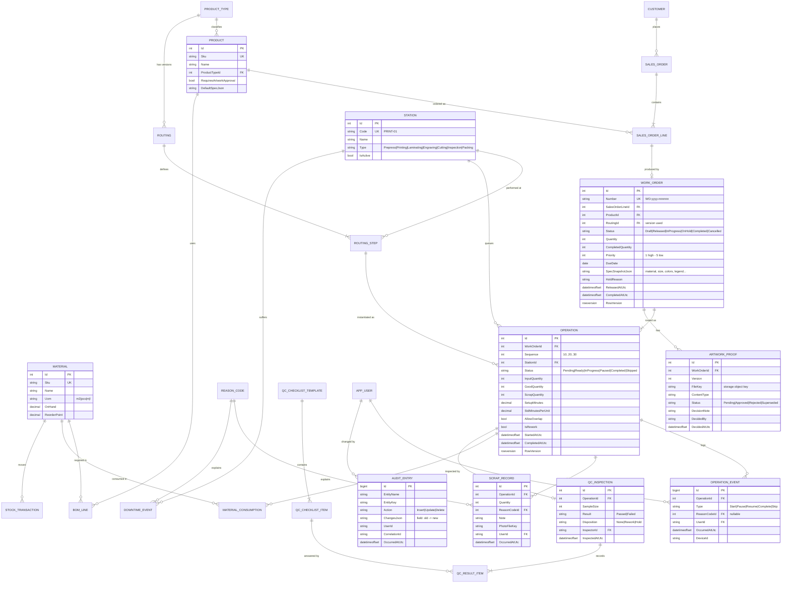

# 02 - Technical Design

> **Status:** Draft v0.3 (2026-09-26) - practice project.
> **Scope:** Architecture and design for the MVP described in `01-business-requirements.md` and `05-backlog.md`.
> **Hosting:** **MonsterASP.NET free plan** - one IIS site (InProcess hosting) at `https://dmb-prodtrack.runasp.net` (planned name) with one 1 GB MSSQL database, EU servers, 256 MB RAM, sleeps after 30 min idle, no email or scheduled tasks. Environments: Local + Prod. Azure and Google Cloud are optional alternatives (`03-tech-stack-and-cloud.md` Appendix A). The code stays host-portable; no cloud SDKs by default.
> **Auth:** ASP.NET Core Identity by default, optional Google sign-in; Microsoft Entra ID is an optional alternative (section 7).

---

## 1. Architecture goals and principles

1. **One deployable, many clients.** A single ASP.NET Core host (`ProdTrack.Server`) serves the REST API, the SignalR hub, the Blazor supervisor/admin UI and the static files of the shop-floor PWA. One IIS site on the free MonsterASP plan (or, on the optional alternatives, one Container App / App Service / Cloud Run service) keeps cost and operations minimal.
2. **Clean architecture.** Business rules live in `Domain` and `Application`, independent of UI, database and cloud. Dependencies point inwards and are enforced by architecture tests.
3. **Host portability by configuration.** Only three concerns are host-specific: file storage, secret retrieval and telemetry export. Each sits behind an abstraction; the **Local** implementations (disk under `App_Data`, configuration secrets, Serilog file) are the default on MonsterASP and on the PC. Azure/GCP implementations live in optional adapter projects created only if an alternative target is activated. SQL Server is used everywhere.
8. **Free-hosting aware.** Lean memory (256 MB), tolerant of app-pool sleep and recycles (auto-reconnect, idempotent background work, state in the DB), no dependency on email or scheduled tasks, small database footprint (1 GB).
4. **API-first for devices.** The PWA (and a future .NET MAUI app) use the versioned REST API; the Blazor Server UI calls the Application layer in-process (same use cases, same authorization).
5. **Secure by default.** Authenticated everywhere, role-based policies, least-privilege SQL logins, no secrets in code, repo or workflow YAML.
6. **Observable.** Structured logs, traces and metrics through OpenTelemetry APIs (`ILogger`, `ActivitySource`, `Meter`) with a correlation ID on every request.
7. **Testable.** Time (`TimeProvider`), current user, file storage and notifications are injectable; integration tests run against real SQL Server in a container.

## 2. System context



## 3. Container view and UI technology choice



**Decision: Blazor (ADR-0002).**

| Option | Pros | Cons | Verdict |
|---|---|---|---|
| **Blazor Web App, Interactive Server** for supervisor/admin UI | All C#, same models and validators as the API; in-process calls to Application layer (no extra API client code for back-office screens); fast to build data-heavy forms/grids; real-time UI natural | Needs a persistent WebSocket per user (fine for a handful of office users; on the free host the circuit is lost when the app pool sleeps or recycles, so a friendly reconnect UI is required, PT-072) | **Chosen** for back-office |
| **Blazor WebAssembly standalone PWA** for the shop floor | Installable, full-screen, runs client-side so short Wi-Fi blips don't kill the UI; consumes the public REST API exactly like a mobile app would; its components can later move into a Razor class library reused by a .NET MAUI Blazor Hybrid app | Larger first download (cached after install); needs API endpoints for everything it does | **Chosen** for tablets |
| Razor Pages / MVC | Simple, very mature, no persistent connection | Live dashboard and scan-driven screens need extra JavaScript | Not chosen |
| React/Angular SPA | Broad market skill | Second language/toolchain; less aligned with a C#/.NET JD | Not chosen (open question Q6) |

The PWA is published as static files and **served by `ProdTrack.Server` under `/floor`** (same origin), so it shares the server's cookie session (no tokens stored in the browser) and needs no CORS.

## 4. Solution and project structure

```text
ProdTrack.slnx
├─ src/
│  ├─ ProdTrack.Domain/                 Entities, value objects, enums, domain events, domain errors. No dependencies.
│  ├─ ProdTrack.Application/            Use cases (commands/queries + handlers), validators, authorization requirements,
│  │                                    ports (interfaces): IAppDbContext, IFileStorage, ISecretProvider, INotifier,
│  │                                    ICurrentUser, IPdfRenderer, IQrCodeGenerator. Depends on Domain only.
│  ├─ ProdTrack.Contracts/              Request/response DTOs, enums for the wire, route constants, hub method names.
│  │                                    No dependencies; shared by Server, ShopFloor, ApiClient.
│  ├─ ProdTrack.Infrastructure/         Cloud-neutral adapters: EF Core DbContext, configurations, migrations,
│  │                                    audit interceptor, number sequences, QuestPDF traveler, QRCoder,
│  │                                    LocalFileStorage, EnvironmentSecretProvider, Data Protection key store.
│  │   (optional, not in MVP) ProdTrack.Infrastructure.Azure / .Gcp - cloud adapters, created only if an
│  │   alternative target is activated (PT-057/PT-058).
│  ├─ ProdTrack.ApiClient/              Typed HttpClient wrappers for the REST API (used by ShopFloor, later MAUI).
│  ├─ ProdTrack.UI.Shared/              Razor class library: shared components (status badges, scan input, KPI tiles).
│  ├─ ProdTrack.ShopFloor/              Blazor WebAssembly PWA (manifest, service worker), base path /floor.
│  └─ ProdTrack.Server/                 Composition root: Program.cs, auth, endpoints (/api/v1), SignalR hub,
│                                       Blazor Web App components, health checks, hosts ShopFloor. web.config
│                                       (InProcess), optional Dockerfile for the local portability check.
├─ tests/
│  ├─ ProdTrack.Domain.Tests/           xUnit, pure unit tests of entities and rules.
│  ├─ ProdTrack.Application.Tests/      xUnit + NSubstitute; handlers, validators, authorization.
│  ├─ ProdTrack.Infrastructure.Tests/   Provider contract tests (Local; emulators only if alternatives exist), PDF/QR tests.
│  ├─ ProdTrack.Server.IntegrationTests/ WebApplicationFactory + Testcontainers (SQL Server); API + hub tests.
│  ├─ ProdTrack.UI.Tests/               bUnit component tests.
│  ├─ ProdTrack.ArchitectureTests/      NetArchTest.Rules (or ArchUnitNET) dependency rules.
│  └─ ProdTrack.E2E.Tests/              Playwright for .NET; smoke and main-flow tests.
├─ deploy/                              app_offline.htm, appsettings.Production.template.json (no secrets)
├─ .github/
│  ├─ workflows/ci.yml                  PR + main: build, tests, coverage, E2E, publish win-x86 + migrations.sql artifact
│  ├─ workflows/deploy.yml              Manual gate: Web Deploy from windows-latest (default) or FTP; deployTarget monsterasp|azure|gcp
│  ├─ workflows/ops.yml                 Weekly: certificate expiry, DB size, encrypted bacpac (+ files) artifact
│  ├─ dependabot.yml, CODEOWNERS, pull_request_template.md, ISSUE_TEMPLATE/
├─ .githooks/pre-push                   Local guard: no direct push to main, build + unit tests
├─ scripts/create-github-issues.sh      Generated from the backlog (labels, milestones, issues)
├─ (Phase 2) azure-pipelines.yml, pipelines/  Azure Pipelines equivalents on a self-hosted agent (docs/04 section 10)
├─ infra/azure/                         (optional, Sprint 8) Bicep for the Azure alternative
├─ docker-compose.yml                   Local SQL Server (+ optional Server container for the portability check)
├─ Directory.Build.props / Directory.Packages.props  Central build settings and package versions
├─ .editorconfig, global.json
└─ docs/, .cursor/rules/, AGENTS.md, README.md
```

### 4.1 Dependency rules



- `Domain` references nothing. `Application` references only `Domain` (plus abstractions packages such as `Microsoft.Extensions.*.Abstractions` and FluentValidation).
- **No cloud SDKs in the default build.** Cloud SDKs (`Azure.*`, `Google.Cloud.*`) may only be referenced from the optional `Infrastructure.Azure` / `Infrastructure.Gcp` projects (created only when an alternative target is activated) and wired in the Server composition root.
- `Contracts` is not referenced by `Domain`/`Application`; mapping between Contracts DTOs and Application models happens in `Server` (endpoints) using hand-written mapping or Mapperly (source generator).
- These rules are asserted in `ProdTrack.ArchitectureTests` (PT-003).

### 4.2 Application layer pattern (CQRS-lite, no MediatR)

- Each use case is a folder: `Application/WorkOrders/Release/ReleaseWorkOrderCommand.cs`, `...Handler.cs`, `...Validator.cs`.
- Own tiny interfaces: `ICommandHandler<TCommand, TResult>`, `IQueryHandler<TQuery, TResult>`; decorators for validation, authorization, logging and transaction via Scrutor `Decorate` (MIT). MediatR is avoided because v13+ uses a commercial/community dual licence; the pattern is small enough to own.
- Handlers return `Result<T>` (success or typed `Error` with code, message, type: Validation, NotFound, Conflict, Forbidden, BusinessRule). Endpoints translate to HTTP status codes (section 11).
- Queries use `AsNoTracking()` projections straight to read models; commands load aggregates, call domain methods, save.
- Authorization is enforced in the Application layer (authorization decorator reads a `[RequiresPolicy(Policies.ReleaseWorkOrders)]` attribute on the command) **and** at the endpoint, so the in-process Blazor path and the REST path share the same rules.

## 5. Domain model

### 5.1 Aggregates

| Aggregate root | Contains | Key invariants |
|---|---|---|
| `SalesOrder` | `SalesOrderLine` | Lines need product, qty > 0, legend when product type requires it |
| `WorkOrder` | `Operation`, `OperationEvent`, `ScrapRecord`, `MaterialConsumption`, `ArtworkProof` | Status transitions (BRD 5.5); release requires approved artwork if required; completed when last operation completes |
| `Station` | - | Unique code; inactive stations cannot be added to routings |
| `Product` | `ProductSpec` (owned), `BomLine` | Unique SKU; spec fields valid for product type |
| `Routing` | `RoutingStep` | Versioned; steps have unique sequence numbers; released WOs keep their version |
| `QcInspection` | `QcResultItem` | Out-of-tolerance => item fails; failed inspection needs disposition |
| `Material` | `StockTransaction` | On-hand = sum of transactions; negative only with Admin override |
| `DowntimeEvent` | - | End after start; one open event per station |

### 5.2 ERD



### 5.3 Persistence conventions

- **SQL Server** everywhere (LocalDB/Express or Docker locally, MonsterASP MSSQL (1 GB) in prod; Azure SQL / Cloud SQL only on the optional alternatives). EF Core code-first migrations in `Infrastructure/Persistence/Migrations`.
- Schemas: `md` (master data), `ord` (sales orders, work orders, operations), `mes` (events, scrap, downtime), `qc`, `inv`, `audit`, `sec` (user profiles, Data Protection keys).
- Keys: `int` identity for most tables, `bigint` for high-volume event/audit tables. Human-readable business numbers (`WO-2026-000123`) are unique indexed columns generated from a SQL `SEQUENCE` per year. (GUID v7 keys were considered but SQL Server orders `uniqueidentifier` differently, so sequential integers are simpler here.)
- Timestamps: `datetimeoffset` in UTC, suffix `AtUtc`. Generated from injected `TimeProvider` (never `DateTime.Now`). Display converts to `Plant:TimeZone` (default `Asia/Manila`).
- Optimistic concurrency: `rowversion` on aggregates; conflicts return 409 with ProblemDetails.
- Spec snapshot stored as JSON (`nvarchar(max)` with `ISJSON` check constraint) mapped to an owned type via EF Core JSON column mapping, so work orders are immune to later catalog edits (BR-02).
- Indexes (initial): `Operation(StationId, Status) INCLUDE (WorkOrderId, Sequence)`, `WorkOrder(Status, DueDate)`, `OperationEvent(OperationId, OccurredAtUtc)`, `ScrapRecord(OccurredAtUtc) INCLUDE (Quantity, ReasonCodeId)`, `AuditEntry(EntityName, EntityKey, OccurredAtUtc)`.
- Seed data via EF Core `UseSeeding`/`UseAsyncSeeding` for reference data (stations, reason codes, A13.1 schemes, Z535 signal words) and a separate `DemoDataSeeder` enabled only locally or explicitly on the practice site (`Seed:Demo=true`).
- **1 GB budget:** no files or logs in SQL; `audit.AuditEntry` rows older than `Audit:RetentionMonths` (default 12) are exported to the backup and purged by a sleep-tolerant background service (PT-047 notes); size watched weekly (`08` section 7.4).
- Provider portability: EF Core keeps SQL mostly provider-neutral; SQL Server-specific features used (`rowversion`, sequences, JSON check) are isolated in entity configurations so a PostgreSQL provider could be added with its own migrations assembly.

## 6. REST API

Base path `/api/v1`. JSON (camelCase), UTC ISO-8601 timestamps. OpenAPI document generated with `Microsoft.AspNetCore.OpenApi` at `/openapi/v1.json`; Swagger UI at `/swagger` in Development (Local) only. Minimal APIs grouped per feature with `MapGroup` and `TypedResults` (chosen over controllers for less ceremony and better testability; controllers would be equally valid).

Paging: `?page=1&pageSize=25` (max 100) returning `{ items, page, pageSize, totalCount }`. Filtering via query parameters. Concurrency: `If-Match` header with base64 rowversion (ETag) on updates.

| Method | Route | Purpose | Roles (policy) | Story |
|---|---|---|---|---|
| GET | `/health/live`, `/health/ready` | Liveness / readiness (DB check) | Anonymous | PT-003 |
| GET | `/api/v1/me` | Current user, roles, profile, home station | Any authenticated | PT-009 |
| GET/POST | `/api/v1/stations` | List / create stations | Read: all; write: Admin | PT-013 |
| PUT/DELETE | `/api/v1/stations/{id}` | Update / deactivate | Admin | PT-013 |
| GET/POST | `/api/v1/products` | List / create products | Read: all; write: Admin, Planner | PT-015 |
| GET/PUT | `/api/v1/products/{id}` | Get / update | same | PT-015 |
| GET/POST | `/api/v1/routings` | List / create routing version | Read: all; write: Admin, Planner | PT-014 |
| GET | `/api/v1/routings/{id}` | Routing with steps | all | PT-014 |
| GET | `/api/v1/reference/{list}` | Color schemes, signal words, materials types, mounting | all | PT-016 |
| GET/POST | `/api/v1/reason-codes` | List (filter by category) / create | Read: all; write: Admin | PT-017 |
| PUT | `/api/v1/reason-codes/{id}` | Update / deactivate | Admin | PT-017 |
| GET/POST | `/api/v1/sales-orders` | List / create | Read: all; write: Admin, Planner | PT-018 |
| GET/PUT | `/api/v1/sales-orders/{id}` | Get / update | same | PT-018 |
| POST | `/api/v1/sales-orders/{id}/work-orders` | Generate work orders from lines | Admin, Planner | PT-019 |
| GET | `/api/v1/work-orders` | Search/filter (status, customer, due, station, late) | all | PT-021 |
| GET | `/api/v1/work-orders/{id}` | Detail incl. operations | all | PT-021 |
| GET | `/api/v1/work-orders/by-number/{number}` | Lookup for scans | all | PT-028 |
| POST | `/api/v1/work-orders/{id}/release` | Release | Admin, Planner | PT-020 |
| POST | `/api/v1/work-orders/{id}/hold` / `resume` / `cancel` | Status changes with reason | Admin, Planner, Supervisor (QC: hold) | PT-022 |
| GET | `/api/v1/work-orders/{id}/timeline` | Event timeline | all | PT-044 |
| GET | `/api/v1/work-orders/{id}/traveler.pdf` | Traveler PDF (`?reprint=true`) | Admin, Planner, Supervisor | PT-025, PT-026 |
| POST | `/api/v1/work-orders/{id}/artwork` | Upload proof (multipart) | Admin, Planner, Operator(Prepress) | PT-023 |
| GET | `/api/v1/work-orders/{id}/artwork/{version}` | Download proof (streamed via server) | all | PT-023 |
| POST | `/api/v1/work-orders/{id}/artwork/{version}/approve` / `reject` | Decision | Admin, Planner | PT-024 |
| GET | `/api/v1/scan/{code}` | Resolve a scanned payload (WO/OP/ST/MAT) to an entity summary and allowed actions | Operator, Supervisor, QC, Admin | PT-028 |
| GET | `/api/v1/stations/{code}/queue` | Station queue | Operator, Supervisor, QC, Admin | PT-030 |
| POST | `/api/v1/operations/{id}/start` | Start | Operator, Supervisor, QC(QC ops), Admin | PT-031 |
| POST | `/api/v1/operations/{id}/pause` / `resume` | Pause (reason) / resume | same | PT-032 |
| POST | `/api/v1/operations/{id}/complete` | Complete with good qty and confirmed consumption | same | PT-033, PT-040 |
| POST | `/api/v1/operations/{id}/skip` | Skip with reason | Supervisor, Admin | BR-04 |
| POST | `/api/v1/operations/{id}/scrap` | Log scrap | Operator, Supervisor, QC, Admin | PT-034 |
| GET/POST | `/api/v1/qc/templates` | Checklist templates | Read: all; write: QC, Admin | PT-035 |
| POST | `/api/v1/operations/{id}/inspection` | Record inspection and disposition | QC, Admin | PT-036, PT-037 |
| GET/POST | `/api/v1/materials` | List / create | Read: all; write: Admin, Planner | PT-038 |
| POST | `/api/v1/materials/{id}/transactions` | Receipt / adjustment | Admin, Planner | PT-039 |
| POST | `/api/v1/stations/{code}/downtime/start` / `stop` | Downtime | Operator, Supervisor, Admin | PT-045 |
| GET | `/api/v1/dashboard/wip` | WIP by station | all | PT-041 |
| GET | `/api/v1/dashboard/late` | Late and at-risk | all | PT-042 |
| GET | `/api/v1/kpis/throughput`, `/scrap`, `/oee` | KPIs with `from`, `to`, `stationCode` | all | PT-043, PT-046 |
| GET | `/api/v1/audit` | Search audit log | Admin, Supervisor, QC | PT-048 |
| GET/PUT | `/api/v1/users`, `/api/v1/users/{id}/profile` | User profiles | Admin (read: Supervisor) | PT-012 |

RPC-style note: SignalR (section 8) is the RPC channel for server-to-client push; business writes always go through REST (or in-process use cases for Blazor Server), never through hub methods, so there is one validated, audited write path.

## 7. Authentication and authorization

### 7.1 Default: ASP.NET Core Identity (ADR-0003)

Chosen because Deo has no Azure subscription (so no guaranteed Entra ID tenant) and Identity is fully self-contained, free, needs no email, and runs the same on every host.

- **ASP.NET Core Identity** with EF Core stores in schema `sec` (`AppUser : IdentityUser` extended with `EmployeeNumber`, `BadgeNumber`, `HomeStationCode`, `IsActive`), `IdentityRole` seeded with `Admin`, `Planner`, `Supervisor`, `Operator`, `QC`, `Viewer`.
- **No self-registration.** Admins create users (PT-012) with a temporary password and "must change password at next sign-in". Password policy: min 12 chars; lockout after 5 failed attempts for 15 min. Optional TOTP authenticator-app 2FA (built into Identity), required for Admin in prod.
- **Bootstrap admin:** on first start in an empty database, if `Auth:BootstrapAdmin:Email` is set, the app creates that user with the password from `Auth:BootstrapAdmin:Password` in server-only configuration (`appsettings.Production.json` on the host, user-secrets locally) and forces a password change. Remove the value afterwards (runbook `08` section 11).
- **Cookie:** `__Host-ProdTrack`, `Secure`, `HttpOnly`, `SameSite=Lax`, sliding expiration, 12 h max; security stamp revalidation every 30 min so disabled users are signed out.
- **HTTPS / hosting:** on MonsterASP, IIS terminates TLS for `https://<name>.runasp.net` and the ASP.NET Core Module passes the scheme through (InProcess), so no forwarded-headers configuration is needed; `UseForwardedHeaders` stays available (config-driven) for the optional alternatives behind proxies. Absolute URLs come from `App:PublicBaseUrl`, so a future custom domain is configuration only.
- **Data Protection keys** are stored in the database (`sec.DataProtectionKeys`) so cookies survive app-pool sleep, recycles and redeploys.
- **No email** (the free plan has no SMTP): password resets are done by an Admin with a temporary password. Phase 2 can add an `IEmailSender` (paid hosting or an external mail API).

### 7.2 Optional: Google sign-in (external login, PT-068)

- Package `Microsoft.AspNetCore.Authentication.Google`, `AddGoogle(...)`, enabled when `Auth:Google:Enabled=true`.
- **New OAuth client in a new, billing-free Google Cloud project** created only for this purpose (Google Auth Platform / APIs & Services > Credentials > OAuth client ID, type *Web application*; an OAuth client needs no billing account). **Do not reuse or touch** the existing `find-an-agent` project that serves www.dmbwebsolutions.com (/crm, /agent, /commerce), so the two apps have separate consent screens, secrets and blast radius.
- Authorized redirect URIs: `https://localhost:5001/signin-google` and `https://dmb-prodtrack.runasp.net/signin-google` (add `https://prodtrack.dmbwebsolutions.com/signin-google` only if the custom domain is activated later). Authorized JavaScript origins are not needed (server-side flow). In *Testing* status no domain verification is expected for basic scopes (verify in the console).
- Consent screen audience *External*, publishing status *Testing* with the few practice users listed as test users (only the basic `openid email profile` scopes, so no Google app verification is expected; verify the current rules in the console). Client ID/secret stored in server-only configuration (`appsettings.Production.json` on the host, user-secrets locally), never in the repo.
- **Linking rule:** Google sign-in only succeeds if the verified Google email matches an existing, active Identity user created by an Admin; the external login is then linked (`AspNetUserLogins`). Roles always come from Identity, never from Google.

### 7.3 Alternative: Microsoft Entra ID (not in MVP)

- Microsoft Entra ID sign-in (`Microsoft.Identity.Web`, OIDC + app roles) is kept as a documented option (`Auth:Mode=Entra`, Phase 2 story PT-069) because many Microsoft shops use it and it is a likely interview topic.
- It needs an Entra tenant where Deo can create an **app registration**. Deo's Azure DevOps organization is backed by a Microsoft account / Entra directory; whether that directory (or a new free tenant) allows app registrations **without an Azure subscription** is **unverified** (open question Q17 in `00`). Azure for Students or any later subscription would settle it.
- Application code is unaffected by the choice: it depends only on `ICurrentUser` and policy names; user profiles would be keyed by Entra `oid` instead of the Identity user ID.

### 7.4 Dev and Test modes

- `Auth:Mode=Dev` registers a development authentication handler with a user/role picker for local work and E2E tests; `Auth:Mode=Test` is header-based for integration tests. `Program.cs` throws at startup if either is enabled outside `Development`/`Testing` environments.
- The PWA is served from the same origin under `/floor` and calls `/api/v1` with the Identity cookie (**BFF-style, no tokens in the browser**). Unsafe methods require an antiforgery header (`X-XSRF-TOKEN`) from `/api/v1/antiforgery`; API paths return 401/403 instead of redirects.
- Bearer tokens for a future MAUI app (Phase 2): Identity API endpoints (`MapIdentityApi`) or Entra, decided then.

### 7.5 Policies

Role names are constants in `ProdTrack.Application/Security/Roles.cs`; policies in `Policies.cs` map capabilities to roles following the matrix in BRD 6.10. Examples:

| Policy | Roles |
|---|---|
| `ManageMasterData` | Admin |
| `ManageProductsAndRoutings` | Admin, Planner |
| `PlanWorkOrders` | Admin, Planner |
| `ControlWorkOrders` (hold/resume/cancel) | Admin, Planner, Supervisor |
| `ExecuteOperations` | Admin, Supervisor, Operator, QC |
| `RecordInspections` | Admin, QC |
| `ViewAudit` | Admin, Supervisor, QC |
| `ReadAll` | any authenticated role |

Resource-based checks (e.g. QC may only start QC-type operations; operator station match) are done in handlers.

## 8. Real-time (SignalR)

- Hub: `ProductionHub` at `/hubs/production` (requires authentication).
- Groups: `dashboard`, `station:{code}`, `workorder:{id}`.
- Client-callable hub methods (subscription only): `JoinStation(code)`, `LeaveStation(code)`, `JoinDashboard()`, `WatchWorkOrder(id)`.
- Server-to-client messages (strongly typed hub `IProductionClient`, names in `Contracts/Realtime`): `OperationChanged(OperationChangedDto)`, `WorkOrderChanged(WorkOrderChangedDto)`, `StationStatusChanged(StationStatusDto)`, `KpiSnapshotChanged(KpiSnapshotDto)`, `LowStockRaised(LowStockDto)`.
- Flow: domain events raised by aggregates are collected by the DbContext and **dispatched after a successful commit** to `INotifier` handlers, which call `IHubContext<ProductionHub, IProductionClient>`. KPI snapshots are throttled (at most one per 2 s per group).
- Blazor Server dashboard components subscribe to an in-process `IRealtimeFeed` (same events) instead of opening a second SignalR connection, saving WebSocket connections and memory on the 256 MB free site.
- **Sleep and reconnect (PT-072):** the free site's app pool stops after 30 min without requests and may recycle at any time, so every connection must survive a restart:
  - PWA/SignalR: `WithAutomaticReconnect` with a custom retry policy (0, 2, 5, 10, 30 s, then every 30 s while the page is visible), `onreconnecting`/`onreconnected` show an "Offline - retrying" banner and re-fetch the station queue (PT-041); after a failed reconnect the client starts a new connection.
  - Blazor Server: customise the reconnect UI (`components-reconnect-modal` / `ReconnectModal` component in .NET 10) with branded, friendly text; configure retries with backoff; when the circuit cannot be resumed (server restarted), reload the page automatically. Keep `DisconnectedCircuitRetentionPeriod` short and `DisconnectedCircuitMaxRetained` small to save memory.
  - Cold start: the first request after sleep takes a few seconds; a lightweight static loading shell (`wwwroot/loading.html`, and the PWA's cached shell) is shown instead of a blank page. **No keep-alive pings** to defeat the sleep (fair use).
  - WebSockets are on by default on MonsterASP but need HTTPS (certificate must be valid, `08` section 6).
- MVP runs a **single instance** (the free site).
- Scale-out (paid hosting, Phase 2+): a SignalR backplane (Redis or Azure SignalR Service) and session affinity for Blazor Server.
- **Background work:** no scheduled tasks exist on the free plan, so periodic jobs (low-stock evaluation, audit purge) are in-process `BackgroundService`s that run only while the app is awake: idempotent, store their last-run time in the DB, catch up on start, never rely on exact timing. Ops jobs (certificate check, backups) run in the scheduled GitHub Actions `ops` workflow instead.
- Reliability note: in-process dispatch after commit can lose a notification if the process dies between commit and send; clients re-sync on reconnect, which is acceptable for dashboards. A transactional outbox is a Phase 2 improvement.

## 9. Barcodes, QR codes and the job traveler

| Payload | Meaning | Example |
|---|---|---|
| `WO:{number}` | Work order header | `WO:WO-2026-000123` |
| `OP:{number}:{seq}` | Operation on a work order | `OP:WO-2026-000123:20` |
| `ST:{stationCode}` | Station label (select station on a tablet) | `ST:PRINT-01` |
| `MAT:{sku}` | Material label | `MAT:VINYL-WHT-24` |
| `EMP:{badge}` | Operator badge (Phase 2 kiosk) | `EMP:10457` |

- Plain-text, uppercase, colon-separated so keyboard-wedge scanners in any keyboard layout type it reliably. Parsed by `ScanCodeParser` in `Application` (unit-tested). Max length 64.
- QR generation: `QRCoder` (MIT) producing PNG/SVG, error correction level M.
- Traveler PDF: `QuestPDF` (check the licence tier; the Community licence is free under a revenue threshold - see `03`). A4 and US Letter templates, header QR + one QR per operation + routing table + specs + legend in large type + "REPRINT n" watermark (PT-025/026).
- Scanning in the PWA: a permanently focused, visually hidden input captures keyboard-wedge scans (terminated by Enter); a "Scan with camera" button uses the browser `BarcodeDetector` API where available with a JS fallback library via JS interop (e.g. ZXing-based). Success/error tones and colour + icon feedback (NFR-06).

## 10. Host portability layer

| Concern | Abstraction (Application) | Local (default on MonsterASP and the PC) | Azure (optional) | GCP (optional) |
|---|---|---|---|---|
| File storage (artwork, scrap photos, generated PDFs) | `IFileStorage` (`SaveAsync`, `OpenReadAsync`, `DeleteAsync`, `ExistsAsync`) | `LocalFileStorage` rooted at `Storage:Local:RootPath` (`App_Data/files` on the host, within the 5 GB disk; `./.data/files` locally) | `AzureBlobFileStorage` (`Azure.Storage.Blobs`, managed identity) | `GcsFileStorage` (`Google.Cloud.Storage.V1`) |
| Secrets (runtime lookups, rare) | `ISecretProvider` (`GetSecretAsync(name)`) | `ConfigurationSecretProvider` (server-only `appsettings.Production.json` / environment variables / user-secrets) | `KeyVaultSecretProvider` | `SecretManagerSecretProvider` |
| Configuration secrets (connection strings, OAuth secrets) | `IConfiguration` | Server-only `appsettings.Production.json` uploaded once and excluded from deploys (or panel environment variables if available - verify); user-secrets locally | Key Vault references | Secret Manager -> env vars |
| Logging / telemetry | `ILogger`, `ActivitySource`, `Meter` | Serilog: rolling compact-JSON file `App_Data/logs` (10 MB x 14) + console locally; `Telemetry:Exporter=None` (OTLP optional) | Azure Monitor OpenTelemetry Distro | JSON console for Cloud Logging |
| Data Protection keys | built in | EF Core key store (`sec.DataProtectionKeys`) | same | same |
| Database | `IAppDbContext` | MonsterASP MSSQL (SQL login) / LocalDB / Docker | Azure SQL Database free offer | Cloud SQL for SQL Server Express |

Selection in `Program.cs`:

```csharp
// Composition root only - no cloud SDK types anywhere else.
var provider = builder.Configuration.GetValue<CloudProvider>("Cloud:Provider"); // Local (default) | Azure | Gcp
builder.Services.AddProdTrackInfrastructure(builder.Configuration);             // EF Core, PDF, QR, audit...
builder.AddProdTrackLocal();   // disk storage, configuration secrets, Serilog file/console - always registered
// Optional adapters exist only when an alternative target is activated (PT-057/PT-058), e.g.:
// if (provider == CloudProvider.Azure) builder.AddProdTrackAzure();  // Blob, Key Vault, Azure Monitor
// if (provider == CloudProvider.Gcp)   builder.AddProdTrackGcp();    // GCS, Secret Manager
```

All `IFileStorage` implementations pass the same contract test suite (Local by default; Azurite / `fake-gcs-server` only when an alternative adapter exists, PT-056). Object keys follow `workorders/{workOrderNumber}/artwork/v{version}/{guid}{ext}`; original file names are stored only as metadata.

## 11. Error handling

- Global exception handler (`IExceptionHandler` + `AddProblemDetails`) returns RFC 9457 ProblemDetails with `traceId` and `correlationId`; stack traces only in Development.
- `Result` errors map: Validation -> 400 (with `errors` dictionary), NotFound -> 404, Forbidden -> 403, Conflict/concurrency -> 409, BusinessRule -> 422 (with `code`, e.g. `WorkOrder.ArtworkNotApproved`).
- Validation: FluentValidation in Application (decorator), same validators used by Blazor forms via a small adapter.
- Blazor Server: `ErrorBoundary` per page region with friendly message and correlation ID; circuit errors logged.
- PWA: `ApiClient` converts ProblemDetails into typed `ApiError` shown as large, plain-language banners (e.g. "This job is on hold: Customer change").
- Transient faults: EF Core `EnableRetryOnFailure` for SQL; HTTP resilience (`Microsoft.Extensions.Http.Resilience`) for outbound calls. Commands are idempotent where it matters: shop-floor actions carry a client-generated `requestId` (GUID) stored with the event; duplicates return the original result (protects against double taps and retries).

## 12. Logging and observability

- Serilog as the logging front end (`UseSerilog`). Default sinks: **rolling file** `App_Data/logs/prodtrack-.json` (compact JSON, daily, `fileSizeLimitBytes` 10 MB, `retainedFileCountLimit` 14, `rollOnFileSizeLimit`, buffered) and console (Local only). Logs never go to the database (1 GB limit). With `Telemetry:Exporter=Otlp`, `writeToProviders: true` also feeds OpenTelemetry. Enrichers: `CorrelationId`, `UserId`, `StationCode`, `Environment`, `Version`.
- Correlation: incoming `X-Correlation-Id` accepted or generated; returned in response headers; equals the W3C trace ID where possible.
- Traces (only when OpenTelemetry is enabled; off by default to save memory): ASP.NET Core, HttpClient, SQL client and EF Core instrumentation; custom `ActivitySource("ProdTrack")` spans for use cases.
- Metrics: custom `Meter("ProdTrack")` counters: `prodtrack.operations.started`, `.completed`, `prodtrack.scrap.units`, `prodtrack.scans.failed`; histogram `prodtrack.usecase.duration`.
- Never log secrets, tokens, full request bodies or personal data beyond user ID/name.
- Health endpoints: `/health/live` (process) and `/health/ready` (DB). Monitoring: see `08-deployment-and-operations.md` section 9.

## 13. Security

| Area | Measures |
|---|---|
| Transport | HTTPS only (Let's Encrypt on `*.runasp.net`, renewed manually every 90 days), HSTS, `__Host-` cookies. TLS protocol settings are controlled by the host (IIS) |
| AuthN/AuthZ | ASP.NET Core Identity (optional Google external login); policies at endpoint and use-case level; resource checks in handlers; deny by default (`FallbackPolicy = RequireAuthenticatedUser`) |
| CSRF | Blazor antiforgery; API antiforgery header for cookie-authenticated unsafe requests; SameSite cookies |
| XSS | Razor encoding by default; no `MarkupString` from user input; Content-Security-Policy header (script-src self + wasm-unsafe-eval for Blazor WASM) |
| Injection | EF Core parameterised queries; no string-concatenated SQL; raw SQL only via `FromSql` interpolation |
| File uploads | Size limit 20 MB, allow-list of extensions and magic-byte sniffing, random object keys, never served from the web root, downloads streamed with `Content-Disposition: attachment` except PDF preview |
| Secrets | Server-only `appsettings.Production.json` on the host (never deployed from the repo), deploy secrets as GitHub Actions repository secrets (Azure DevOps variable group in Phase 2), `dotnet user-secrets` locally; no secrets in repo or YAML; Key Vault / Secret Manager only on the optional alternatives |
| Database | MonsterASP MSSQL with encrypted connections (per the MonsterASP TLS article); remote access enabled only for the deploy/ops workflows and SSMS; if extra logins are allowed on free (verify), separate app login (`db_datareader`, `db_datawriter`, `EXECUTE`, denied UPDATE/DELETE on audit) and migration login (DDL); otherwise the single panel login, documented as a free-plan limitation |
| Rate limiting | ASP.NET Core rate limiter: per-user fixed window on write endpoints; stricter on uploads |
| Dependencies | `dotnet list package --vulnerable` in CI, Dependabot-like review monthly (PT-052) |
| Audit | EF Core `SaveChangesInterceptor` writes `audit.AuditEntry` in the same transaction (PT-047) |
| Headers | `X-Content-Type-Options: nosniff`, `Referrer-Policy: strict-origin-when-cross-origin`, `Permissions-Policy` (camera only for /floor) |

## 14. Performance and scalability

- Targets: NFR-01 (p95 < 500 ms for scan/start/complete), NFR-02 (push < 2 s).
- Queries: projections with `AsNoTracking`, pagination everywhere, indexes from 5.3, split queries for large includes.
- Caching: `HybridCache` for reference data (stations, reason codes, routings) with invalidation on change; KPI snapshot cached 5-10 s.
- Dashboard KPIs computed by SQL aggregate queries over indexed event tables; if needed later, a pre-aggregated `mes.StationHourlyStats` table updated by a background service.
- Payloads: compact DTOs for the PWA; Brotli/Gzip response compression; PWA assets cached by the service worker.
- **Free-plan limits (MonsterASP):**
  - **256 MB RAM:** publish framework-dependent for `win-x86` (32-bit, smaller pointers; the documented MonsterASP route), `<ServerGarbageCollection>false</ServerGarbageCollection>` (Workstation GC), optionally `<ConcurrentGarbageCollection>false</ConcurrentGarbageCollection>`, `<InvariantGlobalization>` only if culture data is not needed (keep ICU for en-PH formatting - measure), bounded `HybridCache` sizes, stream uploads/downloads (no whole-file buffering), QuestPDF documents generated per request and disposed, OpenTelemetry off by default. Self-contained publish is optional and unverified on MonsterASP. Target working set < 180 MB (PT-006).
  - **Sleep after 30 min idle:** cold start of a few seconds (EF Core model build, JIT); keep startup lean (no heavy work in `Program.cs`; seeding only when the DB is empty); ReadyToRun optional if it helps and fits.
  - **EU servers:** ~200+ ms round trip from the Philippines (unverified) - minimise round trips (batch queue data, SignalR push instead of polling).
  - Avoid background polling in MVP.
- Scale path (paid hosting): larger plan or Azure/GCP with a SignalR backplane and session affinity; read replicas not needed at MVP volumes (A6).

## 15. Configuration

| Key | Example | Notes |
|---|---|---|
| `Cloud:Provider` | `Local` (default) / `Azure` / `Gcp` | Selects adapters (section 10); `Local` on MonsterASP |
| `ConnectionStrings:ProdTrack` | `Server=<db-server>;Database=<db>;User Id=<login>;Password=...;Encrypt=True;TrustServerCertificate=True` (MonsterASP values from the panel; TLS options per its MSSQL TLS article - verify) | Server-only `appsettings.Production.json`; user-secrets locally |
| `Storage:Local:RootPath` | `App_Data/files` | Local file storage root (relative to the content root) |
| `Storage:MaxUploadMb` | `20` | Upload limit (5 GB disk) |
| `Audit:RetentionMonths` | `12` | Older audit rows exported and purged (1 GB DB) |
| `Database:MigrateOnStartup` | `false` | `true` only as the fallback if remote SQL access is unavailable on free |
| `Storage:*`, `KeyVault:Uri`, `Gcp:*` | - | Only if an optional alternative target is activated |
| `Auth:Mode` | `Identity` (default) / `Entra` (alternative, Phase 2) / `Dev` / `Test` | `Dev` (user/role picker) and `Test` (header-based, integration tests) are allowed only in Development/Testing |
| `Auth:Google:Enabled`, `Auth:Google:ClientId`, `Auth:Google:ClientSecret` | `true` / from server-only config | Optional Google external login (new OAuth client in a new billing-free Google Cloud project) |
| `Auth:BootstrapAdmin:Email`, `Auth:BootstrapAdmin:Password` | `deo@...` / server-only config | First-run admin creation only; remove the password afterwards |
| `AzureAd:*` | `Instance`, `TenantId`, `ClientId` | Only if `Auth:Mode=Entra` |
| `App:PublicBaseUrl` | `https://dmb-prodtrack.runasp.net` | Absolute links (traveler QR deep links); changing it is all a future custom domain needs |
| `Telemetry:Exporter` | `None` (default) / `Console` / `Otlp` / `AzureMonitor` (optional Azure only) | OpenTelemetry off by default to save memory |
| `Serilog:*` | file sink path `App_Data/logs/prodtrack-.json`, 10 MB, 14 files | Console sink only in Development |
| `Plant:TimeZone` | `Asia/Manila` | IANA ID (works on Linux and Windows with .NET ICU) |
| `Plant:DefaultShift` | `08:00-17:00;break=60;days=Mon-Sat` | OEE-lite and at-risk |
| `Features:*` | `CameraScan=true` | Microsoft.FeatureManagement optional |

## 16. Testing hooks

See `06-testing-strategy.md`. Design choices that enable tests: `TimeProvider`, `ICurrentUser`, `IFileStorage`, `INotifier` injectable; Dev auth handler; WebApplicationFactory-friendly `Program` (`public partial class Program`); deterministic number sequences per test database.

## 17. Architecture Decision Records

ADRs live in `docs/adr/`. Template:

```markdown
# ADR-NNNN: Title
- Status: Proposed | Accepted | Superseded by ADR-XXXX
- Date: YYYY-MM-DD
## Context
## Decision
## Consequences (positive, negative, follow-ups)
## Alternatives considered
```

Initial ADRs to write in Sprint 0:

| ADR | Decision |
|---|---|
| 0001 | Clean architecture with CQRS-lite handlers, no MediatR |
| 0002 | Blazor Web App (Interactive Server) for back office + Blazor WASM PWA for shop floor, single host |
| 0003 | ASP.NET Core Identity with roles (optional Google external login); Entra ID as a later alternative |
| 0004 | Hosting on the free MonsterASP.NET plan (one IIS site on `*.runasp.net`, 1 GB MSSQL, Local + Prod only); Azure/GCP optional alternatives via `deployTarget`; portability limited to storage, secrets, telemetry; no cloud SDKs by default (supersedes the v0.2 "Google Cloud primary" decision) |
| 0008 | Custom domain `prodtrack.dmbwebsolutions.com` deferred; free subdomain with manually renewed Let's Encrypt; upgrade path MonsterASP Premium or Azure for Students, configuration-only (`App:PublicBaseUrl`) |
| 0009 | GitHub Actions on GitHub-hosted runners: build/test on `ubuntu-latest`, deploy by Web Deploy from `windows-latest` (MonsterASP's documented approach; FTP + app_offline.htm alternative), manual deploy gate on the private Free repo; idempotent EF migration script applied by the deploy workflow. Azure Pipelines on a self-hosted agent in Phase 2 (PT-073) |
| 0005 | SQL Server on all targets; EF Core code-first migrations applied by the deploy workflow as an idempotent script |
| 0006 | Minimal APIs with OpenAPI; SignalR for push only |
| 0007 | QR payload format (section 9) |

## 18. Change log

| Date | Version | Change |
|---|---|---|
| 2026-09-26 | 0.1 | Initial technical design (Azure primary, GCP alternative) |
| 2026-09-26 | 0.2 | Google Cloud primary (dedicated project, custom subdomains), Azure alternative; ASP.NET Core Identity default with optional Google sign-in; Entra optional; ADR-0008/0009 |
| 2026-09-26 | 0.3 | MonsterASP free hosting: principles (free-hosting aware), context/container diagrams, optional cloud adapter projects (no cloud SDKs by default), repo layout (`deploy/`, ops pipeline), Identity without email, HTTPS on runasp.net, Google OAuth in a new billing-free project, sleep/reconnect and background-work rules, Local defaults in the portability table, Serilog rolling file, 256 MB/1 GB guidance, config keys, ADR-0004/0005/0008/0009 rewritten |
| 2026-09-26 | 0.3b | GitHub primary: repo layout (`.github/workflows`, `.githooks`, `scripts/`; Azure Pipelines files Phase 2), ADR-0009 GitHub Actions + Web Deploy, ops workflow, secrets in Actions secrets |
| 2026-09-27 | 0.4 | Sprint 0-1 implementation notes: audit rows written inside `SaveChanges` and number sequences table (ADR-0011); integration tests on SQLite (ADR-0010); dashboard refreshes by 30 s polling until the SignalR Blazor client lands; `If-Match` concurrency and sales orders UI deferred |
| 2026-09-27 | 0.5 | Sprint 2-3 batch (PR #2): sales orders, user admin, hold/cancel, ETag/If-Match concurrency (412/409), routing editor, traveler with QRCoder SVG QR codes, /floor scanning and operation execution, QC inspections, scrap, live SignalR dashboard, `Database:MigrateOnStartup` for Development. Full as-built description: `Documentations/ProdTrack-Technical-Document.pdf`. |
