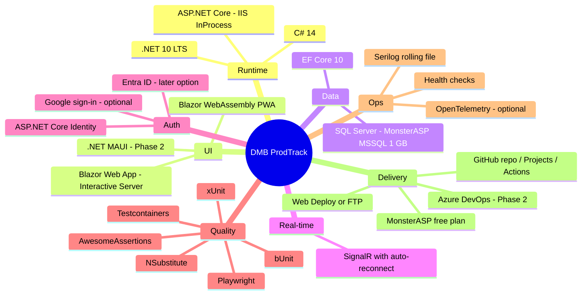
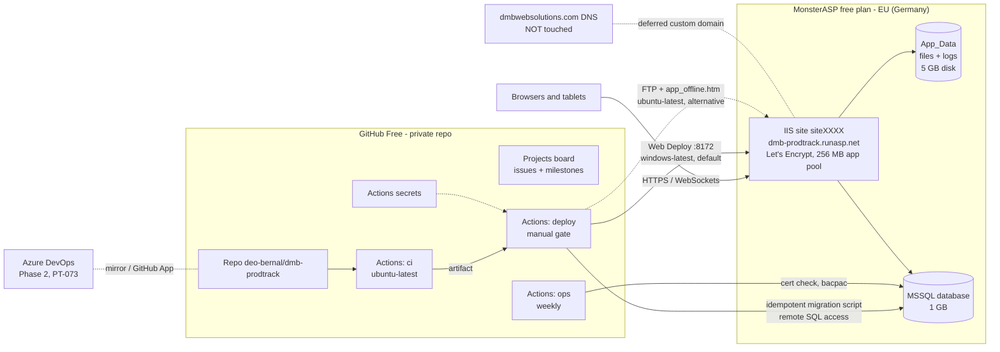

# 03 - Tech Stack and Cloud

> **Status:** Draft v0.3 (2026-09-26) - practice project.
> **Hosting decision (final, 2026-09-26, supersedes the Google Cloud primary of v0.2):** DMB ProdTrack is hosted on the **free MonsterASP.NET plan** - **US$0, no credit card**. One website on the free subdomain **`<name>.runasp.net`** (planned: **`dmb-prodtrack.runasp.net`**, availability to be confirmed at sign-up) with **one 1 GB MSSQL database**, EU (Germany) servers. There is **no hosted dev/staging**: environments are **Local** (Deo's PC) and **Prod** (MonsterASP). **GitHub** is the delivery tooling for now (private repo `deo-bernal/dmb-prodtrack`, Projects board, **GitHub Actions** on GitHub-hosted runners, Actions secrets; `11-github-setup.md`). **Azure DevOps** is a documented **Phase 2** migrate/mirror plan (`04`, PT-073) with a self-hosted agent. The custom domain `prodtrack.dmbwebsolutions.com` is **deferred** (upgrade path in section 7, no code change). **Azure and Google Cloud** are brief, optional alternatives (Appendix A), selected by the deploy workflow input `deployTarget: monsterasp | azure | gcp` (default `monsterasp`).
> **Sources:** facts about MonsterASP were checked on 2026-09-26 on official monsterasp.net / help.monsterasp.net pages, MonsterASP staff forum answers and the ToS; the detailed notes with every URL are in [`research/monsterasp.md`](research/monsterasp.md). Items marked **(verify)** were not confirmed and must be tested after sign-up. Offers change: re-check before relying on any number.

---

## 1. Stack at a glance

## 2. Application technologies

| Technology | Version / package | Why | Notes |
|---|---|---|---|
| .NET | **10 (LTS)** | Current LTS; supported until 14 Nov 2028 per Microsoft's .NET support policy. .NET 8 LTS (in the original brief) reaches end of support on 10 Nov 2026, so a new project should not start on it | Pin SDK in `global.json` (`rollForward: latestFeature`) |
| C# | 14 (ships with .NET 10) | Latest language features (e.g. primary constructors, collection expressions) | Nullable reference types enabled |
| ASP.NET Core Minimal APIs | 10 | REST endpoints with `MapGroup`, `TypedResults`, endpoint filters | Controllers acceptable alternative |
| OpenAPI | `Microsoft.AspNetCore.OpenApi` + Swagger UI (`Swashbuckle.AspNetCore.SwaggerUI`) or Scalar | Built-in document generation since .NET 9; UI for manual testing | UI only in Development (Local) |
| Blazor Web App | 10, Interactive Server render mode | Back-office UI in C#; in-process calls to Application layer | See ADR-0002 in `02` |
| Blazor WebAssembly | 10, standalone with PWA option | Installable tablet app consuming the REST API | Served by the Server under `/floor` |
| UI component library | Microsoft Fluent UI Blazor (`Microsoft.FluentUI.AspNetCore.Components`) or MudBlazor | Accessible, ready components (data grid, dialogs) | Pick one in Sprint 0 (both MIT) |
| SignalR | ASP.NET Core SignalR | Live dashboard and station queues | WebSockets are on by default on MonsterASP (HTTPS required); automatic reconnect is mandatory because the free site sleeps |
| EF Core | 10 + `Microsoft.EntityFrameworkCore.SqlServer` | Productive ORM, migrations, interceptors for audit | Idempotent migration script generated by `ci` and applied by the `deploy` workflow (`11` section 6) |
| SQL Server | Local: SQL Server LocalDB/Express (Windows) or `mcr.microsoft.com/mssql/server:2022-latest` container; Prod: **MonsterASP MSSQL database (1 GB, SQL Server 2025 advertised)** | Matches the JD's SQL Server focus | Stay within T-SQL supported by SQL Server 2019+; Developer/Express editions locally are free |
| FluentValidation | 12.x | Validators in Application layer, reused by UI | Apache 2.0 |
| Scrutor | latest | Decorators for handlers (validation, auth, logging) | MIT |
| Mapperly | latest (source generator) | Compile-time DTO mapping, no reflection | Apache 2.0; AutoMapper avoided (commercial licence since 2025) |
| QuestPDF | latest | Job traveler PDFs in C# | Community licence is free below a revenue threshold (check current terms); fine for personal practice |
| QRCoder | latest | QR code images | MIT |
| ASP.NET Core Identity | `Microsoft.AspNetCore.Identity.EntityFrameworkCore` | Default sign-in, roles, lockout, TOTP 2FA | Schema `sec` |
| Google external login | `Microsoft.AspNetCore.Authentication.Google` | Optional Google sign-in (PT-068) | OAuth client in a new billing-free Google Cloud project (never `find-an-agent`) |
| Microsoft.Identity.Web | latest | Entra ID OIDC - only for the Phase 2 Entra option (PT-069) | Not referenced in MVP |
| Serilog | `Serilog.AspNetCore`, `Serilog.Sinks.File`, `Serilog.Formatting.Compact` | Structured logging to a **rolling file** under `App_Data/logs` (+ console locally) | Size/retention caps (10 MB x 14 files); read via FTP |
| OpenTelemetry | `OpenTelemetry.Extensions.Hosting`, instrumentation packages | Vendor-neutral traces/metrics - **optional** | `Telemetry:Exporter=None` by default (saves memory on 256 MB); `Console`/`Otlp` when needed |
| Azure Monitor OpenTelemetry Distro | `Azure.Monitor.OpenTelemetry.AspNetCore` | Sends OTel data to Application Insights | **Not referenced** - only if the Azure alternative is activated |
| Azure SDK | `Azure.Identity`, `Azure.Storage.Blobs`, `Azure.Security.KeyVault.Secrets` | Blob/Key Vault | **Not referenced by default** - only in an `Infrastructure.Azure` project created if the Azure alternative is activated |
| Google Cloud SDK | `Google.Cloud.Storage.V1`, `Google.Cloud.SecretManager.V1` | GCS / Secret Manager | **Not referenced by default** - only in an `Infrastructure.Gcp` project created if the GCP alternative is activated |
| HybridCache | `Microsoft.Extensions.Caching.Hybrid` | Reference-data caching | In-memory only in MVP |
| Resilience | `Microsoft.Extensions.Http.Resilience` | Retries/timeouts for HttpClient | |

### 2.1 Testing tools

| Tool | Purpose | Licence note |
|---|---|---|
| xUnit (v3) | Unit/integration test framework | Apache 2.0 |
| **AwesomeAssertions** (default) / FluentAssertions / Shouldly | Readable assertions | FluentAssertions v8+ requires a paid licence for commercial use (free for non-commercial); v7 stays Apache 2.0; AwesomeAssertions is the Apache 2.0 community fork with the same API style. Open question Q11 |
| **NSubstitute** (default) or Moq | Test doubles | Both BSD; NSubstitute preferred for readability |
| Testcontainers for .NET (`Testcontainers.MsSql`) | Real SQL Server in Docker for integration tests | MIT; LocalDB is a Windows-only fallback |
| `Microsoft.AspNetCore.Mvc.Testing` | WebApplicationFactory in-memory API tests | |
| bUnit | Blazor component tests | MIT |
| Playwright for .NET | E2E browser tests | Apache 2.0 |
| NetArchTest.Rules / ArchUnitNET | Architecture rules | |
| coverlet + ReportGenerator | Code coverage (Cobertura) published to Azure Pipelines | |
| k6 | Load smoke test (PT-051) | AGPL tool used externally, not shipped |
| fake GCS server, Azurite | Storage emulators - only if an alternative target is activated (PT-056) | |

### 2.2 Developer tooling

Visual Studio 2026 (recommended for .NET 10; can also publish to MonsterASP with the downloaded publish profile) and/or Cursor with C# Dev Kit; Docker Desktop (local SQL Server, Testcontainers); SQL Server Management Studio or VS Code MSSQL extension; `sqlcmd` and `sqlpackage` (migrations, bacpac backups); an FTP client (FileZilla / WinSCP) for log download; Git. Cloud CLIs (`gcloud`, `az`, Terraform, Bicep) are **not needed** unless an alternative target is activated.

## 3. Primary hosting: MonsterASP.NET free plan

### 3.1 Why MonsterASP free

- **Zero cost and no credit card**, which the previous options (Azure free account: not eligible; Google Cloud trial: needs a card and expires after 90 days) could not guarantee long-term.
- Runs the whole stack natively on Windows/IIS: .NET 10 (8/9/10/11 listed), Blazor Server, SignalR/WebSockets (on by default), EF Core + MSSQL, Web Deploy and FTP.
- No ads or branding injected into pages.
- Fits the purpose: the free plan is **for development, testing, learning and evaluation only** (ToS section 3.2(c)). ProdTrack is a personal practice/portfolio project with fictional data, so it fits. It must **not** be used for real DMB production data or any commercial use.

### 3.2 Architecture

### 3.3 Free plan facts and limits (checked 2026-09-26)

| Item | Free plan | Source |
|---|---|---|
| Price / card | US$0, no credit card | monsterasp.net home, Pricing |
| Websites | **1**, free subdomain only (`*.runasp.net` / `*.tryasp.net`); **no custom domains** | Pricing, FAQ, help "DNS settings for custom domains" |
| Disk | 5 GB | Pricing |
| Memory | **256 MB** dedicated in its own application pool | Pricing |
| CPU / bandwidth | Not published; shared, fair use; "no fixed limits" on bandwidth but heavy use may be restricted (notice, then 2 days to fix, then throttling/suspension) | ToS section 6, staff forum answer |
| Database | **1 database, 1 GB** (MSSQL or MySQL); SQL Server 2025 advertised | Pricing, home page |
| Remote DB access | Exists, **disabled by default**, enabled per database under Databases > "Users and remote"; availability on free not stated explicitly **(verify)** | help "Remote access for database" |
| HTTPS | Let's Encrypt on the free subdomain, **manual renewal every 90 days** (the Pricing table shows a cross for free; the HTTPS help page, which is more specific, says it works on free subdomains) **(verify at sign-up)** | help "How to activate HTTPS with Let's Encrypt" |
| App pool idle | **Sleeps after 30 minutes without requests; cannot be changed on free** (Premium: 3 h, "Always Running" on request) | staff forum answer |
| Background services | Run only while the worker process is alive | staff forum answer |
| Scheduled tasks | **Premium only** | staff forum answer |
| Email / SMTP | **Premium only** - no outgoing email from the app on free | help "Sending e-mails from your applications" |
| Backups / SLA / support | **None** on free; the plan may be limited, suspended or discontinued without notice | ToS sections 3.2, 7.3, 9.2 |
| Inactivity | Free accounts "may be deleted, together with all data, after a period of inactivity"; the period is **not published** | ToS section 3.2(e) |
| Accounts | One account per person (no extra accounts to get around limits) | ToS section 2.4 |
| .NET | .NET 8/9/10/11; InProcess works with DLL or EXE; OutOfProcess only with a DLL (an EXE in OutOfProcess disables the app pool) | help "ASP.NET Core hosting model support" |
| Deployment | Web Deploy (msdeploy, port 8172), FTP/SFTP, ZIP upload, Git/GitHub Actions, VS publish profile; no REST deploy API documented | help "Deploy" book |
| Datacenter | EU (Germany); expect roughly 200+ ms round trip from the Philippines **(verify with PT-051)** | home page |

### 3.4 What the limits mean for the design

| Limit | Design response | Where |
|---|---|---|
| Sleeps after 30 min idle | Blazor and SignalR **automatic reconnect** with a branded, friendly reconnect overlay; PWA "Offline - retrying" banner; lightweight cold-start page; health endpoint probed with retries by the pipeline. **No keep-alive pings** to defeat the sleep (fair use) | `02` sections 8 and 14, PT-072 |
| 256 MB RAM | Framework-dependent `win-x86` publish (32-bit, smaller working set) is the default; `<ServerGarbageCollection>false</ServerGarbageCollection>` (Workstation GC uses less memory than the ASP.NET Core default Server GC; optionally `<ConcurrentGarbageCollection>false</ConcurrentGarbageCollection>`), measured locally (PT-006); OpenTelemetry off by default; in-memory caches bounded; Blazor circuit retention limits reduced. Self-contained publish is optional and **unverified** on MonsterASP | `02` section 14, PT-006 |
| 1 GB database | Logs go to files, not the DB; audit log retention/archival job (export and purge older than N months); file blobs stored on disk, not in SQL; size check in the ops runbook | `02` sections 5.3 and 12, `08` section 7 |
| 5 GB disk | Artwork files limited to 20 MB each under `App_Data/files`; log files capped (10 MB x 14) | `02` section 10 |
| No email | **No email features** in the MVP (no password-reset emails: Admin resets passwords; no notifications by email). Phase 2 story PT-066 needs paid hosting or an external mail service | `01`, `02` section 7 |
| No scheduled tasks | Background work only as **in-process `IHostedService`/`BackgroundService`** that tolerates the app sleeping (idempotent, catch-up on start, no exact timing guarantees). Scheduled ops checks (certificate expiry, bacpac export) run as a **scheduled GitHub Actions workflow** (`ops.yml`) instead | `02` section 8, PT-067 |
| No backups | Weekly encrypted `.bacpac` export via `sqlpackage` in the `ops` workflow (remote access) plus manual export before risky migrations | `08` section 7, PT-067 |
| Manual 90-day HTTPS renewal | Ops runbook + weekly certificate-expiry check in the `ops` workflow + calendar reminder | `08` section 6, PT-067 |
| Learning-only ToS | Fictional/sample data only; no real customer data; no commercial use | `00` section 9 |

## 4. Delivery tooling: GitHub now, Azure DevOps in Phase 2

### 4.1 GitHub (primary)

| Item | Free amount (GitHub Free, private repo; verify on GitHub's billing docs) |
|---|---|
| Private repos, Issues, Projects, milestones, Dependabot | Free, unlimited |
| GitHub Actions (GitHub-hosted standard runners) | **2,000 minutes/month** included; Windows jobs may count 2x against the quota (older docs; current docs price by SKU); without a payment method usage stops at the quota (no charges) |
| Artifact storage | **500 MB** (cache 10 GB per repo) |
| Packages (NuGet) | Shares the 500 MB storage (optional PT-071) |
| Branch protection / rulesets, environment required reviewers, environment secrets | **Not available on private repos with GitHub Free** - manual deploy gate instead; available if the repo is public (or partly with GitHub Pro, US$4/month or free via the Student Developer Pack) - see `11` section 2 |
| Secret scanning / push protection | Free on public repos only |

Estimated usage ~1,300 minutes/month (`11` section 8): within the free quota.

### 4.2 Azure DevOps (Phase 2, PT-073)

| Item | Free amount / price (verify on the Azure DevOps pricing page) |
|---|---|
| Users | First **5 Basic users free**; unlimited Stakeholders |
| Microsoft-hosted CI/CD | The free grant (1 parallel job, 1,800 min/month) **now has to be enabled by linking an Azure subscription / billing** - not available to Deo without a card |
| Self-hosted CI/CD | **1 self-hosted parallel job with unlimited minutes, granted automatically** - used in Phase 2 (agent on the assistant's Ubuntu box or Deo's Windows PC, `04` section 1.2) |
| Azure Artifacts | 2 GiB free per organization |
| Azure Test Plans | Basic + Test Plans is **paid after a 30-day trial** (about US$52/user/month, verify); optional |
| GitHub Advanced Security for Azure DevOps | Paid; mention only |

## 5. Cost summary - everything US$0

| Item | Cost | Condition |
|---|---|---|
| MonsterASP free plan (site, 1 GB MSSQL, 5 GB disk, Let's Encrypt) | US$0 | Learning/testing use; manual cert renewal; keep the account active |
| GitHub Free (private repo, Issues, Projects, Actions 2,000 min/month, 500 MB storage) | US$0 | Stay within the included minutes; no payment method on file |
| Azure DevOps Services (Phase 2: Boards, Repos, Pipelines with 1 self-hosted job, Wiki, Artifacts 2 GiB) | US$0 | Up to 5 Basic users; self-hosted agent on the box or Deo's PC |
| GitHub (optional mirror) | US$0 | Free plan |
| Local dev (SQL Server Express/LocalDB/Developer, Docker Desktop personal use, VS Community or Cursor) | US$0 | Personal/learning use (verify Docker Desktop and VS Community licence terms for your situation) |
| Google OAuth client for optional Google sign-in | US$0 | New project without billing |
| **Optional, paid:** GitHub Pro (private-repo branch protection), Azure Test Plans after 30-day trial, MonsterASP Premium for a custom domain | see sections 4 and 7 | Only if Deo decides to pay |

No budgets or billing alerts are needed because nothing is billable.

## 6. Environments

| Environment | Where | Database | URL | Purpose |
|---|---|---|---|---|
| **Local** | Deo's PC (`dotnet run` / Visual Studio; optional Docker) | SQL Server LocalDB/Express, or SQL Server in Docker (`docker-compose.yml`) | `https://localhost:5001` | Development, debugging, E2E locally; `Auth:Mode=Dev` allowed |
| **CI (ephemeral)** | GitHub-hosted `ubuntu-latest` runner | Testcontainers / SQL Server service container | - | Build, unit/integration tests, E2E against the app started on the runner |
| **Prod** | MonsterASP free site | MonsterASP MSSQL 1 GB | `https://dmb-prodtrack.runasp.net` (planned) | The only hosted environment; deployed from `main` by the `deploy` workflow (manual run = approval; GitHub environment `production`) |

There is **no hosted dev/staging** (the free plan allows one site and one database, and a second account is against the ToS). Risky changes are rehearsed locally against a restored copy of the prod bacpac.

## 7. Custom domain `prodtrack.dmbwebsolutions.com` - deferred

The free plan cannot bind custom domains. The app is built so that moving to a custom domain later is **configuration only** (`App:PublicBaseUrl`, OAuth redirect URIs, forwarded headers already enabled). Do **not** change any `dmbwebsolutions.com` DNS record until Deo decides.

| Upgrade path | Cost (verify) | What changes | Code change |
|---|---|---|---|
| **MonsterASP Premium Single** | about **US$1.95/month for the first year, then US$2.50/month, billed annually** | 1 website + 3 subdomains, 2 databases, automatic Let's Encrypt renewal, longer idle timeout. DNS: one CNAME `prodtrack` -> `siteXXXX.siteasp.net` at the registrar (apex and `www` untouched). A second DB also enables a hosted dev copy | None |
| **Azure for Students + Azure Container Apps** (or App Service) | US$100 credit / 12 months, no card, if Deo qualifies as a full-time student | New target `deployTarget=azure` (Appendix A); custom domain with managed certificate | None in the app; add the optional Azure adapter project only if Blob/Key Vault are wanted |
| Cloudflare Worker proxy in front of `*.runasp.net` | Free tier | - | **Not recommended**: grey area under ToS section 5.2 (circumventing plan restrictions); needs the zone on Cloudflare |
| Plain redirect `prodtrack.dmbwebsolutions.com` -> runasp.net | Free at most registrars | Not a real custom domain | None |

## 8. Portability switches (summary)

| Setting | MonsterASP (default) | Local | Azure (optional) | GCP (optional) |
|---|---|---|---|---|
| Deploy workflow input `deployTarget` | `monsterasp` | - | `azure` | `gcp` |
| `Cloud:Provider` | `Local` | `Local` | `Azure` | `Gcp` |
| File storage (`IFileStorage`) | Local disk `App_Data/files` | `./.data/files` | Blob Storage | Cloud Storage |
| Secrets (`ISecretProvider` / config) | Server-only `appsettings.Production.json` (uploaded once, excluded from deploys) and/or environment variables if the panel supports them **(verify)**; deploy secrets in GitHub Actions secrets (Azure DevOps variable group in Phase 2) | `dotnet user-secrets` | Key Vault | Secret Manager |
| Logging / telemetry | Serilog rolling file (`App_Data/logs`); `Telemetry:Exporter=None` | Serilog console + file | Azure Monitor exporter | Cloud Logging (console JSON) |
| Deploy artifact | Framework-dependent `win-x86` publish folder (zip) | `dotnet run` / Docker | Container image or zip | Container image |
| Deploy method | Web Deploy from `windows-latest` (default, as MonsterASP documents); FTP (lftp) from `ubuntu-latest` | - | `azure/login` (OIDC) + Azure CLI / Bicep | `google-github-actions/auth` (OIDC) + gcloud |

Cloud SDK packages are referenced **only** in adapter projects that are created when an alternative is activated, so the default build has no cloud SDKs.

## 9. Licensing notes (third-party libraries)

| Library | Status (verify) | Our choice |
|---|---|---|
| FluentAssertions | v8+ commercial licence required for commercial use; free for non-commercial; v7 Apache 2.0 | AwesomeAssertions (Apache 2.0 fork) by default |
| MediatR | v13+ dual licence (commercial / community with revenue limits) | Not used; own handler interfaces |
| AutoMapper | Moved to commercial licensing in 2025 | Not used; Mapperly or hand mapping |
| QuestPDF | Community licence free under a revenue threshold; paid tiers above | OK for personal practice; revisit for commercial use |
| Moq | MIT; had a 2023 telemetry controversy | NSubstitute by default |

## Appendix A - Optional alternative targets (Azure, Google Cloud)

Kept brief; the full v0.2 Google Cloud design (Cloud Run, Cloud SQL Express, Terraform, domain mapping) and the v0.1 Azure design are in the change history of this document. Use only when a subscription exists (Sprint 8 optional stories PT-057/PT-058).

| Capability | MonsterASP (default) | Azure (optional) | Google Cloud (optional) |
|---|---|---|---|
| Hosting | IIS site, free subdomain | Container Apps (consumption, scale to zero) or App Service B1 (F1 has no custom domains) | Cloud Run (min 0, max 1) |
| SQL Server | MSSQL 1 GB | Azure SQL Database free offer (100,000 vCore-s, 32 GB per DB per month; auto-pause) | Cloud SQL for SQL Server Express (billed while running) |
| Files / secrets | Local disk / server config | Blob Storage / Key Vault | Cloud Storage / Secret Manager |
| Custom domain | Premium only | Managed certificate | Cloud Run domain mapping (Preview) or load balancer |
| CI/CD auth | Web Deploy / FTP credentials in GitHub Actions secrets | GitHub OIDC -> Entra workload identity federation (needs a subscription) | GitHub OIDC -> Workload Identity Federation |
| IaC | None (control panel) | Bicep `infra/azure` | Terraform `infra/gcp` |
| Cost | US$0 | Azure for Students credit, or pay-as-you-go (verify) | Free trial needs a card; free tier limits apply (verify) |

Rules if activated: create a new, dedicated project/resource group; never touch the GCP project `find-an-agent` or any `dmbwebsolutions.com` DNS record without Deo's explicit decision.

## 10. Sources checked (2026-09-26)

MonsterASP.NET (details and quotes in [`research/monsterasp.md`](research/monsterasp.md)):
- Home / FAQ (no card, free subdomains only, no ads, SQL Server 2025): https://www.monsterasp.net/
- Pricing (free plan limits, Premium Single): https://www.monsterasp.net/Pricing/
- Free hosting page (.NET versions, runasp.net / tryasp.net): https://www.monsterasp.net/ASP.NET-Freehosting/
- Blazor hosting (SignalR, WebSockets by default): https://www.monsterasp.net/Blazor-Hosting/
- Terms of Service (sections 2.4, 3.2, 5.2, 6, 7.3, 9.2, 10.5): https://www.monsterasp.net/Terms/
- HTTPS with Let's Encrypt (manual 90-day renewal on free): https://help.monsterasp.net/books/https/page/how-to-activate-https-with-lets-encrypt-certificate
- Custom domains (Premium only): https://help.monsterasp.net/books/domains/page/dns-settings-for-custom-domains
- Hosting model support: https://help.monsterasp.net/books/websites/page/aspnet-core-hosting-model-support
- Deploy from command line (msdeploy): https://help.monsterasp.net/books/deploy/page/how-to-deploy-website-content-from-command-line
- Deploy via FTP/SFTP: https://help.monsterasp.net/books/deploy/page/how-to-deploy-website-content-via-ftpsftp
- GitHub Actions sample (win-x86 publish): https://help.monsterasp.net/books/github/page/how-to-deploy-website-via-github-actions
- Remote database access / SSMS: https://help.monsterasp.net/books/databases/page/remote-access-for-database , https://help.monsterasp.net/books/databases/page/sql-server-management-studio-ssms
- SMTP (Premium only): https://help.monsterasp.net/books/e-mails/page/sending-e-mails-from-your-applications-using-our-local-smtp-server
- Staff answers: app pool 30-minute idle https://forum.monsterasp.net/d/37-application-pool-timeout-configuration-was-set-to-30-minutes ; background services https://forum.monsterasp.net/d/104-aspnet-core-background-services-support ; scheduled tasks https://forum.monsterasp.net/d/92-introducing-a-new-task-scheduler-for-websites-and-databases ; bandwidth https://forum.monsterasp.net/d/238-monthly-data-transfer-limit-free-plan ; WebSockets need HTTPS https://forum.monsterasp.net/d/87-do-server-support-web-sockets
- Example of EF migrations from CI against MonsterASP (third party): https://github.com/RegManApp/RegMan.Backend/blob/main/.github/workflows/publish.yml

GitHub:
- Actions billing and limits: https://docs.github.com/en/billing/concepts/product-billing/github-actions , https://docs.github.com/en/actions/reference/limits
- Environments plan notes: https://docs.github.com/en/actions/reference/workflows-and-actions/deployments-and-environments
- Protected branches: https://docs.github.com/en/repositories/configuring-branches-and-merges-in-your-repository/managing-protected-branches/about-protected-branches

Azure DevOps / Microsoft:
- Azure DevOps pricing (users, Artifacts 2 GiB, Test Plans): https://azure.microsoft.com/en-us/pricing/details/devops/azure-devops-services/
- Test Plans trial: https://learn.microsoft.com/en-us/azure/devops/organizations/billing/try-additional-features-vs
- Parallel jobs (free grant, request form, public projects): https://learn.microsoft.com/en-us/azure/devops/pipelines/licensing/concurrent-jobs
- Azure Artifacts storage: https://learn.microsoft.com/en-us/azure/devops/artifacts/artifact-storage
- Self-hosted agents (Linux / Windows): https://learn.microsoft.com/en-us/azure/devops/pipelines/agents/linux-agent , https://learn.microsoft.com/en-us/azure/devops/pipelines/agents/windows-agent
- GitHub Secret Protection / Code Security for Azure DevOps: https://devblogs.microsoft.com/devops/github-secret-protection-and-github-code-security-for-azure-devops/
- Azure Container Apps pricing / billing: https://azure.microsoft.com/en-us/pricing/details/container-apps/ , https://learn.microsoft.com/en-us/azure/container-apps/billing
- Azure SQL Database free offer: https://learn.microsoft.com/en-us/azure/azure-sql/database/free-offer
- App Service Linux pricing: https://azure.microsoft.com/en-us/pricing/details/app-service/linux/
- App Service limits: https://learn.microsoft.com/en-us/azure/azure-resource-manager/management/azure-subscription-service-limits
- Azure for Students: https://learn.microsoft.com/en-us/azure/education-hub/about-azure-for-students , https://azure.microsoft.com/en-us/free/students
- Azure Monitor pricing: https://azure.microsoft.com/en-us/pricing/details/monitor/

Google Cloud (Appendix A only):
- Free Trial and Free Tier overview: https://docs.cloud.google.com/free/docs/free-cloud-features
- Cloud Run pricing: https://cloud.google.com/run/pricing
- Cloud SQL for SQL Server pricing: https://cloud.google.com/sql/docs/sqlserver/pricing
- .NET support policy: https://dotnet.microsoft.com/en-us/platform/support/policy/dotnet-core
- FluentAssertions licensing FAQ: https://xceed.com/fluent-assertions-faq/ ; MediatR licensing: https://mediatr.io/

## 11. Change log

| Date | Version | Change |
|---|---|---|
| 2026-09-26 | 0.1 | Initial stack and cloud document (Azure primary, GCP alternative) |
| 2026-09-26 | 0.2 | Google Cloud primary (free trial, project `dmb-prodtrack`, asia-southeast1), custom domain options, GCP costs and guardrails; Azure alternative; Identity default |
| 2026-09-26 | 0.3 | **MonsterASP.NET free plan primary** (US$0, no card): free-plan facts with sources, design responses to limits (sleep, 256 MB, 1 GB DB, no email/scheduled tasks/backups, manual HTTPS), self-hosted Azure DevOps agent, all-US$0 cost table, Local + Prod environments only, custom domain deferred with upgrade paths; Azure and GCP reduced to Appendix A; `deployTarget` replaces `targetCloud`; no cloud SDKs by default |
| 2026-09-26 | 0.3b | **GitHub primary tooling** (repo, Projects, Actions; Free-plan limits incl. no branch protection/required reviewers on private repos); Azure DevOps moved to Phase 2 (section 4.2); architecture diagram, cost table, environments and portability rows updated |
