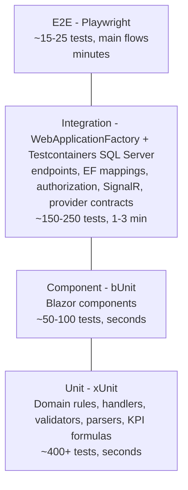

# 06 - Testing Strategy

> **Status:** Draft v0.3 (2026-09-26) - practice project.
> **Principle:** every acceptance criterion in `05-backlog.md` is verified by at least one automated test at the cheapest level that gives confidence. Tests are part of the Definition of Done.

---

## 1. Test pyramid

| Level | Project | Tools | Scope | Runs |
|---|---|---|---|---|
| Unit | `ProdTrack.Domain.Tests`, `ProdTrack.Application.Tests` | xUnit v3, AwesomeAssertions, NSubstitute, `FakeTimeProvider` | State machines, business rules BR-01..BR-15, KPI formulas, `ScanCodeParser`, validators, handlers with substituted ports | Every build, local pre-push |
| Architecture | `ProdTrack.ArchitectureTests` | NetArchTest.Rules | Layer dependency rules, naming, no cloud SDK outside `Infrastructure.*` | Every build |
| Component | `ProdTrack.UI.Tests` | bUnit | Scan input, queue list, KPI tiles, forms with validation, role-based visibility | Every build |
| Integration | `ProdTrack.Server.IntegrationTests` | `WebApplicationFactory<Program>`, Testcontainers.MsSql, Respawn (DB reset), test auth handler | HTTP endpoints end-to-end through EF Core to real SQL Server; ProblemDetails; authorization matrix; concurrency (409); audit entries; SignalR messages | Every build (Docker required) |
| Provider contract | `ProdTrack.Infrastructure.Tests` | xUnit (+ Azurite / fake GCS only if an alternative adapter exists) | Same `IFileStorage` / `ISecretProvider` contract suite against Local (default) and any optional cloud provider | Every build |
| E2E | `ProdTrack.E2E.Tests` | Playwright for .NET (Chromium; tablet viewport 1280x800 + desktop) | Main user flows through the real UI, app started on the GitHub-hosted `ubuntu-latest` runner against a SQL Server service container, test auth (`Auth__Mode=Dev`, environment `Testing`) | `e2e` job of `ci.yml` (required before merge by convention; deploy only accepts green `ci` runs) (PT-029, PT-050) |
| Smoke | deploy workflow step | curl + one Playwright sign-in test | `/health/ready` on `https://dmb-prodtrack.runasp.net` with retries (cold start after deploy or sleep), sign-in page; read-only, never writes prod data | Every deploy |
| Performance | `tests/perf/*.js` | k6 | Server-side p95 < 500 ms for scan/start/complete with 30 virtual tablets + 5 dashboards on the warm free site; memory < 256 MB; PH-to-EU round trip reported separately; small loads only (fair use) | Sprint 7 (PT-051), before demos |
| Security | CI + Dependabot + manual | `dotnet list package --vulnerable`, OWASP ZAP baseline (optional), checklist | Vulnerable packages, headers, auth bypass attempts | CI + Sprint 7 (PT-052) |
| Accessibility | E2E | `Deque.AxeCore.Playwright` | WCAG 2.2 AA violations on key pages | Sprint 7 |

## 2. What to test where (examples)

| Behaviour | Unit | Integration | E2E |
|---|---|---|---|
| WO status transitions (BRD 5.5) | All valid/invalid transitions (theory data) | Release endpoint returns 422 when artwork not approved | Planner releases WO in UI |
| Operation start rules (BR-03/04) | Station mismatch, sequence, overlap, hold | `POST /operations/{id}/start` 403/422/200 with correct roles | Operator scans and starts |
| Quantities (BR-05/06) | good + scrap <= input; next op input | Complete endpoint updates next op | Complete flow |
| KPI formulas (BRD 9) | Scrap rate 5/105 = 4.76%; OEE example 68.4% | KPI endpoints over seeded data | Dashboard shows values |
| Scan payloads | Parser: valid/invalid/lowercase/whitespace/too long | `/scan/{code}` resolves | Hardware-scan simulation (type + Enter) |
| Authorization | Policy -> role mapping | **Matrix test**: every endpoint x every role -> expected 2xx/403 | Operator doesn't see Admin menu |
| Audit | Interceptor builds change set | Update creates audit row with old/new | Audit viewer shows change |
| Idempotency | Handler ignores duplicate requestId | Double POST returns same result, one event | - |
| Real-time | Notifier maps events to messages | Test SignalR client receives `OperationChanged` | Dashboard tile updates |
| File upload | Content sniffing, size, extension | Multipart upload stored via `IFileStorage` | Upload proof in UI |

## 3. Conventions

- **Naming:** `MethodOrScenario_Condition_ExpectedResult`, e.g. `Start_WhenWorkOrderOnHold_ReturnsBusinessRuleError`. Test class per unit under test: `ReleaseWorkOrderHandlerTests`.
- **Structure:** Arrange / Act / Assert with blank lines; one logical assertion per test (multiple `Should()` calls on the same result are fine).
- **Traits:** `[Trait("Category", "Unit" | "Integration" | "E2E" | "Contract")]` so CI workflows can filter.
- **Story traceability:** add `[Trait("Story", "PT-031")]` on tests that cover acceptance criteria. A Gherkin scenario maps to one test method named after the scenario (e.g. `PT031_WrongStation_IsRejected`).
- **Builders:** test data builders in `tests/ProdTrack.TestUtilities` (`WorkOrderBuilder`, `OperationBuilder`) and an `ObjectMother` for seeded reference data. No shared mutable static state.
- **Time:** always `FakeTimeProvider` (`Microsoft.Extensions.TimeProvider.Testing`); never `DateTime.Now` in tests or code.
- **Randomness:** fixed seeds; Bogus allowed for data with a seed.
- **No sleeping:** use polling helpers with timeouts for async/real-time assertions.

## 4. Integration test setup

> **Implemented (Sprint 0-1, ADR-0010):** `ProdTrackFactory : WebApplicationFactory<Program>` (tests/ProdTrack.Server.IntegrationTests) runs the real host in environment `Testing` against **SQLite in-memory** (one open connection per factory, schema from the EF model via `ProdTrack.TestSupport`), `Auth:Mode=Test` with `X-Test-User` / `X-Test-Roles` headers, and a temp folder for files. No Docker or SQL Server is needed locally or in CI. SQL Server-specific behaviour (migrations, rowversion, schemas) is covered by generating the idempotent migration script in CI; Testcontainers/Respawn remain the target once E2E (PT-029) adds a SQL Server service container. The bullets below describe that target.

- `ProdTrackApiFactory : WebApplicationFactory<Program>, IAsyncLifetime` starts one `MsSqlContainer` (image `mcr.microsoft.com/mssql/server:2022-latest`) per test collection, applies migrations once, and uses **Respawn** to reset data between tests (reference data re-seeded).
- Environment `Testing`; `Auth:Mode=Test` registers a test authentication handler that reads `X-Test-User` / `X-Test-Roles` headers (helper: `client.AsRole(Roles.Operator)`).
- `Cloud:Provider=Local` with a temp folder for files; `INotifier` spy to assert real-time events; SignalR tested with `HubConnectionBuilder` against `factory.Server.CreateHandler()`.
- LocalDB fallback (`Testing:UseLocalDb=true`) for Windows machines without Docker; CI always uses Testcontainers.

## 5. E2E scenarios (release gate PT-050)

| # | Scenario | Roles |
|---|---|---|
| E1 | Sign in (Dev auth) and land on role home page | all |
| E2 | Create sales order with 2 lines -> create work orders | Planner |
| E3 | Upload proof, approve, release WO, open traveler PDF | Planner |
| E4 | Tablet: select station, scan OP code, start, log scrap, complete | Operator |
| E5 | Dashboard updates WIP tile after E4 without reload | Supervisor |
| E6 | QC inspection fail -> rework op appears at PRINT-01 | QC |
| E7 | Hold WO -> operator cannot start | Supervisor, Operator |
| E8 | Viewer cannot see write actions | Viewer |
| E9 | Audit viewer shows WO due-date change | Admin |

Page Object Model per page (`StationQueuePage`, `WorkOrderDetailPage`); `data-testid` attributes on interactive elements (`data-testid="btn-start-operation"`), never CSS/text selectors for actions. Traces and screenshots saved on failure.

## 6. Coverage and quality gates

| Gate | Threshold | Enforced |
|---|---|---|
| Build warnings | 0 (warnings as errors) | CI |
| Formatting | `dotnet format --verify-no-changes` | CI |
| Unit + integration pass | 100% | CI (required PR policy) |
| Line coverage Domain + Application | >= 80% (report-only in Sprints 0-2, gate from Sprint 3) | CI |
| Vulnerable packages | No High/Critical | CI |
| E2E pass | 100% | before prod (PT-050) |
| Flaky tests | Quarantine with `[Trait("Category","Quarantine")]` + bug within 1 day | Team rule |

Coverage is a signal, not a goal: prioritise business rules and authorization over trivial getters.

## 7. Test data and environments

| Environment | Data | Purpose |
|---|---|---|
| Local / CI | Seeded reference data + builders; containers disposed | Fast feedback |
| Local (PC) | Reference data + `DemoDataSeeder` (fictitious customers "Acme Refinery", "Blue Ocean Offshore"); restored prod bacpac for migration rehearsal | Manual testing, exploratory sessions |
| Prod (MonsterASP free site) | Reference data + fictitious demo data only (free-plan ToS: learning/testing use) | Demos, release validation, smoke tests |

No real DMB data is ever used.

## 8. Manual / exploratory testing

- **Release regression (PT-070):** before v1.0, run the manual regression as a **GitHub test-run issue** (template `.github/ISSUE_TEMPLATE/test-run.md`: checklist per epic and the MVP demo script; failed steps become `bug` issues linked to the run). Phase 2 option: the same suites in **Azure Test Plans** (30-day trial, paid afterwards, `04` section 13.1).
- Each sprint review: 30-minute exploratory session locally and on the MonsterASP site using a tablet (or browser device emulation) with a USB scanner if available; findings logged as GitHub issues labelled `bug` with steps, expected/actual, screenshot.
- Free-hosting behaviour checklist (PT-072): open the site after > 30 min idle (cold start page), restart during use (reconnect overlay / offline banner), expired-certificate warning drill in the runbook.
- Tablet ergonomics checklist: touch targets >= 48 px, readable at arm's length, works with gloves (large buttons), audible feedback, landscape and portrait.

## 9. Bug workflow

Bug work item (Scrum process) with severity (1-Critical to 4-Low), repro steps, environment, build number. A fix PR must include a regression test that fails before the fix. Critical bugs go into the `Expedite` swimlane.

## 10. Change log

| Date | Version | Change |
|---|---|---|
| 2026-09-26 | 0.1 | Initial testing strategy |
| 2026-09-26 | 0.2 | GCP environments, emulator order, smoke on custom domains; manual regression in Azure Test Plans (PT-070) |
| 2026-09-26 | 0.3 | MonsterASP free hosting: Local + Prod environments, E2E on the self-hosted agent, smoke on runasp.net with cold-start retries, contract tests Local by default, perf targets for the free plan, reconnect checklist, Test Plans optional |
| 2026-09-26 | 0.3b | E2E in the GitHub `ci` workflow (SQL Server service container); release regression via GitHub test-run issue (Azure Test Plans Phase 2) |
| 2026-09-27 | 0.4 | Implementation: integration tests on SQLite in-memory (ADR-0010) instead of Testcontainers for Sprint 0-1; story traits `Story=PT-xxx` and `Category=Unit|Integration|Architecture` in use |
