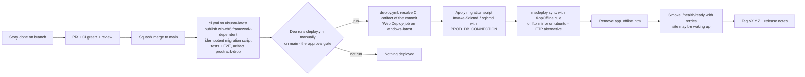

# 08 - Deployment and Operations

> **Status:** Draft v0.3 (2026-09-26) - practice project.
> **Hosting:** **MonsterASP.NET free plan** (US$0, no card): one IIS site on **`https://dmb-prodtrack.runasp.net`** (planned name, confirm availability at sign-up; if it is taken, record the chosen `<name>.runasp.net` here and in the GitHub variable `APP_URL`), one **1 GB MSSQL** database, EU (Germany). Environments: **Local** and **Prod** only. CI/CD: GitHub Actions, `11-github-setup.md` (Azure DevOps Phase 2: `04`). Limits, costs and sources: `03-tech-stack-and-cloud.md` section 3 and [`research/monsterasp.md`](research/monsterasp.md).
> **Never** change any `dmbwebsolutions.com` DNS record (apex, `www` or new subdomains) and never touch the Google Cloud project `find-an-agent` from this repo. The custom domain is deferred (`03` section 7).
> The free plan is for **learning/testing only** (ToS): fictional data only, no real DMB data, no commercial use.

---

## 1. Environments

| Environment | Where | Purpose | Deployed by | Data |
|---|---|---|---|---|
| **Local** | Deo's PC (`dotnet run`, Visual Studio, optional `docker compose up`) | Development, debugging, local E2E, migration rehearsal | Developer | LocalDB/Express or SQL Server container; `Auth:Mode=Dev` or Identity |
| CI (ephemeral) | GitHub-hosted `ubuntu-latest` runner (`ci.yml`) | Build, tests, E2E against the app started on the runner | Workflow | SQL Server service container / Testcontainers | - |
| **Prod** | MonsterASP site `siteXXXX` = `https://dmb-prodtrack.runasp.net` | The only hosted environment ("production" of the practice app, demos) | Workflow `deploy.yml`, run manually on `main` (the manual run is the approval on GitHub Free private repos; GitHub environment `production`) | MonsterASP MSSQL (1 GB) | Let's Encrypt, renew every 90 days (section 6) |

There is no hosted dev/staging: the free plan allows one site and one database, and a second account is prohibited by the ToS. Rehearse risky migrations locally against a restored copy of the latest prod `.bacpac` (section 7.3).

## 2. Local environment setup (PT-006)

1. Install the **.NET 10 SDK** (pinned by `global.json`), Git, and either **SQL Server LocalDB/Express** (Windows) or **Docker Desktop**.
2. Clone the repo, then choose a database:
   - LocalDB: `Server=(localdb)\MSSQLLocalDB;Database=ProdTrack;Trusted_Connection=True;TrustServerCertificate=True`
   - Docker: `docker compose up -d sql` (SQL Server 2022 container on port 1433; password from `.env`, not committed), connection `Server=localhost,1433;Database=ProdTrack;User Id=sa;Password=<from .env>;TrustServerCertificate=True`
3. Store the connection string with `dotnet user-secrets set "ConnectionStrings:ProdTrack" "<value>" --project src/ProdTrack.Server`.
4. `dotnet ef database update --project src/ProdTrack.Infrastructure --startup-project src/ProdTrack.Server`
5. `dotnet run --project src/ProdTrack.Server` -> `https://localhost:5001`. `Auth:Mode=Dev` lets you pick a test user (refused outside Development).
   - **Implemented defaults:** `appsettings.Development.json` already holds the LocalDB string above, so step 3 is only needed for Docker or another server. The dotnet-ef tool is a local tool: run `dotnet tool restore` first.
   - **First run:** on an empty database the host seeds roles, reference data (stations, colour schemes, signal words, reason codes, v1 routings) and the bootstrap admin (`Auth:BootstrapAdmin:Email/Password`). Development ships the documented dev-only password `ChangeMe!Dev2026` for `admin@prodtrack.local` (must be changed at first sign-in); override it with user-secrets. `Database:SeedDemoData=true` (Development only) adds demo products. `Database:MigrateOnStartup` is `false` by default: apply migrations with step 4.
   - `Auth:Mode=Dev` (set via user-secrets) shows a one-click user picker with one user per role; the host refuses to start with it outside Development.
6. Memory check (PT-006): run a Release build, click through a few pages and note the working set (Task Manager / `dotnet-counters`). Target < 180 MB to leave headroom under the 256 MB limit.

## 3. MonsterASP one-time setup (PT-055)

1. **Sign up** at https://www.monsterasp.net/ (free plan, no card). One account per person.
2. **Create the website:** choose the subdomain `dmb-prodtrack` on `runasp.net` (fallbacks: `dmbprodtrack`, `prodtrack-deo`). Note the internal site ID `siteXXXX` (used by FTP/Web Deploy hosts `siteXXXX.siteasp.net`).
3. **.NET version:** select .NET 10 (or keep "No managed code" - ASP.NET Core Module handles it). Keep **InProcess** hosting (the publish output's `web.config` sets `hostingModel="inprocess"`).
4. **HTTPS:** activate the free Let's Encrypt certificate for `<name>.runasp.net` (help: "How to activate HTTPS with Let's Encrypt certificate"). Note the expiry date in the runbook log (section 6). WebSockets require HTTPS.
5. **Database:** create one **MSSQL** database. Note server, database name, login and password.
6. **Remote access:** Databases -> the database -> **"Users and remote"** -> enable remote access. Test from Deo's PC or the box: `sqlcmd -S <server> -d <db> -U <login> -P <pwd> -Q "SELECT @@VERSION"`. If remote access is not available on free **(verify)**, fall back to: migrations applied by the app at startup behind a flag (`Database:MigrateOnStartup=true`, only for this host) and backups via the web SQL manager (`https://webmssql.monsterasp.net`) or the panel.
7. **Deployment credentials:** copy the FTP host/user/password (and Web Deploy user/password for the Windows variant) from the control panel.
8. **Store secrets** only in: **GitHub Actions repository secrets** of `deo-bernal/dmb-prodtrack` (`11` section 5: `MONSTERASP_WEBDEPLOY_PASSWORD`, `MONSTERASP_FTP_*`, `PROD_DB_CONNECTION`, `BACKUP_PASSPHRASE`) and Deo's password manager. Never in Git. (Phase 2: Azure DevOps variable group, `04` section 8.)
9. **Server-only configuration:** create `appsettings.Production.json` from `deploy/appsettings.Production.template.json`, fill in the connection string, `Auth:BootstrapAdmin:*`, optional Google client secret, and upload it **once** by FTP to the site root. Deploys exclude this file (section 5), so it is never overwritten or stored in the repo. If the control panel offers environment variables for the site **(verify)**, those can be used instead (`ConnectionStrings__ProdTrack`, etc.).
10. First deployment: run the `deploy` workflow manually (section 5). Sign in with the bootstrap admin and change the password.

## 4. Configuration on the host

| Setting | Value on MonsterASP | Source |
|---|---|---|
| `ASPNETCORE_ENVIRONMENT` | `Production` | `web.config` `<environmentVariable>` set by the publish profile (no secret) |
| `ConnectionStrings:ProdTrack` | MonsterASP DB (runtime login) | server-only `appsettings.Production.json` |
| `App:PublicBaseUrl` | `https://dmb-prodtrack.runasp.net` | `appsettings.Production.json` |
| `Cloud:Provider` | `Local` | `appsettings.json` |
| `Storage:Local:RootPath` | `App_Data/files` | `appsettings.json` |
| `Logging` (Serilog) | File sink `App_Data/logs/prodtrack-.json`, daily rolling, 10 MB, 14 files | `appsettings.json` |
| `Telemetry:Exporter` | `None` | `appsettings.json` |
| `Auth:Mode` | `Identity` | `appsettings.json` |
| `Database:MigrateOnStartup` | `false` (the deploy workflow applies migrations) | `appsettings.json` |

`App_Data` is not served by IIS as static content; the app creates `App_Data/files` and `App_Data/logs` at startup.

## 5. Deployment

### 5.1 Workflow flow (GitHub Actions)

- Default (as MonsterASP documents for GitHub Actions): **Web Deploy (msdeploy) from `windows-latest`** (`DEPLOY_METHOD=webdeploy`); alternative: **FTP (lftp) from `ubuntu-latest` with `app_offline.htm`** (`DEPLOY_METHOD=ftp`, PT-008). Workflows: `repo-scaffold/.github/workflows/deploy.yml`, explained in `11` section 6. If the repo becomes public or GitHub Pro is used, set `AUTO_DEPLOY=true` and add a required reviewer on the `production` environment (`11` section 7.2). Phase 2 Azure Pipelines YAML: `04` section 10.
- Excluded from mirror/sync (never deleted or overwritten on the server): `App_Data/`, `logs/`, `appsettings.Production.json`, `app_offline.htm`.
- `app_offline.htm` stops the app so DLLs are not locked (avoids FTP "550 file in use") and shows a friendly "Updating - back in a minute" page.
- Migrations run **before** the new code goes live, using expand/contract so the old code keeps working on the new schema.

### 5.2 Manual fallback deploy

- **Visual Studio:** download the publish profile (`.publishSettings`) from the control panel and use Publish (Web Deploy). Do not commit the profile.
- **FTP client:** upload `app_offline.htm`, upload the publish folder (skip the excluded items), delete `app_offline.htm`.

### 5.3 Versioning and release notes

SemVer; `InformationalVersion` = `X.Y.Z+<build number>.<short sha>` shown in the UI footer and in `/health/ready`. Release notes from PR titles (PT keys) in `docs/releases/vX.Y.Z.md`.

## 6. HTTPS certificate renewal runbook (every 90 days, PT-067)

The free plan's Let's Encrypt certificate is valid 90 days and **must be renewed manually**.

1. **Reminder:** a calendar event every 80 days ("Renew ProdTrack HTTPS") plus a GitHub issue in the next sprint milestone.
2. **Automated check:** the scheduled workflow `ops.yml` (weekly, Monday 09:00 PHT = `0 1 * * 1` UTC, `ubuntu-latest`) reads the certificate expiry of `https://<name>.runasp.net` and **fails when fewer than 21 days remain** (a failed run e-mails Deo through GitHub Actions notifications - that is GitHub sending, not the app). Note: GitHub disables scheduled workflows after 60 days without repository activity.
3. **Renew:** log in to the MonsterASP control panel -> Websites -> the site -> **HTTPS / SSL** -> renew/re-issue the Let's Encrypt certificate for the free subdomain.
4. **Verify:** open the site in a private window; `echo | openssl s_client -connect dmb-prodtrack.runasp.net:443 -servername dmb-prodtrack.runasp.net 2>/dev/null | openssl x509 -noout -enddate`; re-run the `ops` workflow (Actions -> ops -> Run workflow).
5. **Record** in the log below and set the next reminder.

| Date renewed (PHT) | New expiry | By | Notes |
|---|---|---|---|
| (first activation) | | Deo | |

The same login also serves as the **regular account activity** that protects a free account from inactivity deletion (period not published: log in at least every 2-4 weeks).

## 7. Database operations

### 7.1 Logins

Use the login created by the panel for the app. If the free plan allows creating extra users **(verify)**, create a separate migration login with DDL rights and give the runtime login only `db_datareader`/`db_datawriter` + `EXECUTE`.

### 7.2 Migrations

- `ci.yml` generates `migrations.sql` with `dotnet ef migrations script --idempotent` and puts it in the `prodtrack-drop` artifact; `deploy.yml` applies it before the code sync with `Invoke-Sqlcmd`/`sqlcmd -b` (connection from secret `PROD_DB_CONNECTION`). Alternative: `dotnet ef database update --connection "$PROD_DB_CONNECTION"` from Deo's PC.
- Forward-only; expand/contract for breaking changes.
- Before a risky migration: manual `.bacpac` export (7.3).

### 7.3 Backups and restore (the free plan has none)

| What | How | When | Retention |
|---|---|---|---|
| Database | `sqlpackage /Action:Export /SourceConnectionString:"$PROD_DB_CONNECTION" /TargetFile:prodtrack-<date>.bacpac` in `ops.yml`, **gpg-encrypted** with `BACKUP_PASSPHRASE` and kept as a workflow artifact (28 days); or on the PC | Weekly + before risky migrations | Artifacts: last ~4 (auto-expire); download monthly to Deo's PC/personal storage (artifact quota 500 MB) |
| Files (`App_Data/files`) | `lftp mirror` (download) in `ops.yml` when `BACKUP_FILES=true`, encrypted artifact | Weekly | Last ~4 (artifact expiry) |
| Config | Git; `appsettings.Production.json` in the password manager (secure note) | On change | - |

Targets for the practice app: RPO <= 7 days, RTO <= 4 h (see NFR-10 in `01`). Restore drill before v1.0: import the latest bacpac into LocalDB/Docker (`sqlpackage /Action:Import`), run the app locally against it, verify.

### 7.4 Size watch (1 GB limit)

`ops.yml` runs `EXEC sp_spaceused` and warns above 700 MB. Levers: purge/archive audit rows older than 12 months (`02` section 5.3), never store files or logs in SQL, shrink only after purging.

## 8. Runtime operations: sleep, memory, background work

- **Sleep:** the app pool stops after 30 min without requests (cannot be changed on free). The first request afterwards is a cold start (a few seconds + EF model build). Users see the friendly loading/reconnect UI (PT-072). Do **not** add external keep-alive pings to prevent it.
- **Background services** (e.g. low-stock evaluation, audit purge) are in-process `BackgroundService`s: idempotent, they catch up on start and must tolerate being stopped at any time. There are no scheduled tasks on free; ops jobs run as the scheduled GitHub Actions workflow `ops.yml`.
- **Memory (256 MB):** watch for app pool recycles/502/503 errors; check the log for startup lines appearing often. Levers: fewer cached items, smaller Blazor circuit retention (`CircuitOptions.DisconnectedCircuitMaxRetained`, `DisconnectedCircuitRetentionPeriod`), Workstation GC, avoid loading large files into memory (stream uploads).
- **No email:** password resets are done by an Admin; no email notifications in the MVP.

## 9. Monitoring

| Signal | Where |
|---|---|
| Logs | `App_Data/logs/*.json` (Serilog compact JSON): download via FTP (`lftp -e "mirror App_Data/logs ./logs; quit"`) or view in the control panel file manager; query locally with `jq` or Seq (optional, local) |
| Health | `GET /health/live` (process) and `/health/ready` (DB) - checked by the deploy smoke test and by `ops.yml` weekly |
| Certificate expiry, DB size | `ops.yml` (section 6, 7.4) |
| Errors | Global exception handler logs with correlation ID; the UI shows the ID to the user |
| Alerting | GitHub Actions e-mail notifications on failed workflow runs (Deo's GitHub notification settings) |

No uptime monitor that polls every few minutes: it would keep the free site awake against the fair-use intent.

## 10. Troubleshooting

| Symptom | Likely cause | Action |
|---|---|---|
| FTP `550` / file in use during deploy | App running, DLLs locked | Ensure `app_offline.htm` was uploaded first; wait 5-10 s; retry |
| HTTP 500.30 / 500.31 after deploy | Startup failure / wrong runtime | Check `App_Data/logs` and stdout log (enable `stdoutLogEnabled` in `web.config` temporarily); confirm .NET 10 selected; framework-dependent `win-x86` |
| App pool disabled | EXE with OutOfProcess | Keep InProcess; open a ticket if disabled |
| 502/503 or frequent restarts | Memory limit (256 MB) | Section 8 levers |
| Blazor keeps "Reconnecting" | WebSockets need HTTPS / certificate expired | Check certificate (section 6); site must use `https://` |
| `/health/ready` Unhealthy | DB unreachable / wrong connection string / DB full | Check `appsettings.Production.json`; size watch (7.4) |
| Workflow cannot reach DB | Remote access disabled / IP restrictions | Enable "Users and remote" in the panel (section 3 step 6); GitHub-hosted runner IPs change, so do not rely on an IP allowlist |
| Google sign-in `redirect_uri_mismatch` | Redirect URI not registered | Add `https://<name>.runasp.net/signin-google` to the OAuth client |
| Users signed out after each deploy | Data Protection keys not persisted | Keys are in `sec.DataProtectionKeys` (DB) |
| Site unreachable / account message | Account suspended or deleted (fair use / inactivity) | Contact support via panel; restore from bacpac to a new site/local |

## 11. Rollback and incidents

- **Rollback:** run `deploy.yml` manually with input `ci_run_id` = the ID of the previous good `ci` run (its artifact must still exist - 5-day retention - otherwise re-run `ci.yml` on the previous release tag first and deploy that run). Migrations are forward-only, so older code must work on the newer schema (expand/contract). For a bad data migration: restore the pre-deploy bacpac locally, fix, and re-import only if needed (importing into the hosted DB requires an empty database - rehearse first).
- **Secret rotation:**

| Secret | Where | Rotation |
|---|---|---|
| FTP / Web Deploy password | Control panel -> GitHub Actions secret | On exposure or every 6 months: reset in panel, update the secret |
| DB password | Control panel -> `PROD_DB_CONNECTION` + `appsettings.Production.json` | On exposure or every 6 months |
| Google OAuth client secret (PT-068) | `appsettings.Production.json` | Yearly or on exposure |
| Bootstrap admin password | `appsettings.Production.json` | Remove the value after first sign-in |
| `BACKUP_PASSPHRASE` | GitHub secret + password manager | Only if exposed (old backups need the old passphrase - keep it) |
| Phase 2: `AZDO_MIRROR_PAT` / agent registration PAT | GitHub secret / only during agent setup (`04`) | At PAT expiry (<= 90 days); revoke registration PAT right after setup |

- **Incident template:** `docs/incidents/YYYY-MM-DD-title.md`: summary, impact, timeline (PHT), root cause, fix, follow-ups.

## 12. Account lifecycle and teardown

- Log in to the control panel regularly (at least every 2-4 weeks; the renewal every 90 days alone may not be enough) and keep the site receiving occasional real use.
- Keep the weekly backups (section 7.3) - the free plan can be suspended or discontinued without notice.
- **Teardown:** export a final bacpac and files, delete the website and database in the panel, delete the GitHub Actions secrets (and archive the repo if desired). Phase 2 only: unregister the self-hosted agent. No DNS records exist to clean up.

## 13. Upgrade path (custom domain)

See `03` section 7. For MonsterASP Premium: add the custom domain `prodtrack.dmbwebsolutions.com` to the site, create a single CNAME `prodtrack` -> `siteXXXX.siteasp.net` at the registrar (only after Deo approves; apex and `www` untouched), let Let's Encrypt auto-renew, update `App:PublicBaseUrl`, `APP_URL` and the OAuth redirect URI. No code change. For Azure/GCP: Appendix A of `03` and optional stories PT-057/PT-058.

## 14. Change log

| Date | Version | Change |
|---|---|---|
| 2026-09-26 | 0.1 | Initial deployment and operations guide (Azure primary) |
| 2026-09-26 | 0.2 | Google Cloud primary: Terraform, Cloud SQL start/stop, domain mapping, runbook, trial end and teardown; Azure alternative |
| 2026-09-26 | 0.3 | **Rewritten for the MonsterASP free plan:** Local + Prod environments, local setup, one-time MonsterASP setup, host configuration, FTP/Web Deploy deployment with `app_offline.htm`, 90-day HTTPS renewal runbook, bacpac backups and size watch, sleep/memory operations, troubleshooting, account lifecycle, custom-domain upgrade path. GCP/Azure content removed (see `03` Appendix A) |
| 2026-09-26 | 0.3b | **GitHub Actions** replaces Azure Pipelines for delivery: `ci.yml`/`deploy.yml`/`ops.yml`, Web Deploy from `windows-latest` default (FTP alternative), manual deploy gate, repo secrets, encrypted backup artifacts, rollback by `ci_run_id` input; Azure DevOps Phase 2 |
| 2026-09-27 | 0.4 | Section 2: implemented local defaults (LocalDB in Development settings, local dotnet-ef tool, first-run bootstrap admin and seeding, SeedDemoData, MigrateOnStartup, Dev auth mode) |
