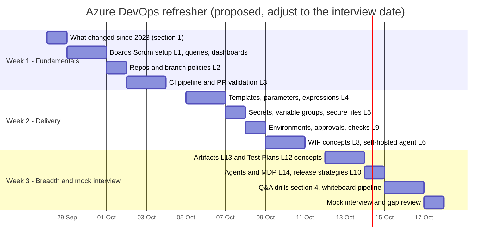

# 10 - Azure DevOps Study Guide (refresher for a Senior Developer interview)

> **Status:** Draft v0.3 (2026-09-26) - practice project. **Phase 2 material:** ProdTrack is delivered on GitHub for now (`11-github-setup.md`); Azure DevOps hands-on work happens in a throwaway `ADO-Lab` project or in Phase 2 (PT-073, setup in `04`). This guide stays the interview refresher; the lab table names the GitHub equivalent you already use so you can compare the two in an interview.
> **Who this is for:** Deo, who used Azure DevOps for under 2 years until about 2023 and is preparing for a Senior Developer interview at a company that uses Azure DevOps.
> **How to use it:** section 1 is a quick "what's new since 2023" briefing, section 2 a self-check, section 3 hands-on labs mapped to this project's backlog, section 4 interview questions with short model answers, and section 5 a 2-3 week schedule. Every item in section 1 was checked against a Microsoft (or cited) source on 2026-09-26. Features change often, so re-check anything you plan to quote as a date.

---

## 1. What changed in Azure DevOps since 2023 (verified)

| When | Change | Why it matters / what to say in an interview | Source |
|---|---|---|---|
| 2023 (Sprint 225) | **New organizations disable creation of classic build and release pipelines by default** (organization/project settings toggles). Existing classic pipelines keep running and can be edited | YAML is the default for new work. Know how to migrate classic releases to multi-stage YAML with environments and approvals | https://devblogs.microsoft.com/devops/disable-creation-of-classic-pipelines/ ; https://learn.microsoft.com/en-us/azure/devops/release-notes/2023/pipelines/sprint-225-update |
| Feb 2024 | **Workload identity federation (WIF) for Azure Resource Manager service connections is GA**: no secrets or certificates; automatic creation; conversion of existing secret-based connections | Default answer to "how does your pipeline authenticate to Azure?" Secretless, uses OIDC between Azure DevOps and Entra ID | https://devblogs.microsoft.com/devops/workload-identity-federation-for-azure-deployments-is-now-generally-available/ ; https://learn.microsoft.com/en-us/azure/devops/release-notes/2024/sprint-234-update |
| 2024 (Sprint 240) | **Pipelines can request OIDC ID tokens** through `System.OidcRequestUri` (REST *Oidctoken - Create*), so scripts and non-Microsoft tools can federate. With a `serviceConnectionId` the token is for that connection; without it you get a pipeline-scoped token (`sub = p://org/project/pipeline`) | This is how this project authenticates to Google Cloud without keys (PT-059). The Azure SDK also added `AzurePipelinesCredential` for code running in pipelines | https://learn.microsoft.com/en-us/azure/devops/release-notes/2024/sprint-240-update ; https://learn.microsoft.com/en-us/rest/api/azure/devops/distributedtask/oidctoken/create?view=azure-devops-rest-7.1 ; https://devblogs.microsoft.com/azure-sdk/improve-security-posture-in-azure-service-connections-with-azurepipelinescredential/ |
| Nov 2024 | **Managed DevOps Pools (MDP) GA**: Microsoft-managed agent pools running in your Azure subscription (your VNet, custom images, scale settings), billed as Azure resources | The answer when a company needs private networking or bigger machines without maintaining self-hosted agents | https://devblogs.microsoft.com/devops/managed-devops-pools-ga/ ; https://learn.microsoft.com/en-us/azure/devops/managed-devops-pools/overview |
| 2025 | **Hosted image retirements**: `ubuntu-20.04` retired (April 2025); `windows-2019` retired (fully by 31 Dec 2025). Use `ubuntu-24.04`/`ubuntu-latest`, `windows-2022`/`windows-2025` | Pin images deliberately; plan image upgrades like dependency upgrades | https://learn.microsoft.com/en-us/azure/devops/pipelines/agents/hosted ; https://devblogs.microsoft.com/devops/upcoming-updates-for-azure-pipelines-agents-images/ |
| Apr 2025 | **No new Azure DevOps OAuth app registrations**; existing Azure DevOps OAuth apps are scheduled for retirement in 2026. New integrations use **Microsoft Entra OAuth** | For integrations, prefer Entra tokens / managed identities over PATs and legacy OAuth | https://devblogs.microsoft.com/devops/no-new-azure-devops-oauth-apps/ ; https://learn.microsoft.com/en-us/azure/devops/integrate/get-started/authentication/entra-oauth |
| 2025 | **GitHub Advanced Security for Azure DevOps** is sold as two products: **GitHub Secret Protection** (US$19) and **GitHub Code Security** (US$30) per active committer per month | Know the capabilities: secret scanning + push protection, dependency scanning, CodeQL code scanning, results in Repos | https://devblogs.microsoft.com/devops/github-secret-protection-and-github-code-security-for-azure-devops/ ; https://learn.microsoft.com/en-us/azure/devops/repos/security/github-advanced-security-billing |
| Jun 2025 | **New Boards Hub** is the only Boards experience (legacy Boards removed; no opt-out) | UI screenshots/tutorials from 2023 may look different; behaviour of backlogs/sprints/queries is the same | https://learn.microsoft.com/en-us/azure/devops/release-notes/2025/sprint-259-update ; https://devblogs.microsoft.com/devops/new-boards-hub-update-spring-2025/ |
| Jul 2025 | **Markdown editor for work item large text fields GA** (opt-in per field; a field saved as Markdown stays Markdown); Markdown in comments too | Acceptance criteria can be written in Markdown | https://devblogs.microsoft.com/devops/markdown-support-arrives-for-work-items/ |
| 2025 | **New Repos pull request experience** listed as generally available, with continuing improvements (comment navigation, target-branch filtering, accessibility) | PR review UI differs from 2023 | https://learn.microsoft.com/en-us/azure/devops/project/navigation/preview-features ; https://learn.microsoft.com/en-us/azure/devops/release-notes/2025/sprint-265-update |
| Nov 2026 (planned) | **Node 6, 10 and 16 task handlers removed from the agent**; tasks targeting them will run on the latest Node available (or fail). Custom tasks should target **Node 20_1** or **Node 24** (Node 24 is the recommended target; Node 20 removal is also scheduled) | Explains the log warnings you'll see; update task major versions and custom tasks | https://learn.microsoft.com/en-us/azure/devops/release-notes/roadmap/2026/retire-node-6 ; https://learn.microsoft.com/en-us/azure/devops/pipelines/agents/nodejs-runners |
| Ongoing | **Public projects are being retired**; existing public projects convert to private (scheduled for 2027 per the parallel-jobs documentation). The free Microsoft-hosted grant for private projects (1 job, 1,800 min/month) may need a request form for new organizations | Budget for parallel jobs; don't rely on public-project free minutes | https://learn.microsoft.com/en-us/azure/devops/pipelines/licensing/concurrent-jobs |

Not included because I could not verify them with a primary source: claims about Azure DevOps Server release naming, AI/Copilot features in Boards/Repos, and exact dates for the retirement of legacy OAuth apps. Check the release notes (https://learn.microsoft.com/en-us/azure/devops/release-notes/) and the roadmap (https://learn.microsoft.com/en-us/azure/devops/release-notes/features-timeline) the week before the interview.

## 2. Core concepts checklist (can you explain each in 1-2 minutes?)

**Boards and Scrum**
- [ ] Processes (Basic, Agile, Scrum, CMMI); inherited processes and custom fields; why Scrum uses *Effort* and *Product Backlog Item*.
- [ ] Hierarchy Epic > Feature > PBI > Task; bugs as requirements vs tasks; backlog levels.
- [ ] Iterations vs areas; team settings; capacity; sprint burndown; velocity; cumulative flow; WIP limits; Definition of Done per column.
- [ ] Queries (flat, tree, direct links), tags, charts on dashboards; CSV import/export; `AB#123` linking.

**Repos**
- [ ] Branch policies: reviewers, linked work items, comment resolution, merge types, build validation, status checks, path filters, auto-complete.
- [ ] Branch security (force push, bypass policies), tag security, forks, PR templates, required reviewers by path.
- [ ] Branching strategies: trunk-based with short-lived branches vs GitFlow; release branches; hotfixes.

**Pipelines**
- [ ] YAML structure: `trigger`, `pr`, `schedules`, `resources`, `parameters`, `variables`, `stages` > `jobs` > `steps`; `pool`.
- [ ] Template types: stage/job/step/variable templates, `extends` templates (for mandatory security steps), template repositories via `resources.repositories`.
- [ ] Expressions: compile-time `${{ }}`, runtime `$[ ]`, macro `$( )`; conditions; `dependsOn`; output variables (`isOutput=true`, `dependencies.<job>.outputs[...]`, `stageDependencies`).
- [ ] Runtime parameters vs variables; variable groups (plain, secret, Key Vault-linked); secure files; secret masking; `env:` mapping.
- [ ] Deployment jobs, environments, strategies (`runOnce`, `rolling`, `canary`), approvals and checks (approvals, branch control, business hours, exclusive lock, invoke REST/Azure Function, required template).
- [ ] Service connections: ARM with WIF, Docker registry, generic, GitHub; per-pipeline authorization; protected resources.
- [ ] Agents: Microsoft-hosted (images, limits), self-hosted, scale-set agents, Managed DevOps Pools; parallel jobs and licensing.
- [ ] Artifacts: pipeline artifacts (`publish`/`download`) vs Azure Artifacts feeds (NuGet/npm/Universal), upstream sources, views, retention.
- [ ] Caching (`Cache@2`), test results and code coverage publishing, pipeline decorators (org-level), retention policies.

**Quality and security**
- [ ] Test Plans (manual test cases, suites, configurations, runner, exploratory testing), licence.
- [ ] Advanced Security features; dependency scanning alternatives; secret hygiene; least privilege for the build service identity (*Limit job authorization scope*).

## 3. Hands-on labs mapped to this project

Labs run in a throwaway Azure DevOps project (`ADO-Lab`, free: 5 Basic users, 1 self-hosted parallel job - the Microsoft-hosted grant needs billing, so every lab uses a self-hosted agent, `04` section 1.2) or on ProdTrack itself once Phase 2 (PT-073) connects Azure Pipelines to the GitHub repo. The "GitHub equivalent" column is what ProdTrack uses now.

| # | Lab | GitHub equivalent now (story) | What to practise | Done when |
|---|---|---|---|---|
| L1 | Scrum project, iterations, CSV import, board setup | Projects board + milestones via `create-github-issues.sh` (PT-001) | Scrum process, area/iteration paths, capacity, board columns + WIP, CSV hierarchy import of `docs/backlog.csv` (`04` sections 1-4) | Epics tree correct; Sprint 0 has its PBIs and tasks |
| L2 | Repo + branch policies + PR template | Conventions + pre-push hook; rulesets only if public/Pro (PT-059) | Policies table in `04` section 6, squash-only, linked work items, `AB#` | A direct push to main is rejected; a PR shows required checks |
| L3 | CI pipeline for PR validation | `ci.yml` (PT-002) | `trigger` vs `pr`, path filters, `UseDotNet@2`, test results, coverage, build validation policy | PR blocked on failing test; Tests and Coverage tabs populated |
| L4 | Templates + runtime parameter `deployTarget` | `deploy.yml` input `deployTarget` (PT-007, PT-058) | Stage/job/step templates, `${{ if }}`, `${{ else }}`, `parameters` with `values`, compile-time vs runtime | "Run pipeline" shows the `deployTarget` dropdown; compiled YAML (Download full YAML) shows only the MonsterASP stages |
| L5 | Variable groups + secret handling | Actions repository secrets (PT-007) | Variable group with secret variables and pipeline permissions; masking; `env:` mapping; secure files | Deploy works; no secret visible in logs |
| L6 | Self-hosted agent | GitHub-hosted runners (no equivalent needed) | Register a Linux agent as a service (`04` section 1.2): PAT scope, agent pool, capabilities/demands, non-admin user, updates | Pipeline runs on your agent; PAT revoked afterwards |
| L7 | Dashboards, queries, wiki | Projects views/insights, `docs/` in repo | Dashboard widgets (`04` section 13.4); publish `docs/` as a code wiki; sprint notes in project wiki | Sprint review uses the dashboard |
| L8 | Workload identity federation (concepts) | GitHub OIDC (`id-token: write`) for the optional Azure/GCP targets (PT-058) | `System.OidcRequestUri`, token claims, ARM WIF service connections; compare with GitHub's OIDC subject claims | You can explain OIDC federation vs stored secrets for both tools |
| L9 | Environments, approvals, checks, exclusive lock | `production` environment; manual dispatch gate on private Free (PT-007) | Environment `prodtrack-prod` approvals, branch control, business hours, exclusive lock; deployment history | Prod stage waits for approval; feature-branch run can't deploy |
| L10 | Release strategies and rollback on IIS | `deploy.yml` with `ci_run_id` (PT-008) | `app_offline.htm` + msdeploy (`-enableRule:AppOffline`) vs FTP; redeploy of a previous artifact; YAML `runOnce`/`rolling`/`canary` strategies conceptually (VM/Kubernetes) | Rollback rehearsed in under 5 minutes |
| L11 | Release gate with E2E + dependency scanning | `e2e` job + Dependabot (PT-050, PT-052) | Stage dependencies, conditions, failing the release on test results; vulnerable-package scan | Prod blocked when E2E fails |
| L12 | Test Plans (optional, 30-day trial) | GitHub test-run issue (PT-070) | Requirement-based suites, shared steps, parameters, runner, bugs from failed steps, progress report | A plan executed and on the dashboard |
| L13 | Azure Artifacts feed | GitHub Packages (PT-071) | Feed with nuget.org upstream, `NuGetAuthenticate@1`, SemVer, views, retention, 2 GiB limit | Contracts package consumed from the feed |
| L14 | Agents: hosted vs self-hosted vs Managed DevOps Pools | GitHub-hosted vs self-hosted runners | Read how MDP differs (needs Azure); why the hosted free grant needs billing | You can explain the trade-offs |

## 4. Interview questions with concise model answers

**Q1. Walk me through the structure of a multi-stage YAML pipeline.**
Triggers (`trigger`, `pr`, `schedules`, pipeline `resources`) decide when it runs. `parameters` are typed runtime inputs; `variables` hold values and groups. `stages` contain `jobs` (a job runs on one agent; jobs in a stage can run in parallel) and jobs contain `steps` (tasks or scripts). Stages depend on each other via `dependsOn` and `condition`. Deployment jobs target environments so approvals, checks and history apply. In ProdTrack: Build -> Deploy_Dev -> Deploy_Prod, one artifact promoted through environments.

**Q2. What are templates and when do you use `extends`?**
Templates reuse stages, jobs, steps or variables with parameters (like functions). `extends` makes a pipeline inherit from a template that controls the overall structure; combined with the *Required template* check on an environment or service connection it enforces mandatory steps (e.g. security scans) org-wide. Templates can live in a separate repo referenced through `resources.repositories` and pinned to a tag.

**Q3. `${{ }}` vs `$[ ]` vs `$( )`?**
`${{ }}` is evaluated at compile time (template expansion; can add/remove stages, uses parameters); `$[ ]` is a runtime expression (e.g. conditions, output variables from dependencies); `$( )` is macro syntax replaced just before a task runs. Example: `targetCloud` uses `${{ if }}` so the unused cloud's stages don't exist in the run.

**Q4. How do you set up PR validation?**
A `pr:` trigger in YAML for GitHub/Bitbucket, but for **Azure Repos** PR builds are configured through the **build validation branch policy** (the YAML `pr:` keyword is ignored for Azure Repos). Add path filters, make it required, set an expiry, and combine with required reviewers, linked work items and comment resolution.

**Q5. Which branch policies do you consider essential?**
Minimum reviewers (no self-approval in a team, reset votes on new pushes), build validation, linked work items, comment resolution, restricted merge types (squash for linear history), and security: deny force push and bypass. Optionally required reviewers by path (e.g. `infra/` needs a DevOps reviewer) and status checks from external tools.

**Q6. Environments, approvals and checks - how do they work?**
An environment is a deployment target with history. Checks are evaluated before a stage that targets it starts: manual approvals (with timeout and instructions), branch control, business hours, exclusive lock, invoke REST API / Azure Function, required template, and more. Checks can also protect service connections, variable groups, secure files, repos and agent pools. They replaced classic release "pre-deployment approvals/gates".

**Q7. Variable groups vs Key Vault?**
Variable groups share variables across pipelines; they can store secrets in Azure DevOps (masked, access-controlled) or be linked to Azure Key Vault so secret values stay in the vault and are fetched at runtime by a service connection. Best practice: application secrets should be read by the app at runtime from the vault (managed identity) and never flow through the pipeline; pipeline-only secrets in Key Vault-linked groups or secure files with approvals. In ProdTrack (GCP) app secrets live in Secret Manager and Cloud Run reads them.

**Q8. What are service connections and how should they authenticate today?**
Stored, access-controlled connections to external systems (Azure, registries, Kubernetes, GitHub...). For Azure use ARM connections with **workload identity federation** (OIDC, no secrets to rotate), scoped to a resource group, authorized per pipeline, protected with approvals. Convert old secret-based connections. For other clouds, federate using the pipeline OIDC token.

**Q9. How does Workload Identity Federation work under the hood?**
The pipeline requests a short-lived OIDC token from Azure DevOps (issuer `https://vstoken.dev.azure.com/<org-id>`, audience `api://AzureADTokenExchange`, subject naming the service connection or pipeline). The target identity provider (Entra ID federated credential, or a GCP workload identity pool) trusts that issuer and subject and exchanges the token for a short-lived cloud access token. No long-lived secret exists anywhere.

**Q10. Pipeline artifacts vs Azure Artifacts?**
Pipeline artifacts are files produced by a run (`publish`/`download`), used to pass build outputs between stages and retained with the run. Azure Artifacts are package feeds (NuGet, npm, Maven, Python, Universal) with versioning, upstream sources (proxy/cache nuget.org), views for promotion (`@prerelease`, `@release`) and retention policies; 2 GiB free per organization.

**Q11. What release strategies do you know, and which would you use here?**
All-at-once (`runOnce`) with health checks and fast rollback; rolling (VMs); canary (percentage of traffic/pods, then promote); blue-green (two slots/revisions, switch traffic); feature flags to decouple deploy from release. ProdTrack: `runOnce` + smoke test; Cloud Run revisions allow canary/blue-green by traffic splitting; App Service would use deployment slots (Standard tier and above - verify). Database changes follow expand/contract so rollbacks don't need schema rollback.

**Q12. How do you make builds fast and reliable?**
Build once and promote; cache NuGet (`Cache@2` or locked restore); parallel jobs where the licence allows; split unit vs integration vs E2E; fail fast (format/analyzers first); retry only transient steps; pin tool versions (`global.json`, image versions); keep tests hermetic (Testcontainers).

**Q13. Microsoft-hosted vs self-hosted vs Managed DevOps Pools?**
Hosted: zero maintenance, clean VM per job, limited size/time, public network. Self-hosted: full control, private network access, caching, but you patch and secure it. Managed DevOps Pools: Microsoft manages the agent lifecycle, but agents run in your Azure subscription/VNet with your images and scaling - good for private resources without running your own fleet.

**Q14. How do you handle secrets in YAML scripts?**
Never inline; use secret variables or Key Vault-linked groups; secrets are not exposed to scripts automatically - map them via `env:`; don't `echo` them; avoid passing on the command line; use `issecret=true` for secrets created at runtime; restrict who can edit pipelines and use protected resources with approvals.

**Q15. How do you run Scrum in Azure Boards?**
Scrum process; product backlog ordered by the PO; refinement makes PBIs Ready (acceptance criteria, estimate); Sprint Planning sets the sprint goal, pulls PBIs into the iteration, breaks them into tasks with hours against team capacity; the taskboard for daily work; burndown and velocity on a dashboard; Sprint Review demos the increment from the dev environment; Retrospective actions become PBIs/tasks. Link commits/PRs to PBIs for traceability; keep WIP low.

**Q16. How do you trace a production issue back to the work item?**
Deployment history on the environment shows the run, the run shows commits and linked work items; the PR shows the review; tests and coverage are attached to the run. In code: correlation IDs in logs (Cloud Logging / App Insights) connect the incident to a revision/build number.

**Q17. How would you migrate a classic release pipeline to YAML?**
Inventory stages/tasks/variables/approvals; create environments with equivalent approvals and checks; move variables to variable groups; convert tasks (view YAML per task helps); implement as a multi-stage YAML with templates; run in parallel for a few releases; then disable the classic pipeline. New orgs can't create classic pipelines by default anyway.

**Q18. What's the difference between the build service identity scopes and why limit them?**
Pipelines run with a project- or collection-scoped build service identity and `System.AccessToken`. *Limit job authorization scope to current project* (and to referenced repositories in YAML) reduces what a compromised pipeline can access. Grant only needed permissions (e.g. Contribute to a specific repo for tagging).

**Q19. Test Plans vs automated tests in pipelines?**
Automated tests run in pipelines and publish results (Tests tab, trend widgets). Test Plans manage manual/exploratory testing and link test cases to requirements; automated tests can be associated with test cases for traceability. Test Plans needs the Basic + Test Plans access level (paid, 30-day trial).

**Q20. What does GitHub Advanced Security for Azure DevOps give you?**
Secret scanning with push protection, dependency scanning (known-vulnerable packages), CodeQL code scanning, alerts in Repos and PR annotations. Since 2025 it is sold as Secret Protection and Code Security per active committer.

## 5. Study schedule (3 weeks, ~1-1.5 h per weekday + a longer weekend session)

| Week | Goal | Output |
|---|---|---|
| 1 (28 Sep - 3 Oct 2026) | Refresh Boards/Repos/CI; know the 2023-2026 changes | `ADO-Lab` project configured, `docs/backlog.csv` imported, CI running on a self-hosted agent (ProdTrack itself runs on GitHub; see `11`) |
| 2 (5-10 Oct 2026, overlaps Sprint 0) | Multi-stage YAML, templates, secrets, environments, OIDC | Templates in `ADO-Lab` or ProdTrack; a deploy stage to the MonsterASP site (or a dummy stage) behind an environment with approval |
| 3 (12-17 Oct 2026) | Breadth + interview practice | Answers to section 4 out loud in ~1 minute each; a whiteboard diagram of the ProdTrack pipeline; list of questions to ask the interviewer (their branching model, release cadence, agent setup, how they use Test Plans) |

If the interview is sooner, compress to 2 weeks: days 1-5 = section 1 + L1-L4; days 6-10 = L5, L8, L9 + section 4 drills.

## 6. Change log

| Date | Version | Change |
|---|---|---|
| 2026-09-26 | 0.2 | New study guide: verified changes since 2023, checklist, labs mapped to PT stories, interview Q&A, schedule |
| 2026-09-26 | 0.3 | Marked Phase 2 / interview refresher (GitHub is the current tooling, doc `11`); labs re-mapped to `ADO-Lab`/PT-073 with GitHub equivalents: `deployTarget`, self-hosted agent lab, WIF concepts, IIS rollback instead of Cloud Run, Test Plans optional; schedule rows updated |
