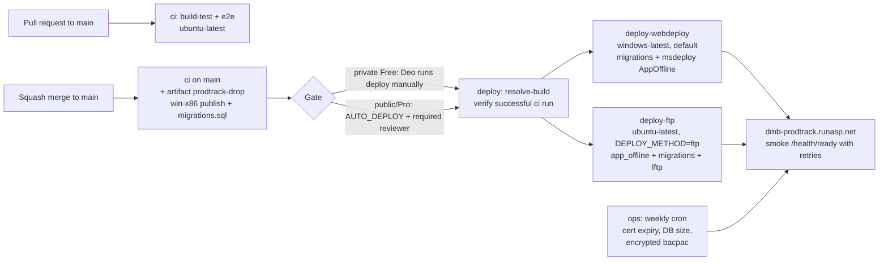

# 11 - GitHub Setup (Repo, Projects, Actions) - primary delivery tooling

> **Status:** Draft v0.3 (2026-09-26) - practice project.
> **Decision (2026-09-26):** GitHub is the day-to-day tool for now: private repo **`deo-bernal/dmb-prodtrack`**, **GitHub Projects** board with the backlog as issues (labels + sprint milestones), **GitHub Actions** on GitHub-hosted runners for CI/CD to the free MonsterASP site, secrets in **GitHub Actions secrets**. **Azure DevOps** becomes a documented **Phase 2** "migrate or mirror" plan (`04-azure-devops-setup.md`, story PT-073) and stays the interview-study topic (`10-azure-devops-study-guide.md`).
> Ready-to-commit files: [`../repo-scaffold/`](../repo-scaffold/) (`.github/workflows/ci.yml`, `deploy.yml`, `ops.yml`, Dependabot, PR/issue templates, `deploy/app_offline.htm`, issue-import script).
> Everything here is US$0 and needs no credit card. Nothing in this document has been executed; it is the plan.

---

## 1. Why GitHub first

- **Free with no card:** GitHub Free includes **2,000 Actions minutes/month and 500 MB artifact storage for private repos**; Microsoft-hosted Azure Pipelines now needs an Azure subscription with billing (only a self-hosted agent is free there).
- **Documented by MonsterASP:** MonsterASP's help has a GitHub Actions deployment guide (Web Deploy from `windows-latest`).
- **Agent-friendly:** Cursor/Codex cloud agents work directly on GitHub repos (no mirror needed).
- **Interview value is kept:** the Azure DevOps setup and study guide remain, and PT-073 practises the migration in Phase 2.

## 2. GitHub Free limits that shape this plan (checked on GitHub Docs, 2026-09-26)

| Feature | Private repo on GitHub Free | Public repo (any plan) / GitHub Pro | Source |
|---|---|---|---|
| Actions minutes (standard hosted runners) | **2,000 min/month** included; Windows runners may count at 2x in the included quota (older docs; current docs price by SKU - verify on the billing page). No payment method = usage simply stops at the quota | Public: free, unlimited on standard runners. Pro: 3,000 min | "GitHub Actions billing", "Actions limits" |
| Artifact storage | **500 MB** (plus 10 GB cache per repo) | Pro: 1 GB | same |
| Branch protection rules / rulesets | **Not available** | Available | "About protected branches" (plan availability note) |
| Environments: required reviewers, wait timer, deployment branches | **Not available** (environment can still be referenced for deployment history) | Public: available; Pro: deployment branches only (required reviewers need a public repo or Enterprise) | "Deployments and environments" |
| Environment secrets / variables | **Not available** -> use repository secrets/variables | Available | same |
| Secret scanning / push protection | Paid (GitHub Secret Protection) | Free on public repos | GitHub Advanced Security docs |
| Dependabot alerts and version updates | Available | Available | Dependabot docs |
| GitHub Projects, Issues, milestones | Available | Available | - |

**Consequence:** on a private Free repo, the requested "required reviewer approval" and "branch protection with required checks" **cannot be enforced**. This plan therefore uses:

1. **Default (private, US$0):** deployments run **only when Deo starts the `deploy` workflow manually** on `main` (the human gate), the workflow refuses anything that is not a successful `ci` run, and merge discipline is documented (PR + green `build-test` + `e2e`, squash merge). Deployments are still recorded on the `production` environment.
2. **Upgrade options (decision for Deo, open question in `00`):** make the repo **public** (all protections + unlimited standard-runner minutes, but the code and the DMB-inspired name become public; secrets stay safe in Actions secrets), or use **GitHub Pro** (US$4/month, or free with the GitHub Student Developer Pack if eligible) for branch protection/rulesets on private repos. Required reviewers on a *private* repo need GitHub Enterprise; on a public repo they are free. With protections available, follow section 7.2 and set `AUTO_DEPLOY=true`.

## 3. Repository setup (PT-001)

1. Create **`deo-bernal/dmb-prodtrack`**: *Private*, no template, add a README later. (CLI: `gh repo create deo-bernal/dmb-prodtrack --private`.)
2. **Settings > General > Pull Requests:** allow **squash merging only**, default commit message "Pull request title", enable *Always suggest updating pull request branches* and **Automatically delete head branches**.
3. **Settings > Actions > General:** Actions permissions "Allow deo-bernal, and select non-deo-bernal, actions" with `actions/*` allowed (checkout, setup-dotnet, upload/download-artifact); **Workflow permissions: Read repository contents** (workflows request more only where needed); do not allow Actions to create/approve PRs.
4. **Settings > Code security:** enable Dependabot alerts and security updates; commit `.github/dependabot.yml`.
5. Copy `repo-scaffold/` into the repo root together with the PT-003 skeleton and push via a PR (or the very first commit directly to `main`).
6. Local clone: `git clone https://github.com/deo-bernal/dmb-prodtrack.git`; branch names `feature/PT-031-start-operation`; commit messages `PT-031: Start operation by scan`; PR description `Closes #<issue>`.

## 4. GitHub Projects board and backlog import (PT-001)

1. **Create the project:** Your profile > Projects > New project > *Board* template, name **"DMB ProdTrack"**. Note its number (URL `github.com/users/deo-bernal/projects/<n>`). Link it to the repo (Project settings > Manage access / repo *Projects* tab).
2. **Fields:** *Status* (Todo, In progress, In review, Done - default), add **Points** (Number; the import script creates it if missing) and optionally *Iteration* (2-week iterations starting 2026-10-05) - milestones already carry the sprint.
3. **Views:** *Board* by Status (filter `milestone:"Sprint 0"` for the current sprint), *Table* grouped by Milestone with a Points sum, *Roadmap* by milestone due date. Built-in workflows: item closed -> Done, PR merged -> Done.
4. **Import the backlog** with the generated script (from the repo root, where `scripts/` was copied):

```bash
gh auth login                      # as deo-bernal
gh auth refresh -s project         # Projects scope for the board
DRY_RUN=1 ./scripts/create-github-issues.sh | less       # review: 102 labels, 10 milestones, 73 issues
DRY_RUN=0 PROJECT_NUMBER=<n> ./scripts/create-github-issues.sh
```

   - Epics/features become labels (`epic:E04`, `feature:F04.1`), sprints become milestones (Sprint 0-8 with due dates, Phase 2), MVP stories get `mvp`. Re-running skips existing issues (matched by the `PT-nnn:` title prefix).
   - `docs/backlog-github-issues.csv` has the same data (Title, Body, Labels, Milestone, Points) for other tools. `docs/backlog.csv` stays for the Azure Boards import in Phase 2.
5. **Scrum on GitHub:** sprint planning = assign the milestone and move items to Todo; daily scrum note = comment on a pinned "Sprint N" discussion/issue; review/retro notes in `docs/sprints/` or the repo wiki; burndown = milestone progress bar + Projects *Insights* chart (Points sum by Status).

## 5. Secrets and variables (Settings > Secrets and variables > Actions)

| Name | Kind | Value / example | Used by |
|---|---|---|---|
| `APP_URL` | Variable | `https://dmb-prodtrack.runasp.net` | deploy, ops |
| `MONSTERASP_SITE` | Variable | `siteXXXX` (MonsterASP's GitHub guide calls this `WEBSITE_NAME` / `SERVER_USERNAME`) | deploy (Web Deploy) |
| `DEPLOY_METHOD` | Variable | `webdeploy` (default) or `ftp` | deploy |
| `AUTO_DEPLOY` | Variable | `false` (default). `true` only with an approval gate (section 7.2) | deploy |
| `MONSTERASP_FTP_ROOT` | Variable | site root after FTP login, e.g. `/wwwroot` **(verify)** | deploy (ftp), ops |
| `BACKUP_FILES` | Variable | `false` / `true` (include `App_Data/files` in the weekly backup; watch the 500 MB storage) | ops |
| `MONSTERASP_WEBDEPLOY_PASSWORD` | **Secret** | Web Deploy password from the panel (`SERVER_PASSWORD` in MonsterASP's guide) | deploy |
| `MONSTERASP_FTP_HOST` / `_USER` / `_PASSWORD` | **Secret** | `siteXXXX.siteasp.net` and panel credentials (`sftp://...` for SFTP) | deploy (ftp), ops |
| `PROD_DB_CONNECTION` | **Secret** | `Server=...;Database=...;User Id=...;Password=...;Encrypt=True;TrustServerCertificate=True` (remote access enabled in the panel) | deploy, ops |
| `BACKUP_PASSPHRASE` | **Secret** | long random passphrase (also in the password manager) - encrypts backup artifacts | ops |

Rules: secrets are masked in logs and are **not passed to workflows triggered from forks**; map them only into the steps that need them (`env:` per step); never `echo` them; rotate on exposure (`08` section 11). On a public repo, backups are still safe because they are encrypted before upload.

## 6. Workflows



| Workflow | Trigger | Jobs | Notes |
|---|---|---|---|
| `ci.yml` | PR to `main`, push to `main`, manual | `build-test` (restore locked, format, build `-warnaserror`, unit, integration via Testcontainers, coverage summary, vulnerable packages, publish `win-x86` framework-dependent + idempotent `migrations.sql` on `main`), `e2e` (SQL Server service container, app started on the runner, Playwright) | Concurrency cancels superseded runs; artifact retention 5 days (500 MB quota) |
| `deploy.yml` | Manual (`workflow_dispatch` on `main`, optional `ci_run_id` for rollback, `deployTarget` monsterasp/azure/gcp); or `workflow_run` after `ci` when `AUTO_DEPLOY=true` | `resolve-build`, `deploy-webdeploy` (default) or `deploy-ftp`, `deploy-alternative` (placeholder) | `concurrency: deploy-production` (one at a time); environment `production` |
| `ops.yml` | Monday 01:00 UTC (09:00 PHT), manual | `ops-checks` | Fails < 21 days before certificate expiry; warns > 700 MB DB; encrypted backup artifact kept 28 days |

**Why Web Deploy is the default:** it is the method MonsterASP documents for GitHub Actions (`windows-latest` runner; their sample uses the third-party `rasmusbuchholdt/simply-web-deploy@2.1.0` action with secrets `WEBSITE_NAME`, `SERVER_COMPUTER_NAME=https://siteXXXX.siteasp.net:8172`, `SERVER_USERNAME`, `SERVER_PASSWORD`). `deploy.yml` calls `msdeploy.exe` directly with MonsterASP's documented command line instead of the action, so the extra rules (`-enableRule:AppOffline`, skipping `App_Data`, `logs`, `appsettings.Production.json`) are visible and no third-party action gets the password. If `msdeploy.exe` is missing on the image it installs Web Deploy with Chocolatey (**verify** the path on the first run). The build itself runs on `ubuntu-latest` (cheaper minutes); only the short deploy job uses Windows.

**Migrations:** `ci` generates `migrations.sql` with `dotnet ef migrations script --idempotent`; the deploy job applies it with `Invoke-Sqlcmd -ConnectionString` (PowerShell `SqlServer` module, installed if missing) before the code sync. Expand/contract keeps the old code working during the few seconds in between. Remote access must be enabled for the database in the MonsterASP panel; GitHub runner IPs change, and MonsterASP documents no IP allow-list (**verify** remote access on the free plan, PT-055). Fallback: `Database:MigrateOnStartup=true` (`08` section 3).

**Rollback:** run `deploy` with the `ci_run_id` of the previous good run (artifacts live 5 days); for older builds re-run `ci` manually on the tag/commit (`workflow_dispatch` on that ref) and deploy that run.

## 7. Merge rules and deploy gate

### 7.1 Default: private repo on GitHub Free

- Work only through PRs from `feature/PT-nnn-*` branches; merge only when `build-test` and `e2e` are green and the PR checklist is done (self-review allowed; CODEOWNERS requests your review).
- Never push directly to `main` (not technically blocked on Free - keep a local pre-push hook that rejects pushes to `main`: `.githooks/pre-push`, `git config core.hooksPath .githooks`).
- Deploy = **Actions > deploy > Run workflow** on `main`. This click is the approval; the run appears under *Environments > production*.

### 7.2 When protections are available (public repo, or Pro for rulesets)

- **Settings > Rules > Rulesets > New branch ruleset** "main": target `main`; *Restrict deletions*, *Block force pushes*, *Require a pull request* (1 approval; for a solo project allow bypass for the admin or 0 approvals), *Require status checks*: `build-test`, `e2e`, *Require linear history*.
- **Settings > Environments > production:** *Required reviewers* = deo-bernal (public repo), *Deployment branches and tags* = `main` and `v*` tags; move `PROD_DB_CONNECTION` and the MonsterASP secrets to **environment secrets**.
- Set variable `AUTO_DEPLOY=true`: each successful `ci` on `main` starts `deploy`, which waits for your approval.
- Public repo only: enable **secret scanning + push protection** (free on public repos).

## 8. Minutes and storage budget (private, 2,000 min / 500 MB)

| Activity | Estimate (verify with Settings > Billing > Usage after Sprint 1) |
|---|---|
| `ci` per PR push (build-test ~6-8 min + e2e ~6-8 min) | ~15 min; 60 PR pushes/month = ~900 min |
| `ci` on merge to `main` | ~15 min; 20 merges = ~300 min |
| `deploy` (ubuntu resolve 1 min + Windows job ~5 min, possibly counted 2x) | ~11 min; 10 deploys = ~110 min |
| `ops` weekly | ~5 min; ~20 min/month |
| **Total** | **~1,300 min/month** - within 2,000; if tight: skip `e2e` on draft PRs, run it only on `main` and before releases |
| Artifacts | drop ~50-80 MB x 5-day retention, encrypted bacpac a few MB x 28 days - keep well under 500 MB; delete old artifacts if needed |

## 9. Optional: Cursor / Codex agents

Agents work on branches and open PRs in this repo; the same PR checklist and `ci` apply. Give them `AGENTS.md` and `.cursor/rules/`. Never give an agent the deploy secrets or ask it to run `deploy`.

## 10. Troubleshooting

| Symptom | Fix |
|---|---|
| `deploy` job skipped | Not run on `main`, `AUTO_DEPLOY` not `true` for automatic runs, or `DEPLOY_METHOD` routes to the other job |
| `resolve-build`: "not a successful ci run" | Pick a run ID from a green `ci` run (Actions > ci > run URL number) |
| `download-artifact`: artifact not found | Artifact expired (5 days) or the run was a PR build (no artifact) - re-run `ci` on `main` |
| msdeploy `ERROR_USER_NOT_AUTHORIZED` / 401 | Wrong `MONSTERASP_SITE` or Web Deploy password; check the panel's Web Deploy settings |
| msdeploy `ERROR_FILE_IN_USE` | AppOffline rule not honoured - switch to `DEPLOY_METHOD=ftp` (uploads `app_offline.htm` first) and report |
| lftp `550` / TLS errors | See `08` section 10; check `MONSTERASP_FTP_ROOT`, try `sftp://` host |
| `Invoke-Sqlcmd` login timeout | Remote access disabled for the DB, or not available on free - see `08` section 3 fallback |
| Workflow run blocked "spending limit" / quota | Included minutes used up - wait for the next cycle or reduce `e2e` frequency (section 8) |
| Scheduled `ops` stopped running | Public repos disable schedules after 60 days without activity - re-enable in Actions |

## 11. Phase 2: move or mirror to Azure DevOps (PT-073)

Follow `04-azure-devops-setup.md` (Phase 2): import `docs/backlog.csv` into Azure Boards, mirror the GitHub repo into Azure Repos (or connect Azure Pipelines to the GitHub repo with the Azure Pipelines GitHub App), run the YAML pipelines on a **self-hosted agent** (the Microsoft-hosted free grant needs an Azure subscription with billing), and keep **only one system holding the deploy secrets** at a time. Concept mapping for interviews:

| GitHub | Azure DevOps |
|---|---|
| Issues + Projects + milestones | Boards: work items, backlogs, iterations |
| Branch rulesets, required checks | Branch policies, build validation |
| Actions workflows / jobs / steps, reusable workflows | Pipelines stages / jobs / steps, templates |
| Repository/environment secrets, variables | Variable groups (secret variables), secure files, Key Vault links |
| Environments with required reviewers | Environments with approvals and checks |
| GitHub-hosted / self-hosted runners | Microsoft-hosted / self-hosted agents, Managed DevOps Pools |
| Artifacts (workflow), Packages | Pipeline artifacts, Azure Artifacts feeds |
| `workflow_dispatch` inputs | Runtime parameters |
| OIDC (`id-token: write`) to clouds | Workload identity federation service connections |

## 12. Sources (checked 2026-09-26)

- GitHub Actions billing (included minutes/storage by plan, rates): https://docs.github.com/en/billing/concepts/product-billing/github-actions
- Actions limits: https://docs.github.com/en/actions/reference/limits
- Minute multipliers (Windows 2x, older billing doc): https://github.com/github/docs/blob/086d7f835f2e801c70db93959786f323fc30a201/content%2Fbilling%2Fmanaging-billing-for-github-actions%2Fabout-billing-for-github-actions.md
- Deployments and environments (required reviewers / environment secrets plan notes): https://docs.github.com/en/actions/reference/workflows-and-actions/deployments-and-environments
- About protected branches: https://docs.github.com/en/repositories/configuring-branches-and-merges-in-your-repository/managing-protected-branches/about-protected-branches
- MonsterASP GitHub Actions guide: https://help.monsterasp.net/books/github/page/how-to-deploy-website-via-github-actions
- MonsterASP msdeploy command line: https://help.monsterasp.net/books/deploy/page/how-to-deploy-website-content-from-command-line
- Windows runner image contents: https://github.com/actions/runner-images/blob/main/images/windows/Windows2025-Readme.md
- `gh` manual (issue, label, project): https://cli.github.com/manual/

## 13. Change log

| Date | Version | Change |
|---|---|---|
| 2026-09-26 | 0.3 | New document: GitHub as primary tooling (repo, Projects, Actions, secrets), GitHub Free plan limits and the manual deploy gate, workflows in `repo-scaffold/`, issue import script, minutes budget, Azure DevOps as Phase 2 |
